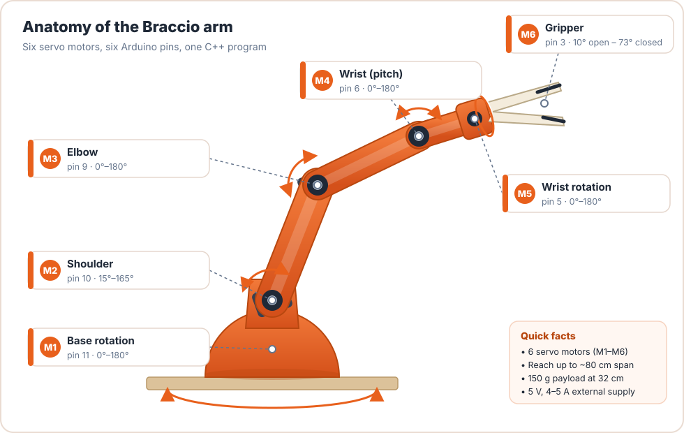

<div align="center">


# Practical C++ with the Braccio Arm

**Learn C++ from zero by programming a real 6-joint robotic arm, the Tinkerkit Braccio.**

[](https://theafricanjiant.github.io/Practical-C-/)
[](https://github.com/TheAfricanJiant/Practical-C-/actions/workflows/gh-pages.yml)
[](https://github.com/TheAfricanJiant/Practical-C-/actions/workflows/test-code.yml)
[](LICENSE)



### 👉 [**theafricanjiant.github.io/Practical-C-**](https://theafricanjiant.github.io/Practical-C-/) 👈

</div>

---

## What is this?

A free, hands-on course that teaches **C++** by programming the **Tinkerkit Braccio** robotic arm with an Arduino UNO.
It starts at "what is a compiler?" and ends with you writing, testing and shipping your **own Arduino library** and
solving **inverse kinematics** so the gripper reaches any point you type.

- **20 lessons + a hands-on Lesson 00**, each with a concept explanation, diagrams, desktop C++ you can run anywhere,
  an **🦾 Arm Lab** sketch for the real robot, exercises and solutions.
- **5 projects:** a PC simulator, pick & place (state machine), a serial command console, teach & replay with EEPROM,
  and inverse kinematics.
- **15 illustrated diagrams** of the arm, wiring, servo signals, memory, motion and kinematics.
- **No arm? No problem.** Every lab runs in the free [Wokwi](https://wokwi.com) simulator using our
  [six-servo circuit](examples/wokwi/diagram.json).
- **Every code sample is tested:** it compiles, runs, and never commands an unsafe angle.

## Curriculum

| | Part | Lessons | You build |
|---|---|---|---|
| 🚀 | **Start Here** | Setup · Meet the Braccio · L00 Make the arm move | your first moving sketch |
| 📘 | **C++ Basics** | 01 Compiler · 02 Types · 03 Loops · 04 Functions · 05 Headers · 06 Include guards · 07 Preprocessor | a keyboard pose menu, a multi-file sketch |
| 📙 | **Classes** | 08 Classes · 09 Constructors · 10 Encapsulation · 11 Methods & `const` | calibration objects, a safety guard, your own motion engine |
| 📗 | **Memory** | 12 Pointers · 13 References · 14 Stack/heap/2 KB RAM · 15 Arrays | a jog controller, synchronised motion, choreographed routines |
| 📕 | **Libraries** | 16 Build system · 17 Library anatomy · 18 Inside BraccioV2 (a code review with 6 real bugs) · 19 Writing MyBraccio · 20 Deploy, test & debug | the **MyBraccio** library + PC unit tests |
| 🏆 | **Projects** | P1 Simulator · P2 Pick & place · P3 Serial console · P4 Record & replay · P5 Kinematics | a robot that does what *you* decide |

Plus a practice workbook (28 exercises), a BraccioV2/MyBraccio API reference, a cheatsheet, troubleshooting,
a glossary and curated resources.

> **Best experience:** read it on the [website](https://theafricanjiant.github.io/Practical-C-/), which has search,
> dark mode, diagrams, tabs and collapsible solutions. The Markdown sources in [`docs/`](docs/) are readable on GitHub too,
> but some site features (admonitions, tabs, included code files) only render on the website.

## Quick start

1. **Tools:** install the [Arduino IDE 2](https://www.arduino.cc/en/software) and, from the Library Manager, **BraccioV2**.
2. **Hardware:** Braccio with **Shield V4+**, an Arduino UNO, and the **5 V / 4–5 A** adapter. Clamp the base to the table.
3. **Open** [`examples/arm_labs/L00_first_move`](examples/arm_labs/L00_first_move/L00_first_move.ino), upload it, *then* plug in the 5 V supply.
4. Follow [Lesson 00](https://theafricanjiant.github.io/Practical-C-/hardware/first_move/).

## Repository layout

```text
Practical-C-/
├── docs/                         # the course website (MkDocs Material)
│   ├── hardware/                 #   Meet the Braccio, Lesson 00
│   ├── Part1_Cpp_Basics/ … Part4_Arduino_Libraries/
│   ├── Projects/ Exercises/ Appendix/
│   ├── images/                   #   photo + SVG diagrams
│   └── stylesheets/ javascripts/
├── examples/
│   ├── arm_labs/                 # one Arduino sketch per lesson (L00–L20)
│   ├── projects/                 # P2–P5 sketches
│   ├── libraries/
│   │   ├── ArmPoses/             #   Lesson 17's teaching library
│   │   └── MyBraccio/            #   Lesson 19's library: copy into Documents/Arduino/libraries
│   ├── pc_tests/                 # Lesson 20: unit tests with fake Arduino headers
│   ├── pc_simulator/             # P1 simulator + P5 IK test (desktop C++)
│   └── wokwi/                    # six-servo simulator circuit
├── BraccioV2.h / BraccioV2.cpp   # the library studied in Lesson 18 (unmodified)
├── .github/workflows/
│   ├── gh-pages.yml              # builds and publishes the website
│   └── test-code.yml             # runs PC tests + compiles every sketch for the UNO
└── mkdocs.yml
```

## Run the website locally

```bash
pip install -r requirements.txt
mkdocs serve          # then open http://127.0.0.1:8000
```

Every push to `main` rebuilds the site automatically.
**One-time setup:** in the repository's *Settings → Pages*, set **Source = GitHub Actions**.

## Run the tests

```bash
cd examples/pc_tests
g++ -std=c++17 -Wall -Wextra -I fake -I ../libraries/MyBraccio/src \
    test_mybraccio.cpp ../libraries/MyBraccio/src/MyBraccio.cpp -o test_mybraccio
./test_mybraccio        # 32 checks, 0 failed
```

## Community edition & credits

This course is written and maintained by the
**[Hardware Innovation Valley Community (HWIVC)](https://hwivc.org/)** in Buea, Cameroon, as part of a community effort to
make practical robotics and embedded-systems education accessible to everyone.

It gives full credit to the **[BraccioV2](https://github.com/kk6axq/BraccioV2)** library by **Lukas Severinghaus**
(included here unmodified for study, under its original licence notice) and to the original
**[Arduino Braccio](https://github.com/arduino-libraries/Braccio)** library by **Andrea Martino** and **Angelo Ferrante**.
The Braccio photo is of the Arduino Tinkerkit Braccio product.

## Contributing

Found a mistake, a broken link, or have an idea for a lesson? [Open an issue](https://github.com/TheAfricanJiant/Practical-C-/issues)
or send a pull request. Please run the tests before submitting code changes.

## License

Course text and original code: [MIT](LICENSE). `BraccioV2.h` / `BraccioV2.cpp` keep their own LGPL notice.
