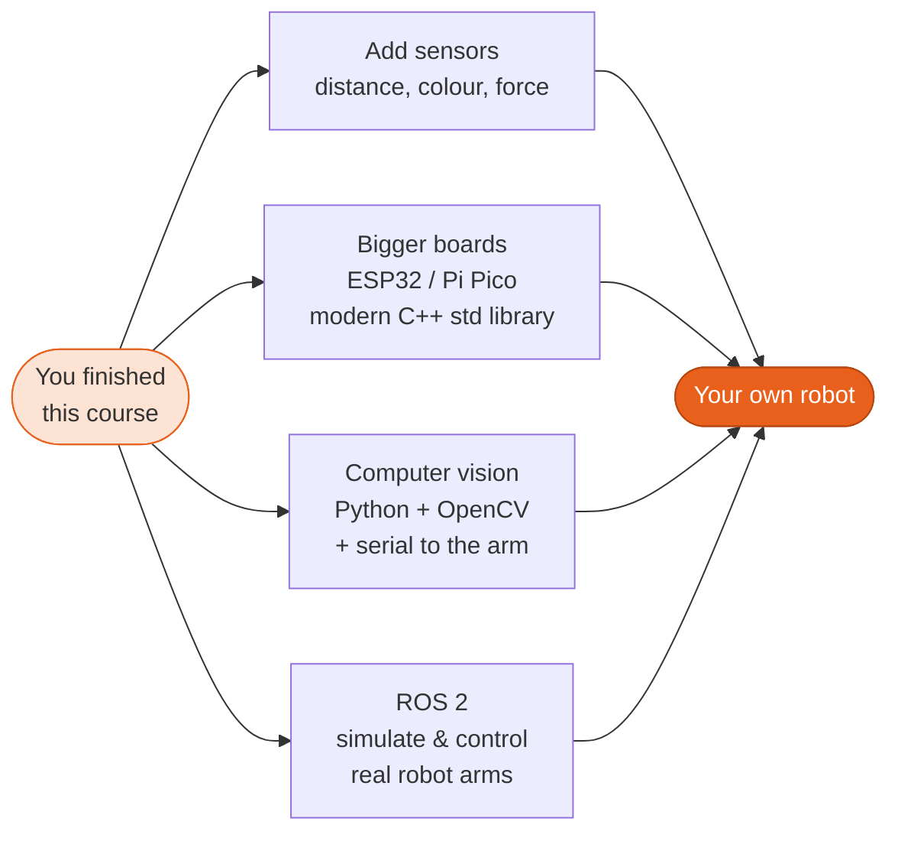

# Resources & Further Learning

Hand-picked, mostly **free** resources to go deeper. ⭐ marks the ones we recommend most.

---

## The Braccio arm

-   :material-book-open-variant: **Official Getting Started guide** ⭐

    ---

    Assembly, shield pinout, the official library's API and safety pose.

    [:octicons-arrow-right-24: docs.arduino.cc](https://docs.arduino.cc/retired/getting-started-guides/Braccio/)

-   :material-file-pdf-box: **Assembly guide (PDF)**

    ---

    Step-by-step mechanical assembly with pictures.

    [:octicons-arrow-right-24: Braccio Quick Start Guide](https://content.arduino.cc/assets/Braccio%20Quick%20Start%20Guide.pdf)

-   :material-youtube: **Assembly video**

    ---

    Arduino's official video walkthrough of building the arm.

    [:octicons-arrow-right-24: YouTube](https://www.youtube.com/watch?v=Lwb2ppat_bs)

-   :material-github: **BraccioV2 library** ⭐

    ---

    The library studied in Lesson 18, by Lukas Severinghaus.

    [:octicons-arrow-right-24: github.com/kk6axq/BraccioV2](https://github.com/kk6axq/BraccioV2)

-   :material-github: **Official Arduino Braccio library**

    ---

    The original library by Andrea Martino and Angelo Ferrante (`ServoMovement`).

    [:octicons-arrow-right-24: arduino-libraries/Braccio](https://github.com/arduino-libraries/Braccio)

-   :material-tools: **Community guides**

    ---

    Bring-up notes, advice and code for the Tinkerkit Braccio.

    [:octicons-arrow-right-24: WLaney/tinkerkit-braccio](https://github.com/WLaney/tinkerkit-braccio)

Technical specifications: [Arduino store page](https://store.arduino.cc/products/tinkerkit-braccio-robot).

---

## Learning C++

| Resource | Type | Why |
|---|---|---|
| ⭐ [LearnCpp.com](https://www.learncpp.com/) | free website | The best free C++ tutorial. Every lesson here links to its matching chapter. |
| ⭐ [cppreference.com](https://en.cppreference.com/) | reference | The precise definition of every language feature and library function. |
| [Compiler Explorer](https://godbolt.org/) | online tool | See the assembly your code becomes (try the *AVR gcc* compiler). |
| [OnlineGDB](https://www.onlinegdb.com/online_c++_compiler) | online IDE | Compile, run and **debug** C++ in the browser. |
| [The Cherno: C++ series](https://www.youtube.com/playlist?list=PLlrATfBNZ98dudnM48yfGUldqGD0S4FFb) | video | Clear, practical videos on pointers, classes, memory and more. |
| [freeCodeCamp: C++ for beginners](https://www.youtube.com/watch?v=vLnPwxZdW4Y) | video | A 4-hour full beginner course. |
| [C++ Core Guidelines](https://isocpp.github.io/CppCoreGuidelines/CppCoreGuidelines) | guidelines | How experts write modern, safe C++. |
| *Programming: Principles and Practice Using C++*, B. Stroustrup | book | A beginner's textbook by the creator of C++. |
| *A Tour of C++*, B. Stroustrup | book | A short overview of modern C++ once you know the basics. |

## Arduino & embedded systems

| Resource | Type | Why |
|---|---|---|
| ⭐ [Arduino Documentation](https://docs.arduino.cc/) | docs | Official tutorials, board pages and the [language reference](https://docs.arduino.cc/language-reference/). |
| ⭐ [Wokwi simulator](https://wokwi.com/) · [docs](https://docs.wokwi.com/) | online simulator | Arduino + servos in the browser. Our [six-servo circuit](https://github.com/TheAfricanJiant/Practical-C-/blob/main/examples/wokwi/diagram.json). |
| [Arduino CLI](https://arduino.github.io/arduino-cli/) | tool | Build and upload from the terminal; the [build process](https://arduino.github.io/arduino-cli/latest/sketch-build-process/) explained. |
| [Arduino memory guide](https://docs.arduino.cc/learn/programming/memory-guide/) | article | Flash, SRAM, EEPROM in depth. |
| [Adafruit: Multi-tasking the Arduino](https://learn.adafruit.com/multi-tasking-the-arduino-part-1) | tutorial | Non-blocking code and state machines. |
| [Adafruit: Memories of an Arduino](https://learn.adafruit.com/memories-of-an-arduino) | tutorial | Where your variables really live. |
| [SparkFun: Hobby servo tutorial](https://learn.sparkfun.com/tutorials/hobby-servo-tutorial) | tutorial | How servos work, inside and out. |
| [Nick Gammon's Arduino pages](https://www.gammon.com.au/serial) | articles | Deep, reliable articles on [serial](https://www.gammon.com.au/serial), [timers](https://www.gammon.com.au/timers) and more. |
| [Arduino library specification](https://arduino.github.io/arduino-cli/latest/library-specification/) · [style guide](https://docs.arduino.cc/learn/contributions/arduino-library-style-guide/) | spec | For publishing your own library. |
| [ATmega328P datasheet](https://ww1.microchip.com/downloads/en/DeviceDoc/Atmel-7810-Automotive-Microcontrollers-ATmega328P_Datasheet.pdf) | datasheet | The chip itself: registers, timers, memory. |
| *Making Embedded Systems*, E. White | book | Excellent next step into professional embedded software. |

## Robotics

| Resource | Type | Why |
|---|---|---|
| ⭐ [Robot Academy (QUT, Peter Corke)](https://robotacademy.net.au/) | free video lessons | Short, excellent lessons on kinematics, e.g. [IK for a 2-joint arm](https://robotacademy.net.au/lesson/inverse-kinematics-for-a-2-joint-robot-arm-using-geometry/). |
| [Modern Robotics (Lynch & Park)](https://hades.mech.northwestern.edu/index.php/Modern_Robotics) | free book + videos | A university-level robotics course, free online. |
| [MIT OCW 2.12: Introduction to Robotics](https://ocw.mit.edu/courses/2-12-introduction-to-robotics-fall-2005/) | course | Lecture notes on manipulators and kinematics. |
| [ROS 2 documentation](https://docs.ros.org/) | framework | The Robot Operating System used in research and industry. |
| [easings.net](https://easings.net/) | visual guide | Easing curves for smooth motion (Lesson 11). |
| [pySerial](https://pyserial.readthedocs.io/) | Python library | Drive the arm from Python (Project P3). |

## Tools

| Tool | Use |
|---|---|
| [Arduino IDE 2](https://www.arduino.cc/en/software) | write, upload, Serial Monitor & Plotter |
| [Visual Studio Code](https://code.visualstudio.com/) + [C/C++ extension](https://marketplace.visualstudio.com/items?itemName=ms-vscode.cpptools) | editor for desktop C++ |
| [MSYS2](https://www.msys2.org/) | `g++` on Windows |
| [Git](https://git-scm.com/) · [Pro Git book](https://git-scm.com/book/en/v2) | version control |
| [GitHub Actions: compile-sketches](https://github.com/arduino/compile-sketches) | automatic compilation of Arduino sketches (used by this repo) |

## Community & help

- [Arduino Forum](https://forum.arduino.cc/): friendly, very active, and searchable. Most problems have been solved there before.
- [r/cpp_questions](https://www.reddit.com/r/cpp_questions/): beginner-friendly C++ help.
- [Hardware Innovation Valley Community (HWIVC)](https://hwivc.org/): the Buea, Cameroon community behind this edition of the course.
- **This course:** questions, corrections and improvements are welcome as
  [issues or pull requests](https://github.com/TheAfricanJiant/Practical-C-/issues).

---

## Where to go next

