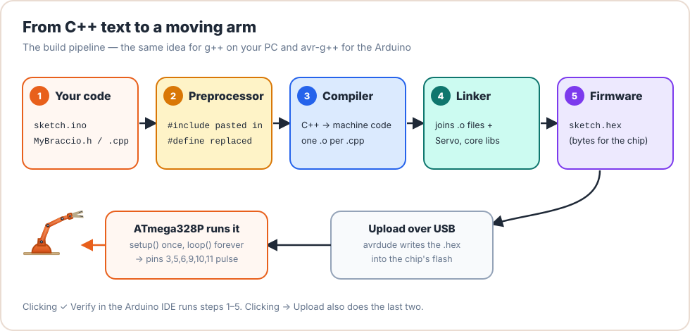

# Lesson 01: How C++ Becomes Motion

<div class="lesson-meta"><span>⏱ 60 min</span><span>🎯 Beginner</span><span>🧩 Prerequisite: Lesson 00</span></div>

!!! abstract "What you'll learn"
    - The **four stages** that turn C++ text into a program: preprocess, compile, assemble, link
    - The anatomy of a C++ program: `#include`, `main`, statements, comments
    - How to compile on your PC with `g++` and read its **error messages**
    - What the Arduino IDE does when you click **Verify** and **Upload**

---

## The problem: chips only understand numbers

The ATmega328P chip on your Arduino doesn't understand English, or C++. It understands about 130 very simple
**instructions**, each stored as a number, like "copy this byte", "add these two registers" or "jump to address 512".

Writing those numbers by hand would be painful. So we write **C++**, a language people can read, and a program
called a **compiler** translates it into the chip's numbers. This is why C++ is called a *compiled* language.

<figure markdown>
{ .diagram }
<figcaption>The same pipeline runs whether you compile for your PC (<code>g++</code>) or for the Arduino (<code>avr-g++</code>).</figcaption>
</figure>

| Stage | Input | Output | What it does |
|---|---|---|---|
| **1. Preprocessor** | `.cpp` / `.ino` + headers | expanded text | Pastes in `#include` files, replaces `#define` names |
| **2. Compiler** | expanded text | assembly (`.s`) | Checks grammar and types, translates to CPU instructions |
| **3. Assembler** | assembly | object file (`.o`) | Turns instructions into binary machine code |
| **4. Linker** | all `.o` files + libraries | program (`.exe` / `.hex`) | Joins the pieces and connects function calls to their code |

!!! tip "Two kinds of errors"
    - **Compiler errors** mean your *grammar* is wrong: a missing `;`, a misspelled name, a wrong type.
    - **Linker errors** (`undefined reference to ...`) mean the grammar is fine, but a function you *promised* exists
      was never written or never included in the build. You'll meet these in [Lesson 05](lesson05_headers.md).

---

## Your first C++ program, piece by piece

```cpp title="status_check.cpp" linenums="1"
#include <iostream>   // (1)!

// Entry point: every C++ program starts running here.
int main() {          // (2)!
    std::cout << "Initializing Braccio arm..." << std::endl;   // (3)!
    std::cout << "6 joints online." << std::endl;
    return 0;         // (4)!
}
```

1. A **preprocessor directive**. It says "paste the contents of the `iostream` library header here", which gives us `std::cout` for printing.
2. `main` is a **function**. `int` means it returns a whole number to the operating system when it finishes.
3. `std::cout` is the console output. `<<` pushes text into it. `std::endl` ends the line. Every **statement** ends with a semicolon `;`.
4. Returning `0` tells the operating system "everything went fine".

*(Click the numbered circles in the code for explanations.)*

### The rules of the grammar

- **Statements end with `;`.** Forgetting it is the most common beginner error.
- **Braces `{ }` group statements** into a *block*, such as the body of a function.
- **C++ is case-sensitive.** `Main`, `MAIN` and `main` are three different names.
- **Comments** are ignored by the compiler: `// until end of line` or `/* across many lines */`.
- **Whitespace doesn't matter** to the compiler, but indentation matters a lot to humans. Indent every block.

---

## Compile it yourself

Save the program above as `status_check.cpp`, then in a terminal in the same folder:

```bash
g++ -std=c++17 -Wall -Wextra status_check.cpp -o status_check
./status_check
```

| Flag | Meaning |
|---|---|
| `-std=c++17` | Use the C++17 version of the language |
| `-Wall -Wextra` | Turn on (almost) all **warnings** |
| `-o status_check` | Name the output program `status_check` |

Output:

```text
Initializing Braccio arm...
6 joints online.
```

### Watch each stage separately

You can stop `g++` after any stage and look at the result:

```bash
g++ -E status_check.cpp -o status_check.ii   # 1. preprocess only
g++ -S status_check.cpp -o status_check.s    # 2. compile to assembly
g++ -c status_check.cpp -o status_check.o    # 3. assemble to object code
g++ status_check.o -o status_check           # 4. link into a program
```

Open `status_check.ii` in an editor. Your 8-line program has grown to **tens of thousands of lines**, because
`#include <iostream>` pasted the whole library header in. Open `status_check.s` to see real assembly instructions.

!!! example "See it online"
    Paste the program into [Compiler Explorer](https://godbolt.org) and choose the compiler **AVR gcc**. You'll see
    the exact instructions your code becomes on an Arduino chip. Hover over any line to see which assembly it produced.

---

## Reading error messages (a superpower)

Let's break the program on purpose. Remove the semicolon after the first `std::endl`:

```cpp title="broken.cpp"
#include <iostream>

int main() {
    std::cout << "Initializing Braccio arm..." << std::endl   // compile error: missing ';'
    std::cout << "6 joints online." << std::endl;
    return 0;
}
```

`g++` answers:

```text
broken.cpp: In function 'int main()':
broken.cpp:4:62: error: expected ';' before 'std'
    4 |     std::cout << "Initializing Braccio arm..." << std::endl
      |                                                              ^
      |                                                              ;
    5 |     std::cout << "6 joints online." << std::endl;
```

How to read it:

1. **File and position:** `broken.cpp:4:62` means line 4, column 62.
2. **Kind:** `error` (must fix) or `warning` (should fix).
3. **Message:** `expected ';' before 'std'`. The compiler got to `std` on line 5 and realised line 4 never ended.
4. **Fix the first error first.** One mistake can cause a cascade of later errors, which often vanish once the first one is fixed.

---

## On the Arduino: same pipeline, different target

When you click **✓ Verify** in the Arduino IDE, it runs the same four stages using **`avr-g++`**, a
**cross-compiler** that runs on your laptop but produces instructions for the AVR chip. Clicking **→ Upload** also
sends the resulting `.hex` file to the board through USB, using a tool called `avrdude`.

At the end of a build, the IDE prints something like:

```text
Sketch uses 6124 bytes (18%) of program storage space. Maximum is 32256 bytes.
Global variables use 412 bytes (20%) of dynamic memory, leaving 1636 bytes for local variables.
```

- **Program storage** = flash memory, where your compiled instructions live (32 KB).
- **Dynamic memory** = RAM, for your variables (only 2 KB!). We'll look at both in [Lesson 14](../Part3_Memory/lesson14_dynamic_memory.md).

!!! tip "See the real commands"
    In **File → Preferences**, tick **Show verbose output during: compile**. The next build will print every
    `avr-g++` command, with the same `-c`, `-o` and `-I` flags you just used by hand.

Two differences between a desktop program and a sketch:

| Desktop C++ | Arduino sketch |
|---|---|
| Starts at `int main()` | Starts at `setup()`, then calls `loop()` forever. The Arduino core has a hidden `main()` that calls them. |
| Prints with `std::cout` | Prints with `Serial.print()` to the Serial Monitor |
| Has an operating system | No operating system. Your code *is* the only thing running. |

The hidden `main()` in the Arduino core looks roughly like this:

```cpp
// simplified from the Arduino core's main.cpp
int main() {
    init();          // set up timers used by millis() and PWM
    setup();         // your code
    for (;;) {
        loop();      // your code, forever
    }
}
```

---

## :material-robot-industrial: Arm Lab: Hello, Arm!

!!! arm "Arm Lab 01"
    This sketch prints information that the **preprocessor** fills in at build time (`__FILE__`, `__DATE__`,
    `__TIME__`), then waves once. Upload it, open the Serial Monitor at 9600 baud, and read what it prints.

```cpp title="L01_hello_arm.ino"
--8<-- "examples/arm_labs/L01_hello_arm/L01_hello_arm.ino"
```

**Try this:**

1. Upload it twice, a minute apart. Does the time printed change? Why? (Hint: *when* does the preprocessor run?)
2. Delete a `;` and click Verify. Find the line number in the red error text.
3. Misspell `safeDelay` as `safedelay`. What does the error say? Is it a compiler or a linker error?

??? success "Answers"
    1. Yes. `__TIME__` is replaced with the time of **compilation**, not the time the program runs. The text is frozen into the program.
    2. The error message points at the line *after* the missing semicolon, just like on the desktop.
    3. `'class Braccio' has no member named 'safedelay'; did you mean 'safeDelay'?`. This is a **compiler** error, because the header told the compiler every name that exists, and `safedelay` isn't one of them.

---

## Common mistakes

| Mistake | Symptom | Fix |
|---|---|---|
| Missing `;` | `expected ';' before ...` on the **next** line | Add the semicolon at the end of the previous statement |
| Wrong capitalisation (`Serial.Println`) | `has no member named 'Println'` | C++ is case-sensitive: use `println` |
| Unmatched `{` or `}` | `expected '}' at end of input` | Indent properly; every `{` needs its `}` |
| Smart quotes copied from a web page (`“text”`) | `stray '\342' in program` | Retype the quotes as plain `"` |

---

## Exercises

**1. Your details.** Write a desktop program that prints your name, your community or school, and today's date on
three separate lines.

**2. Stage detective.** For each error, say which stage (preprocessor, compiler or linker) reports it:
a) `fatal error: Servoo.h: No such file or directory`
b) `error: 'angel' was not declared in this scope`
c) `undefined reference to 'moveArm()'`

**3. Size check.** Verify the Lesson 00 sketch in the Arduino IDE. Write down how many bytes of flash and RAM it uses.
Then add ten more `Serial.println("...")` lines and verify again. Which number grew, and why?

??? success "Solution 1"
    ```cpp
    #include <iostream>

    int main() {
        std::cout << "Name: Ada Nkwenti" << std::endl;
        std::cout << "Community: HWIVC, Buea" << std::endl;
        std::cout << "Date: 2026-09-26" << std::endl;
        return 0;
    }
    ```

??? success "Solution 2"
    a) **Preprocessor.** It can't find the file to paste in for `#include`.
    b) **Compiler.** It's a grammar/name error inside a `.cpp` file (a typo for `angle`).
    c) **Linker.** The function was declared, so the compiler was happy, but no definition was found to link.

??? success "Solution 3"
    Both numbers grow. The *program storage* grows because the new calls are extra instructions. The *dynamic memory*
    grows too, because on AVR, string literals are copied into RAM at start-up. The fix is the `F()` macro,
    `Serial.println(F("text"))`, which keeps the text in flash. More on this in [Lesson 14](../Part3_Memory/lesson14_dynamic_memory.md).

---

## Recap

- C++ is **compiled**: preprocessor → compiler → assembler → linker → program.
- Every desktop program starts in `main()`. Every sketch starts in `setup()` and repeats `loop()`.
- Always compile with warnings (`-Wall -Wextra`), and fix the **first** error first.
- The Arduino IDE uses `avr-g++`, a cross-compiler, and reports how much flash and RAM you use.

## Further reading

- [LearnCpp: Introduction to the compiler, linker and libraries](https://www.learncpp.com/cpp-tutorial/introduction-to-the-compiler-linker-and-libraries/)
- [Compiler Explorer](https://godbolt.org): see your code as assembly
- [Arduino: Sketch build process](https://arduino.github.io/arduino-cli/latest/sketch-build-process/)
