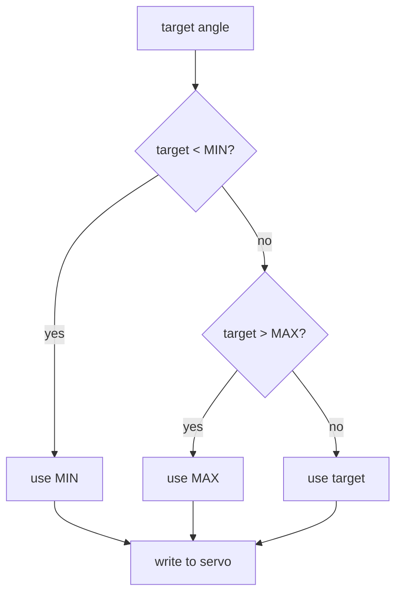
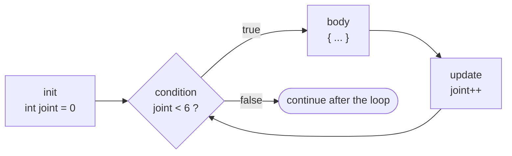

# Lesson 03: Decisions & Loops

<div class="lesson-meta"><span>⏱ 90 min</span><span>🎯 Beginner</span><span>🧩 Prerequisite: Lesson 02</span></div>

!!! abstract "What you'll learn"
    - Comparison (`==`, `<`, `>=` …) and logical (`&&`, `||`, `!`) operators
    - Making decisions with `if` / `else if` / `else`, `switch` and the `?:` operator
    - Repeating actions with `for`, `while` and `do … while`, plus `break` and `continue`
    - Reading keys from the Serial Monitor to control the arm
    - Why an endless loop inside `loop()` can freeze your robot

---

## Programs that decide

So far our programs ran straight from top to bottom. Real robots have to **react**: *if* the target is past the limit,
clamp it; *while* the joint hasn't arrived, keep moving; *for* each of the six joints, run a test.
These are **control-flow** statements.

### Comparisons and logic

Comparisons produce a `bool` (`true` or `false`):

| Operator | Meaning | Example (angle = 90) | Result |
|---|---|---|---|
| `==` | equal to | `angle == 90` | `true` |
| `!=` | not equal to | `angle != 90` | `false` |
| `<` `>` | less / greater | `angle < 15` | `false` |
| `<=` `>=` | less-or-equal / greater-or-equal | `angle >= 15` | `true` |
| `&&` | AND: both true | `angle >= 15 && angle <= 165` | `true` |
| <code>&#124;&#124;</code> | OR: at least one true | <code>angle &lt; 15 &#124;&#124; angle &gt; 165</code> | `false` |
| `!` | NOT | `!(angle == 90)` | `false` |

!!! danger "`=` is not `==`"
    `if (angle = 180)` **assigns** 180 to `angle`, and the condition is then always true. Your arm swings to 180 every
    time. Compile with `-Wall`, and the compiler warns: *suggest parentheses around assignment used as truth value*.

---

## `if`, `else if`, `else`



```cpp title="clamp.cpp"
#include <iostream>

int main() {
    const int SHOULDER_MIN = 15;
    const int SHOULDER_MAX = 165;
    int requested[] = {-20, 15, 90, 170, 400};   // an array (Lesson 15) so we can try several values

    for (int target : requested) {                // "for each target in requested"
        int safe;
        if (target < SHOULDER_MIN) {
            safe = SHOULDER_MIN;
        } else if (target > SHOULDER_MAX) {
            safe = SHOULDER_MAX;
        } else {
            safe = target;
        }
        std::cout << "requested " << target << " -> sending " << safe << '\n';
    }
    return 0;
}
```

Output:

```text
requested -20 -> sending 15
requested 15 -> sending 15
requested 90 -> sending 90
requested 170 -> sending 165
requested 400 -> sending 165
```

This is exactly what Arduino's `constrain(value, min, max)` does, and BraccioV2 calls `constrain` on every
angle you give it.

### The conditional operator `?:`

A compact `if`/`else` that produces a value:

```cpp
int direction = (current < target) ? +1 : -1;   // "if current < target then +1 else -1"
```

You'll find this exact line in BraccioV2's `_moveServo()` function.

---

## `switch`: choose between many options

When one variable can have many specific values, such as a command letter typed by the user, `switch` is cleaner than a
long chain of `else if`:

```cpp title="switch_demo.cpp"
#include <iostream>

int main() {
    char commands[] = {'O', 'C', 'H', 'X'};

    for (char cmd : commands) {
        switch (cmd) {
            case 'O':
                std::cout << "Open gripper (10)\n";
                break;              // leave the switch
            case 'C':
                std::cout << "Close gripper (73)\n";
                break;
            case 'H':
            case 'h':               // two cases can share code
                std::cout << "Go home\n";
                break;
            default:
                std::cout << "Unknown command '" << cmd << "'\n";
        }
    }
    return 0;
}
```

!!! warning "Don't forget `break`"
    Without `break`, execution **falls through** into the next `case`. Sometimes that's useful (like `'H'`/`'h'` above),
    but usually it's a bug. `switch` works only on whole-number types (`int`, `char`, `enum`), not on strings or floats.

---

## Loops

### `for`: when you know how many times

```cpp
for (int joint = 0; joint < 6; joint++) {
    // runs with joint = 0, 1, 2, 3, 4, 5
}
```



### `while`: repeat until something changes

```cpp
while (current != target) {
    current += (current < target) ? 1 : -1;   // step one degree toward the target
}
```

### `do … while`: run at least once

```cpp
do {
    reading = analogRead(A0);
} while (reading < 10);   // body runs once before the first check
```

### `break` and `continue`

- `break` leaves the loop immediately.
- `continue` skips the rest of this pass and goes to the next one.

```cpp title="loops.cpp"
#include <iostream>

int main() {
    // 1. for: print a sweep plan from 0 to 180 in steps of 45
    for (int angle = 0; angle <= 180; angle += 45) {
        std::cout << angle << ' ';
    }
    std::cout << '\n';

    // 2. while: step a joint from 90 toward 97, one degree at a time
    int current = 90;
    const int target = 97;
    int steps = 0;
    while (current != target) {
        current += (current < target) ? 1 : -1;
        steps++;
    }
    std::cout << "arrived at " << current << " after " << steps << " steps\n";

    // 3. continue + break: skip the gripper (joint 5), stop at a faulty joint 3
    for (int joint = 0; joint < 6; joint++) {
        if (joint == 5) continue;
        if (joint == 3) {
            std::cout << "joint 3 fault, stopping test\n";
            break;
        }
        std::cout << "joint " << joint << " OK\n";
    }

    // 4. nested loops: a 3 x 3 grid of (base, shoulder) poses
    for (int base = 60; base <= 120; base += 30) {
        for (int shoulder = 70; shoulder <= 110; shoulder += 20) {
            std::cout << "(" << base << "," << shoulder << ") ";
        }
        std::cout << '\n';
    }
    return 0;
}
```

---

## Loops on a robot: don't freeze!

On your PC, a `while` loop that runs for a long time just keeps the CPU busy. On the Arduino, **your code is the
only thing running**. If you write

```cpp
while (digitalRead(BUTTON) == HIGH) {
    // waiting for the button...
}
```

then nothing else happens while you wait: the servos don't get updated and serial commands pile up. This is called
**blocking** code.

`loop()` itself already repeats forever, so the Arduino way is: **do a little work, then return**, and let `loop()` call
you again. BraccioV2 is designed around this idea: each call to `arm.update()` moves every joint **one small step**.
You'll look at its design in detail in [Lesson 18](../Part4_Arduino_Libraries/lesson18_bracciov2_deep_dive.md).

```cpp
void loop() {
    arm.update();            // one small step for every joint
    delay(10);
    if (Serial.available()) {
        // react to a key press, without ever blocking the arm
    }
}
```

---

## :material-robot-industrial: Arm Lab 03a: loops

!!! arm "Arm Lab 03a"
    The whole *find directions* sketch from Lesson 00 (36 lines) becomes a 7-line `for` loop, followed by a stepped sweep.
    BraccioV2's joint names (`BASE_ROT` = 0, `SHOULDER` = 1, … `GRIPPER` = 5) are just numbers, so we can loop over them.

```cpp title="L03_loops.ino"
--8<-- "examples/arm_labs/L03_loops/L03_loops.ino"
```

## :material-robot-industrial: Arm Lab 03b: a keyboard pose menu

!!! arm "Arm Lab 03b"
    Open the Serial Monitor, set the line ending to *Newline*, and type `1`–`4` to choose a pose. Notice that `loop()`
    never blocks: it updates the arm, checks for a key, and returns.

```cpp title="L03_input.ino"
--8<-- "examples/arm_labs/L03_input/L03_input.ino"
```

**Try this:**

1. Add a case `'5'` that makes the arm "bow" (shoulder forward, wrist down).
2. Make the menu accept both `'p'` and `'P'` for park.
3. What happens if you replace `arm.update(); delay(10);` with `arm.safeDelay(2000);`? Type keys quickly and see.

??? success "Answer to 3"
    Keys you type during the 2-second `safeDelay` wait in the serial buffer. The arm only reacts once the delay
    ends, so the robot feels slow and "laggy". Non-blocking code keeps it responsive.

---

## Common mistakes

| Mistake | What happens |
|---|---|
| `if (x = 5)` | Assigns instead of comparing, so the condition is always true |
| `for (int i = 0; i <= 6; i++)` over 6 joints | Runs **7** times (0…6): joint 6 doesn't exist |
| `;` right after `if (...)` or `for (...)` | `if (a > b);` ends the `if` immediately, and the block below *always* runs |
| Missing `break` in `switch` | Falls through into the next case |
| Loop variable never changes | Infinite loop, and the Arduino freezes |

---

## Exercises

**1. Range checker.** Write a desktop program that, for each gripper value in `{0, 10, 40, 73, 90}`, prints
`"open"` if it's ≤ 20, `"holding"` if it's between 21 and 60, `"closed"` if it's 61–73, and `"INVALID"` otherwise.

**2. Countdown.** Print `5 4 3 2 1 GO!` using a `while` loop.

**3. Steps to target.** A joint moves `delta` degrees per update. Write a loop that counts how many updates a joint needs
to go from 30° to 150° with `delta = 1`, then `delta = 4`. (Be careful: what if it overshoots?)

**4. Arm challenge: wave.** Write `loop()` so the arm waves "hello" **three times** by moving the wrist between 60° and 120°,
then pauses for 3 seconds. Use a `for` loop.

??? success "Solution 1"
    ```cpp
    #include <iostream>

    int main() {
        int values[] = {0, 10, 40, 73, 90};
        for (int g : values) {
            std::cout << g << ": ";
            if (g < 10 || g > 73) {
                std::cout << "INVALID\n";
            } else if (g <= 20) {
                std::cout << "open\n";
            } else if (g <= 60) {
                std::cout << "holding\n";
            } else {
                std::cout << "closed\n";
            }
        }
        return 0;
    }
    ```
    Checking the *invalid* case first keeps the other conditions simple.

??? success "Solution 2"
    ```cpp
    #include <iostream>

    int main() {
        int n = 5;
        while (n > 0) {
            std::cout << n << ' ';
            n--;
        }
        std::cout << "GO!\n";
        return 0;
    }
    ```

??? success "Solution 3"
    ```cpp
    #include <iostream>

    int main() {
        int deltas[] = {1, 4};
        for (int delta : deltas) {
            int current = 30;
            const int target = 150;
            int updates = 0;
            while (current != target) {
                int remaining = target - current;
                int step = (remaining < delta) ? remaining : delta;   // don't overshoot
                current += step;
                updates++;
            }
            std::cout << "delta " << delta << ": " << updates << " updates\n";
        }
        return 0;
    }
    ```
    `delta 1: 120 updates`, `delta 4: 30 updates`. Without the "don't overshoot" line, a `delta` that doesn't divide
    the distance evenly would jump past the target and then oscillate forever. BraccioV2 has exactly this bug (see
    [Lesson 18](../Part4_Arduino_Libraries/lesson18_bracciov2_deep_dive.md#bug-hunt)).

??? success "Solution 4"
    ```cpp
    void loop() {
      for (int i = 0; i < 3; i++) {
        arm.setOneAbsolute(WRIST, 60);
        arm.safeDelay(700);
        arm.setOneAbsolute(WRIST, 120);
        arm.safeDelay(700);
      }
      arm.setOneAbsolute(WRIST, 90);
      arm.safeDelay(3000);
    }
    ```

---

## Recap

- Comparisons give `bool`. Combine them with `&&`, `||`, `!`. Never confuse `=` with `==`.
- `if`/`else if`/`else` for ranges, `switch` for specific values (remember `break`).
- `for` when you know the count, `while` when you wait for a condition, `do … while` to run at least once.
- On a microcontroller, avoid long **blocking** loops. Do a small step in `loop()` and return.

## Further reading

- [LearnCpp: Control flow introduction](https://www.learncpp.com/cpp-tutorial/control-flow-introduction/)
- [LearnCpp: for statements](https://www.learncpp.com/cpp-tutorial/for-statements/)
- [Arduino: Serial.read()](https://docs.arduino.cc/language-reference/en/functions/communication/serial/read/)
- [Adafruit: Multi-tasking the Arduino (non-blocking code)](https://learn.adafruit.com/multi-tasking-the-arduino-part-1)
