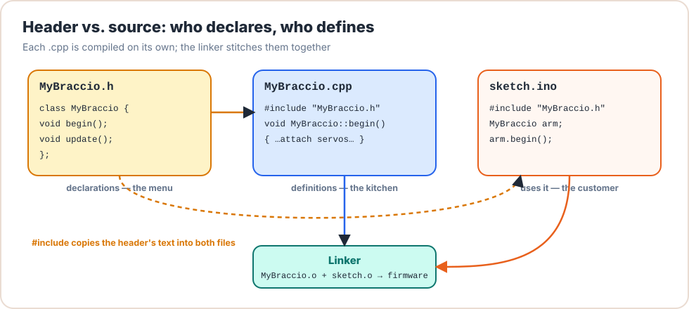

# Lesson 05: Header & Source Files

<div class="lesson-meta"><span>⏱ 75 min</span><span>🎯 Beginner → Intermediate</span><span>🧩 Prerequisite: Lesson 04</span></div>

!!! abstract "What you'll learn"
    - Why real projects are split into many files
    - What goes in a **header** (`.h`) and what goes in a **source** file (`.cpp`)
    - `#include "file.h"` vs `#include <file.h>`
    - Compiling several files with `g++` and reading **linker** errors
    - `extern` and the **One Definition Rule**
    - Using extra tabs in the Arduino IDE

---

## Why split code into files?

`BraccioV2` is about 330 lines. A real robot controller can be 30 000. Keeping everything in one file would be like
writing a whole book on one page. Splitting helps you:

- **Find things:** arm motions in one file, serial commands in another.
- **Reuse code:** the same `arm_moves` files can go into many sketches, and that's exactly what a library is.
- **Build faster:** only the files you changed get recompiled.
- **Hide details:** users read the short header, not the long implementation.

## The deal between `.h` and `.cpp`

<figure markdown>
{ .diagram }
<figcaption>The header is the <b>menu</b> (what you can order), the .cpp is the <b>kitchen</b> (how it's made), and the sketch is the <b>customer</b>.</figcaption>
</figure>

| File | Contains | Example |
|---|---|---|
| **Header** `.h` | *Declarations*: function prototypes, class definitions, constants, `extern` variables | `void openGripper();` |
| **Source** `.cpp` | *Definitions*: the function bodies, the actual variables | `void openGripper() { ... }` |
| **User** `.cpp` / `.ino` | `#include "header.h"`, then calls the functions | `openGripper();` |

### A complete desktop example

The three files below form one program. (In the course repository, they are separate files; here they're shown one after
another.)

```cpp title="joint_math.h + joint_math.cpp + main.cpp"
// FILE: joint_math.h
#ifndef JOINT_MATH_H
#define JOINT_MATH_H

const int SHOULDER_MIN = 15;
const int SHOULDER_MAX = 165;

int clampAngle(int angle, int minAngle, int maxAngle);
int travel(int from, int to);

#endif
// FILE: joint_math.cpp
#include "joint_math.h"

int clampAngle(int angle, int minAngle, int maxAngle) {
    if (angle < minAngle) return minAngle;
    if (angle > maxAngle) return maxAngle;
    return angle;
}

int travel(int from, int to) {
    return (to > from) ? to - from : from - to;
}
// FILE: main.cpp
#include <iostream>
#include "joint_math.h"

int main() {
    int target = clampAngle(200, SHOULDER_MIN, SHOULDER_MAX);
    std::cout << "target " << target << ", travel " << travel(90, target) << '\n';
    return 0;
}
```

Compile **both** `.cpp` files together (headers are never compiled on their own. They are only `#include`d):

```bash
g++ -std=c++17 -Wall main.cpp joint_math.cpp -o arm_math
./arm_math          # target 165, travel 75
```

Or compile each file separately and link them afterwards, which is what build systems (and the Arduino IDE) do:

```bash
g++ -c main.cpp        -o main.o          # compile only
g++ -c joint_math.cpp  -o joint_math.o    # compile only
g++ main.o joint_math.o -o arm_math       # link
```

!!! note "About `#ifndef JOINT_MATH_H`"
    Those three lines around the header are an **include guard**. The next lesson explains exactly why every header
    needs one.

---

## `#include "..."` vs `#include <...>`

| Form | Searches | Use for |
|---|---|---|
| `#include "arm_moves.h"` | the current folder first, then the system folders | **your own** files |
| `#include <Servo.h>` | the system / library folders only | standard and installed libraries |

---

## When linking goes wrong

Forget to compile `joint_math.cpp`:

```bash
g++ main.cpp -o arm_math
```

```text
/usr/bin/ld: main.o: in function `main':
main.cpp:(.text+0x1a): undefined reference to `clampAngle(int, int, int)'
collect2: error: ld returned 1 exit status
```

The **compiler** was happy, because the header *declared* `clampAngle`. The **linker** then looked for the *definition* and
couldn't find it. `ld` is the linker. Whenever you see `undefined reference`, ask yourself: *which `.cpp` file defines this,
and is it part of the build?*

The opposite error, `multiple definition of 'x'`, means the same thing was **defined** in two files. That usually
happens when you put a function body or a variable definition in a header that is included by two `.cpp` files.

### The One Definition Rule (ODR)

> Everything can be **declared** many times, but must be **defined exactly once** in the whole program.

| In a header, this is ✅ OK | In a header, this is ❌ a bug |
|---|---|
| `void wave(int times);` | `void wave(int times) { ... }` *(unless marked `inline`)* |
| `extern Braccio arm;` | `Braccio arm;` |
| `const int GRIPPER_OPEN = 10;` *(const globals are private to each file)* | `int moveCount = 0;` |
| `class Joint { ... };` *(class definitions are allowed)* | |

### `extern`: sharing one global variable

To use one global object (like our `arm`) from several files, **define** it in exactly one `.cpp`/`.ino`, and
**declare** it with `extern` in the header:

```cpp
// arm_moves.h
extern Braccio arm;     // declaration: "exists elsewhere"

// sketch.ino
Braccio arm;            // definition: the actual object, exactly once
```

---

## Tabs in the Arduino IDE

A sketch folder can contain extra `.h` and `.cpp` files. The IDE shows them as **tabs** and compiles them all together.
Click the **⋯** menu at the top right of the editor → **New Tab**, and name it `arm_moves.h`, then add another called
`arm_moves.cpp`.

```text
L05_multifile/
├── L05_multifile.ino    ← main sketch (must have the same name as the folder)
├── arm_moves.h          ← tab 2
└── arm_moves.cpp        ← tab 3
```

---

## :material-robot-industrial: Arm Lab: a three-file sketch

!!! arm "Arm Lab 05"
    Create the three tabs below and upload. The behaviour is the same as before, but `L05_multifile.ino` is now tiny.
    You've written your first **mini-library**.

=== "L05_multifile.ino"

    ```cpp
    --8<-- "examples/arm_labs/L05_multifile/L05_multifile.ino"
    ```

=== "arm_moves.h"

    ```cpp
    --8<-- "examples/arm_labs/L05_multifile/arm_moves.h"
    ```

=== "arm_moves.cpp"

    ```cpp
    --8<-- "examples/arm_labs/L05_multifile/arm_moves.cpp"
    ```

**Break it on purpose:**

1. Delete `Braccio arm;` from the `.ino`. Read the error: is it the compiler or the linker complaining?
2. Put it back, and also add `Braccio arm;` (without `extern`) to the header. What's the error now?
3. Rename `wave` in `arm_moves.cpp` to `waveHand` (but not in the header). Which step fails?

??? success "Answers"
    1. **Linker:** `undefined reference to 'arm'`. It was declared (`extern`) but never defined.
    2. **Linker:** `multiple definition of 'arm'` (or a compiler *redefinition* error in the `.ino`). The object is now defined in every file that includes the header.
    3. **Linker:** `undefined reference to 'wave(int)'`. The declaration promised `wave`, but no definition exists.

---

## Exercises

**1. Split it.** Take your solutions to Lesson 04's exercises (`isInRange`, `degToRad`, `moveTimeMs`) and split them into
`arm_utils.h`, `arm_utils.cpp` and `main.cpp`. Compile with one `g++` command.

**2. Where does it go?** For each line, say whether it belongs in the `.h`, the `.cpp`, or either:
(a) `int travel(int from, int to);` (b) `int travel(int from, int to) { ... }` (c) `const int ELBOW_PIN = 9;`
(d) `int totalMoves = 0;` (e) `extern int totalMoves;`

**3. Read BraccioV2.** Open `BraccioV2.h` and `BraccioV2.cpp` in this repository. Find one declaration and its matching
definition. How does the `.cpp` file show that `begin()` belongs to the `Braccio` class?

??? success "Solution 2"
    (a) `.h`: it's a declaration. (b) `.cpp`: it's a definition. (c) `.h`, because `const` globals may be defined in headers.
    (d) `.cpp`: it's a definition of a non-const variable. (e) `.h`: it's the matching declaration.

??? success "Solution 3"
    `BraccioV2.h` declares `void begin();` inside `class Braccio { ... };`. `BraccioV2.cpp` defines it as
    `void Braccio::begin() { ... }`. The `Braccio::` prefix (the *scope resolution operator*) says "the `begin`
    that belongs to class `Braccio`". You'll learn it properly in [Lesson 08](../Part2_OOP/lesson08_classes.md).

---

## Recap

- Headers **declare**, source files **define**, and users `#include` the header.
- Compile every `.cpp`, never the `.h`. The linker joins the object files.
- `undefined reference` = missing definition. `multiple definition` = defined twice. Remember the ODR.
- Share one global with `extern` in the header and a single definition in one source file.
- Arduino tabs are just extra files in the sketch folder.

## Further reading

- [LearnCpp: Programs with multiple code files](https://www.learncpp.com/cpp-tutorial/programs-with-multiple-code-files/)
- [LearnCpp: Header files](https://www.learncpp.com/cpp-tutorial/header-files/)
- [cppreference: Definitions and ODR](https://en.cppreference.com/w/cpp/language/definition)
