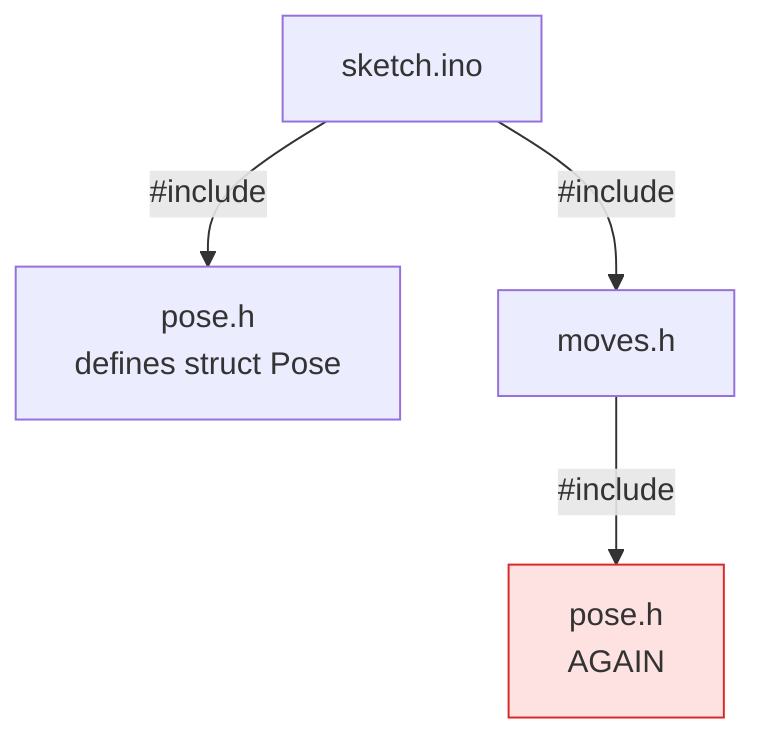
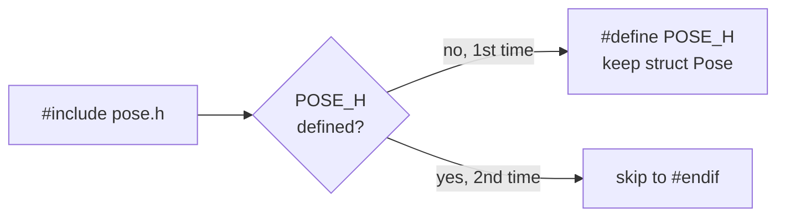

# Lesson 06: Include Guards

<div class="lesson-meta"><span>⏱ 45 min</span><span>🎯 Intermediate</span><span>🧩 Prerequisite: Lesson 05</span></div>

!!! abstract "What you'll learn"
    - Why including the same header twice breaks the build
    - The classic `#ifndef` / `#define` / `#endif` **include guard**
    - `#pragma once`, the modern shortcut
    - A first look at `struct`, a type that groups values (a whole arm **pose**!)
    - How BraccioV2 guards its own header

---

## The problem: double inclusion

`#include` is plain copy-and-paste. When header A includes header B, and your sketch includes **both**, B's text
gets pasted **twice**:



Declaring a function twice is harmless, but **defining** a type twice is an error. Let's see it happen. First, meet the
`struct`: a custom type that bundles several values under one name.

```cpp title="double_include.cpp (broken on purpose)"
// FILE: pose.h
struct Pose {                 // no include guard!
    int base, shoulder, elbow, wrist, wristRot, gripper;
};
// FILE: moves.h
#include "pose.h"
void printPose(Pose p);
// FILE: main.cpp
// compile error expected: pose.h ends up pasted twice
#include <iostream>
#include "pose.h"
#include "moves.h"            // pastes pose.h a second time

int main() {
    Pose home = {90, 90, 90, 90, 90, 50};
    std::cout << home.base << '\n';
    return 0;
}
```

```text
In file included from moves.h:1,
                 from main.cpp:4:
pose.h:1:8: error: redefinition of 'struct Pose'
pose.h:1:8: note: previous definition of 'struct Pose'
```

In a small program you could just delete one `#include`. In a project with dozens of headers that include each other,
you can't keep track. The header itself must protect against being pasted twice.

---

## The fix: an include guard

```cpp title="pose.h"
#ifndef POSE_H        // 1. "if POSE_H is NOT yet defined..."
#define POSE_H        // 2. "...define it now, and keep going"

struct Pose {
    int base, shoulder, elbow, wrist, wristRot, gripper;
};

#endif                // 3. end of the protected region
```

- **First time** the preprocessor sees it: `POSE_H` isn't defined, so it defines it and keeps the contents.
- **Second time**: `POSE_H` is already defined, so everything up to `#endif` is **skipped**.



The same program, now guarded, compiles fine:

```cpp title="guarded.cpp"
// FILE: pose.h
#ifndef POSE_H
#define POSE_H
struct Pose {
    int base, shoulder, elbow, wrist, wristRot, gripper;
};
#endif
// FILE: moves.h
#ifndef MOVES_H
#define MOVES_H
#include "pose.h"
int totalAngle(Pose p);
#endif
// FILE: moves.cpp
#include "moves.h"
int totalAngle(Pose p) {
    return p.base + p.shoulder + p.elbow + p.wrist + p.wristRot + p.gripper;
}
// FILE: main.cpp
#include <iostream>
#include "pose.h"
#include "moves.h"

int main() {
    Pose home = {90, 90, 90, 90, 90, 50};
    std::cout << "base " << home.base << ", sum " << totalAngle(home) << '\n';
    return 0;
}
```

### Naming the guard

The macro name must be **unique** in the whole project. Two headers using the same guard name would silently hide each
other. Convention: the file name in capitals, with `.` replaced by `_`, often with the project name in front:

| File | Guard |
|---|---|
| `pose.h` | `POSE_H` |
| `MyBraccio.h` | `MYBRACCIO_H` or `MY_BRACCIO_H_` |
| `BraccioV2.h` | `BRACCIOV2_H_` (that's what the real library uses) |

!!! warning "Names to avoid"
    Don't start guard names with an underscore followed by a capital letter (`_POSE_H`), or use double underscores
    (`__POSE_H`). Those names are reserved for the compiler and standard library.

---

## `#pragma once`

Almost every compiler (GCC, Clang, MSVC, and the Arduino toolchain) also accepts a one-line version:

```cpp
#pragma once

struct Pose { /* ... */ };
```

| | `#ifndef` guard | `#pragma once` |
|---|---|---|
| Part of the C++ standard | ✅ | ❌ (but universally supported) |
| Can't clash with another header's name | ❌ (you choose the name) | ✅ |
| Less typing | ❌ | ✅ |
| Used by Arduino libraries | most common | also common |

Either is fine. This course uses classic guards because you'll meet them in almost every Arduino library, including
BraccioV2. **What matters is that every header has one.**

---

## How BraccioV2 does it

```cpp title="BraccioV2.h (excerpt)"
#ifndef BRACCIOV2_H_
#define BRACCIOV2_H_

#include <Arduino.h>
#include <Servo.h>
...
class Braccio {
  ...
};

#endif
```

`Arduino.h` and `Servo.h` have their own guards too. So when your sketch includes `Servo.h` *and* `BraccioV2.h`, the
`Servo` class is still defined only once.

---

## A quick look at `struct`

`struct` lets you make your own type from several variables called **members**. You access members with a dot:

```cpp title="struct_demo.cpp"
#include <iostream>

struct Pose {
    int base;
    int shoulder;
    int elbow;
    int wrist;
    int wristRot;
    int gripper;
};

int main() {
    Pose park = {90, 45, 180, 180, 90, 10};   // initialise in order
    park.gripper = 30;                        // change one member
    Pose copy = park;                         // copies ALL members

    std::cout << "park gripper " << park.gripper << ", copy elbow " << copy.elbow << '\n';
    std::cout << "a Pose uses " << sizeof(Pose) << " bytes\n";   // 6 ints
    return 0;
}
```

A `Pose` is much easier to pass around than six separate numbers. In [Lesson 08](../Part2_OOP/lesson08_classes.md) you'll see
that a `struct` is almost the same thing as a `class`.

---

## :material-robot-industrial: Arm Lab: poses in a guarded header

!!! arm "Arm Lab 06"
    `pose.h` is included twice: once directly and once through `moves.h`. Thanks to the guards, it builds.
    Then **delete the three guard lines from `pose.h`** and click Verify to see the `redefinition` error for yourself.

=== "L06_guards.ino"

    ```cpp
    --8<-- "examples/arm_labs/L06_guards/L06_guards.ino"
    ```

=== "pose.h"

    ```cpp
    --8<-- "examples/arm_labs/L06_guards/pose.h"
    ```

=== "moves.h"

    ```cpp
    --8<-- "examples/arm_labs/L06_guards/moves.h"
    ```

=== "moves.cpp"

    ```cpp
    --8<-- "examples/arm_labs/L06_guards/moves.cpp"
    ```

---

## Exercises

**1. Guard it.** Add include guards to the `joint_math.h` and `arm_utils.h` headers from Lesson 05 (if you haven't already),
using the naming convention above.

**2. Spot the bug.** Two teammates wrote `servo_utils.h` and `sensor_utils.h`, and both used the guard `UTILS_H`.
What happens when a sketch includes both?

**3. New pose.** Add a `const Pose WAVE_UP` and `WAVE_DOWN` to `pose.h` and make the arm wave in `loop()` using
`moveToPose`.

??? success "Solution 2"
    The first header defines `UTILS_H`. When the second header is included, its guard sees that `UTILS_H` is already
    defined and **skips its entire contents**. You then get confusing errors like `'readSensor' was not declared`,
    even though the header is clearly included. This is why guard names should include the file name (and ideally
    the project name), or why you might prefer `#pragma once`.

??? success "Solution 3"
    ```cpp
    // pose.h (inside the guard)
    const Pose WAVE_UP   = {90, 90, 90, 120, 90, 50};
    const Pose WAVE_DOWN = {90, 90, 90, 60,  90, 50};

    // sketch
    void loop() {
      moveToPose(WAVE_UP, 600);
      moveToPose(WAVE_DOWN, 600);
    }
    ```

---

## Recap

- `#include` is copy-paste, so headers can end up pasted twice. Defining a type twice is an error.
- Wrap **every** header in `#ifndef NAME_H` / `#define NAME_H` / `#endif`, or use `#pragma once`.
- Guard names must be unique. Base them on the file name.
- `struct` groups related values. A `Pose` holds all six joint angles.

## Further reading

- [LearnCpp: Header guards](https://www.learncpp.com/cpp-tutorial/header-guards/)
- [cppreference: `#pragma once`](https://en.cppreference.com/w/cpp/preprocessor/impl)
- [LearnCpp: Structs](https://www.learncpp.com/cpp-tutorial/introduction-to-structs-members-and-member-selection/)
