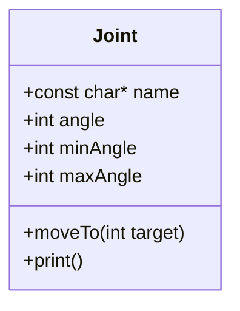
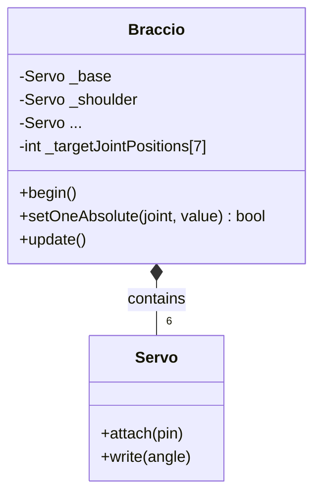

# Lesson 08: Classes & Objects

<div class="lesson-meta"><span>⏱ 90 min</span><span>🎯 Intermediate</span><span>🧩 Prerequisite: Part 1</span></div>

!!! abstract "What you'll learn"
    - The idea behind **object-oriented programming**: bundle data *and* behaviour together
    - Defining a `class`, creating **objects**, and using the dot operator
    - Member variables and member functions (**methods**)
    - Defining methods outside the class with `ClassName::`
    - `struct` vs `class`, and a first look at `public` / `private`
    - How BraccioV2 is organised as one big class

---

## From loose variables to objects

Describing one joint with loose variables gets messy fast:

```cpp
int shoulderAngle = 90;
int shoulderMin = 15;
int shoulderMax = 165;
int shoulderPin = 10;
// ...and again for base, elbow, wrist, wrist rotation, gripper: 24 variables!
```

The data belongs together, and so do the actions (move, clamp, print). A **class** is a blueprint that bundles both:



An **object** is one real thing built from the blueprint. `Joint` is the blueprint; `shoulder` and `elbow` are two
objects, each with its **own** copy of the data.

<div class="grid cards" markdown>

-   **Class** = blueprint / cookie cutter

    Written once. Describes what every joint *has* and *can do*.

-   **Object** = a thing built from it / a cookie

    `Joint shoulder;` `Joint elbow;`. Each has its own `angle`.

</div>

---

## Your first class

```cpp title="joint_class.cpp"
#include <iostream>

class Joint {
public:                                   // (1)!
    // Member variables: the data every Joint has
    const char* name = "joint";
    int angle = 90;
    int minAngle = 0;
    int maxAngle = 180;

    // Member function (method): something every Joint can do
    void moveTo(int target) {
        if (target < minAngle) target = minAngle;
        if (target > maxAngle) target = maxAngle;
        angle = target;                    // (2)!
    }

    void print() {
        std::cout << name << " at " << angle << " deg"
                  << " [" << minAngle << ".." << maxAngle << "]\n";
    }
};                                        // (3)!

int main() {
    Joint shoulder;                       // (4)!
    shoulder.name = "shoulder";
    shoulder.minAngle = 15;
    shoulder.maxAngle = 165;

    Joint gripper;
    gripper.name = "gripper";
    gripper.minAngle = 10;
    gripper.maxAngle = 73;

    shoulder.moveTo(200);                 // (5)!
    gripper.moveTo(40);

    shoulder.print();
    gripper.print();
    return 0;
}
```

1. `public:` means code outside the class may use the members below. More on this in a moment.
2. Inside a method, `angle` means **this object's** `angle`. When you call `shoulder.moveTo(...)`, it changes the shoulder's angle and no other joint's.
3. A class definition ends with `};`. Forgetting that semicolon gives very confusing errors.
4. Creates an object called `shoulder`. Members start with their default values (`angle = 90`, …).
5. The **dot operator** calls a method on a particular object.

Output:

```text
shoulder at 165 deg [15..165]
gripper at 40 deg [10..73]
```

---

## Methods defined outside the class

For long methods, and always in libraries, the class lists the method's **declaration**, and the definition is written
outside using the **scope resolution operator** `::`

```cpp title="outside_definition.cpp"
#include <iostream>

class Joint {
public:
    int angle = 90;
    void nudge(int degrees);   // declaration only
    void print();
};

// "the nudge that belongs to Joint"
void Joint::nudge(int degrees) {
    angle += degrees;
}

void Joint::print() {
    std::cout << "angle = " << angle << '\n';
}

int main() {
    Joint elbow;
    elbow.nudge(15);
    elbow.nudge(-5);
    elbow.print();   // angle = 100
    return 0;
}
```

That's exactly the pattern you saw in `BraccioV2.cpp` in Lesson 05:

```cpp
void Braccio::begin() {          // the begin() that belongs to class Braccio
  _initializeServos(true);
}
```

In a library, the class goes in the **header** (`.h`) and the `Class::method` definitions go in the **source** (`.cpp`).

---

## `this`: the object a method was called on

Inside a method, the keyword `this` is a pointer to the object the method was called on (pointers come in
[Lesson 12](../Part3_Memory/lesson12_pointers.md)). You rarely need it, but it helps when a parameter has the same name as a member:

```cpp
void Joint::setAngle(int angle) {
    this->angle = angle;   // member angle = parameter angle
}
```

---

## `struct` vs `class`

In C++ they're almost identical. The **only** difference is the default access:

| | members are by default | conventionally used for |
|---|---|---|
| `struct` | `public` | plain bundles of data, like `Pose` in Lesson 06 |
| `class` | `private` | objects with behaviour and rules to protect |

```cpp title="default_access.cpp"
#include <iostream>

struct PoseS { int base = 90; };   // public by default
class  PoseC { int base = 90; };   // private by default

int main() {
    PoseS a;
    PoseC b;
    std::cout << a.base << '\n';   // fine
    std::cout << b.base << '\n';   // compile error: 'base' is private
    return 0;
}
```

`private` members can only be used by the class's own methods. That's how a class **protects its rules**, and it's the
topic of [Lesson 10](lesson10_encapsulation.md). In this lesson we keep everything `public` so we can experiment.

---

## BraccioV2 is one class

Open `BraccioV2.h`. The whole library is one class:

```cpp title="BraccioV2.h (simplified)"
class Braccio {
  public:
    Braccio();                                 // constructor (Lesson 09)
    void begin();
    bool setOneAbsolute(int joint, int value);
    void update();
    void safeDelay(int ms);
    // ...
  private:
    Servo _base, _shoulder, _elbow, _wrist_rot, _wrist, _gripper;   // six Servo objects!
    int _jointMax[7];
    int _currentJointPositions[7];
    int _targetJointPositions[7];
    // ...
};
```

And in your sketch, `Braccio arm;` creates **one object** of that class. Every `arm.something()` you've written so far was
a method call on that object.

Notice that the `Braccio` class *contains* six `Servo` objects. Building bigger objects out of smaller ones is called
**composition**, and it's how you build a robot in software: an arm *has* joints; a joint *has* a servo.



---

## :material-robot-industrial: Arm Lab: a `Gripper` class

!!! arm "Arm Lab 08"
    The `Gripper` class remembers whether it's open or closed and counts how many times it has grabbed. `hand.toggle()`
    decides by itself whether to open or close.

```cpp title="L08_gripper_class.ino"
--8<-- "examples/arm_labs/L08_gripper_class/L08_gripper_class.ino"
```

**Try this:**

1. Add a method `void grabFor(unsigned long ms)` that closes, waits `ms` milliseconds, then opens.
2. Add a member `int softAngle = 45;` and a method `holdSoft()` for fragile objects.
3. Create a **second** `Gripper` object called `test`, and change its `closedAngle` without touching `hand`. Print both.
   (It won't drive a second gripper, since there's only one, but each object keeps its own data.)

---

## Common mistakes

| Mistake | Symptom |
|---|---|
| Missing `;` after the class's closing `}` | Errors on the *next* line, such as `expected ';' after class definition` |
| Calling a method without an object: `open();` | `'open' was not declared in this scope` |
| Using `Joint.moveTo(90)` (the class name) | `expected unqualified-id`. Call methods on an **object**: `shoulder.moveTo(90)` |
| Forgetting `Joint::` when defining outside | The compiler thinks it's a free function and can't see the members |
| Accessing a `private` member from outside | `'x' is private within this context` |

---

## Exercises

**1. `LedIndicator`.** Write a class with a `bool on` member and methods `turnOn()`, `turnOff()`, `toggle()` and `print()`.

**2. `Pose` with methods.** Turn Lesson 06's `struct Pose` into a struct with a method `int totalTravel(Pose other)` that
returns the sum of the absolute differences of all six joint angles between two poses.

**3. Two joints.** Using the `Joint` class above, create `base` and `elbow`, move them to 30 and 150, then write a free
function `int widestSpread(Joint a, Joint b)` that returns the difference between their angles.

??? success "Solution 1"
    ```cpp
    #include <iostream>

    class LedIndicator {
    public:
        bool on = false;
        void turnOn()  { on = true; }
        void turnOff() { on = false; }
        void toggle()  { on = !on; }
        void print()   { std::cout << (on ? "ON" : "OFF") << '\n'; }
    };

    int main() {
        LedIndicator status;
        status.toggle();
        status.print();   // ON
        status.toggle();
        status.print();   // OFF
        return 0;
    }
    ```

??? success "Solution 2"
    ```cpp
    #include <iostream>

    struct Pose {
        int base, shoulder, elbow, wrist, wristRot, gripper;

        int totalTravel(Pose other) {
            return diff(base, other.base) + diff(shoulder, other.shoulder) + diff(elbow, other.elbow)
                 + diff(wrist, other.wrist) + diff(wristRot, other.wristRot) + diff(gripper, other.gripper);
        }

        static int diff(int a, int b) { return a > b ? a - b : b - a; }   // helper; 'static' explained in Lesson 11
    };

    int main() {
        Pose home = {90, 90, 90, 90, 90, 50};
        Pose park = {90, 45, 180, 180, 90, 10};
        std::cout << "home -> park travel: " << home.totalTravel(park) << " deg\n";   // 0+45+90+90+0+40 = 265
        return 0;
    }
    ```

??? success "Solution 3"
    ```cpp
    #include <iostream>

    class Joint {
    public:
        const char* name = "joint";
        int angle = 90;
        int minAngle = 0;
        int maxAngle = 180;
        void moveTo(int target) {
            if (target < minAngle) target = minAngle;
            if (target > maxAngle) target = maxAngle;
            angle = target;
        }
    };

    int widestSpread(Joint a, Joint b) {
        return a.angle > b.angle ? a.angle - b.angle : b.angle - a.angle;
    }

    int main() {
        Joint base, elbow;
        base.moveTo(30);
        elbow.moveTo(150);
        std::cout << "spread = " << widestSpread(base, elbow) << '\n';   // 120
        return 0;
    }
    ```
    `a` and `b` are **copies** of the objects (pass-by-value). That's fine here, but in
    [Lesson 13](../Part3_Memory/lesson13_references.md) you'll learn to pass objects by `const&` instead.

---

## Recap

- A **class** bundles data (member variables) and behaviour (methods). An **object** is one instance of it.
- Use the dot operator: `object.member`, `object.method()`.
- Define long methods outside the class with `ClassName::method`, class in the `.h`, definitions in the `.cpp`.
- `struct` defaults to `public`, `class` to `private`.
- BraccioV2 is a single class that *contains* six `Servo` objects (composition).

## Further reading

- [LearnCpp: Introduction to object-oriented programming](https://www.learncpp.com/cpp-tutorial/introduction-to-object-oriented-programming/)
- [LearnCpp: Classes and class members](https://www.learncpp.com/cpp-tutorial/introduction-to-classes/)
- [Arduino: Writing a library (the Morse example)](https://docs.arduino.cc/learn/contributions/arduino-creating-library-guide/)
