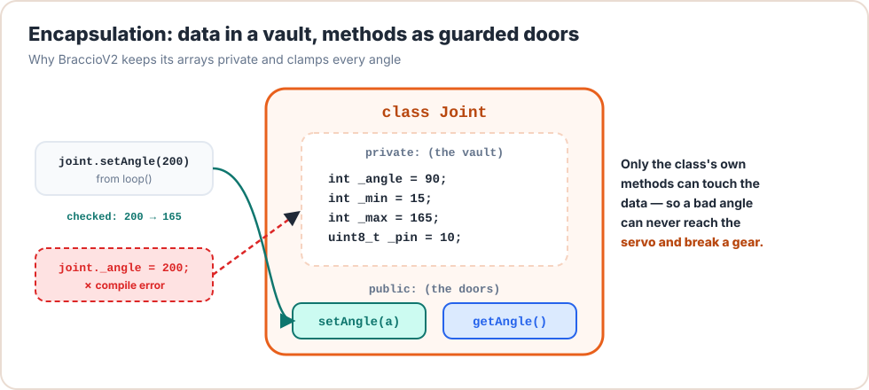

# Lesson 10: Encapsulation & Safety Limits

<div class="lesson-meta"><span>⏱ 75 min</span><span>🎯 Intermediate</span><span>🧩 Prerequisite: Lesson 09</span></div>

!!! abstract "What you'll learn"
    - **Encapsulation**: hide the data, expose safe operations
    - `public`, `private` and `protected`
    - **Invariants**: rules that must *always* be true for an object
    - Getters and setters that validate, and clamping vs rejecting
    - Reviewing BraccioV2's public API: what it protects, and what it doesn't
    - Building a `SafetyGuard` that stops the arm from hitting the table

---

## Why hide data?

Suppose `Joint` has a public `angle` member. Anyone, anywhere, can write:

```cpp
shoulder.angle = 250;   // physically impossible: the servo strains and gears strip
```

The class had a perfectly good `moveTo()` that clamps, but nothing *forced* anyone to use it. **Encapsulation** fixes that:
make the data `private` and offer only methods that keep it valid.

<figure markdown>
{ .diagram }
<figcaption>Private data is only reachable through public methods, and those methods enforce the rules.</figcaption>
</figure>

| Access | Who can use it |
|---|---|
| `public` | everyone |
| `private` | only the class's own methods (and `friend`s) |
| `protected` | the class and classes derived from it (inheritance, beyond this course) |

---

## Invariants: rules that are always true

An **invariant** is a statement about an object that must hold after *every* public method call. For a joint:

1. `min <= angle <= max`
2. `min <= max`
3. `0 <= min` and `max <= 180`

If every way of changing the object preserves these rules, the rules can never be broken. That's the promise
encapsulation gives you.

```cpp title="safe_joint.cpp"
#include <iostream>

class SafeJoint {
public:
    SafeJoint(int minA, int maxA, int home)
        : _min(clampTo(minA, 0, 180)), _max(clampTo(maxA, 0, 180)), _angle(0) {
        if (_min > _max) {                  // invariant 2
            int t = _min; _min = _max; _max = t;
        }
        _angle = clampTo(home, _min, _max); // invariant 1
    }

    // Setter that CLAMPS. Returns true if the value was used unchanged.
    bool setAngle(int a) {
        _angle = clampTo(a, _min, _max);
        return _angle == a;
    }

    // Setter that REJECTS. Changes nothing if the value is invalid.
    bool setLimits(int minA, int maxA) {
        if (minA < 0 || maxA > 180 || minA > maxA) {
            return false;                   // refuse: object unchanged
        }
        _min = minA;
        _max = maxA;
        _angle = clampTo(_angle, _min, _max);   // keep invariant 1 after the change!
        return true;
    }

    // Getters: read-only access
    int angle() const { return _angle; }
    int minAngle() const { return _min; }
    int maxAngle() const { return _max; }

private:
    static int clampTo(int v, int lo, int hi) { return v < lo ? lo : (v > hi ? hi : v); }

    int _min;
    int _max;
    int _angle;
};

int main() {
    SafeJoint shoulder(15, 165, 90);

    bool exact = shoulder.setAngle(250);
    std::cout << "asked 250 -> " << shoulder.angle() << (exact ? "" : " (clamped)") << '\n';

    bool ok = shoulder.setLimits(100, 50);          // invalid: min > max
    std::cout << "setLimits(100, 50) " << (ok ? "accepted" : "rejected") << '\n';

    shoulder.setLimits(30, 120);                     // valid, and angle 165 must follow
    std::cout << "after new limits, angle = " << shoulder.angle()
              << " [" << shoulder.minAngle() << ".." << shoulder.maxAngle() << "]\n";

    // shoulder._angle = 250;   // would not compile: '_angle' is private
    return 0;
}
```

Output:

```text
asked 250 -> 165 (clamped)
setLimits(100, 50) rejected
after new limits, angle = 120 [30..120]
```

### Clamp or reject?

| Strategy | Example | Good when |
|---|---|---|
| **Clamp** to the nearest valid value | angle 250 → 165 | the intent is clear ("go as far as you can") |
| **Reject** and leave the object unchanged | limits 100..50 → refused | there's no sensible nearest value |
| **Report** either way with a `bool` return | `return _angle == a;` | the caller may want to know (and log it) |

BraccioV2 clamps and *tries* to report: `setOneAbsolute` returns `false` when it had to clamp. (It has a bug in exactly
that return value. Can you find it before [Lesson 18](../Part4_Arduino_Libraries/lesson18_bracciov2_deep_dive.md#bug-hunt)?)

---

## Getters and setters: not for everything

Beginners sometimes write a getter **and** a setter for every private member. That's just a public variable with extra
steps. Ask instead: *what operations make sense for this object?*

| ❌ Mechanical | ✅ Meaningful |
|---|---|
| `setAngle()`, `getAngle()`, `setTarget()`, `getTarget()`, `setDelta()`… | `moveTo(angle)`, `nudge(degrees)`, `isMoving()`, `angle()` |

Offer a setter only when changing that value from outside is a real operation, and give it validation.

---

## Reviewing BraccioV2's encapsulation

```cpp title="BraccioV2.h (excerpt)"
class Braccio {
  public:
    bool setOneAbsolute(int joint, int value);   // clamps to limits ✅
    void setJointMax(int joint, int value);      // clamps to 0..180 ✅, but doesn't check max > min ⚠️
    void setDelta(int joint, int value);         // no validation at all ⚠️
    void setAllNow(int b, int s, int e, int w, int w_r, int g);   // "Does not constrain values" ❌
    ...
  private:
    int _jointMax[7] = {180, 165, 180, 180, 180, 73};   // hidden: you can't write 250 here ✅
    int _currentJointPositions[7];
    ...
};
```

| Method | What goes wrong with bad input |
|---|---|
| `setOneAbsolute(ELBOW, 999)` | Nothing. It's clamped to 180. 👍 |
| `setOneAbsolute(9, 90)` | **Joint index 9 isn't checked.** It writes outside the arrays (memory corruption, [Lesson 15](../Part3_Memory/lesson15_arrays.md)). |
| `setDelta(BASE_ROT, 0)` | The joint never moves again, silently. |
| `setDelta(BASE_ROT, -1)` | The joint moves *away* from its target forever… past its limits. |
| `setAllNow(90, 0, 90, 90, 90, 180)` | Writes 0 to the shoulder and 180 to the gripper **without clamping**. |

The private arrays are protected well, but some public doors are left unlocked. In `MyBraccio`
([Lesson 19](../Part4_Arduino_Libraries/lesson19_coding_mybraccio.md)) you'll lock every one of them.

---

## :material-robot-industrial: Arm Lab: a SafetyGuard

!!! arm "Arm Lab 10"
    The `SafetyGuard` owns a private rule: *don't lower the shoulder and elbow at the same time* (the gripper would dig
    into the table). Its statistics can be read but never reset from outside. Watch the Serial Monitor: some poses are
    rejected, and the arm doesn't move for them.

```cpp title="L10_safety_guard.ino"
--8<-- "examples/arm_labs/L10_safety_guard/L10_safety_guard.ino"
```

!!! warning "Tune the rule for your arm"
    The table-zone numbers depend on your arm's calibration and directions (Lesson 00). Test new rules in
    `DRY_RUN` mode (Lesson 07) or with the arm lifted clear of the table first.

**Try this:**

1. Uncomment `guard._rejected = 0;` and read the error.
2. Add a rule that rejects any gripper value above 65 while the base is moving more than 60° away from its current pose.
   *(Hint: you'll need to remember the last accepted base angle in a private member.)*
3. Add a public `void resetStats()`. Is that a good idea? Who should be allowed to call it?

---

## Common mistakes

| Mistake | Why it hurts |
|---|---|
| Making data `public` "just for now" | Code everywhere starts depending on it; you can never add validation later |
| A setter that validates, but a constructor that doesn't | The object can be born invalid |
| Changing limits without re-clamping the current value | Invariant broken: angle 165 with max 120 |
| Returning a non-const reference to private data (`int& angle()`) | Callers can write through it. The door is open again. |

---

## Exercises

**1. Gripper with invariants.** Write `class SafeGripper` with private `_angle`, `_openAngle = 10`, `_closedAngle = 73`,
methods `open()`, `close()`, `setGrip(int percent)` (0 % = open, 100 % = closed, clamped), and `bool isClosed() const`.

**2. Speed limit.** Add a private `_maxStep` to `SafeJoint` and a method `int stepToward(int target)` that moves `_angle`
at most `_maxStep` degrees toward `target` (never overshooting) and returns the new angle. Test from 90 toward 100 with
`_maxStep = 3`: you should see 93, 96, 99, 100.

**3. Audit.** List three more ways a user could put BraccioV2 in a bad state through its public API. For each, say how you
would validate it.

??? success "Solution 1"
    ```cpp
    #include <iostream>

    class SafeGripper {
    public:
        void open()  { _angle = _openAngle; }
        void close() { _angle = _closedAngle; }
        void setGrip(int percent) {
            if (percent < 0) percent = 0;
            if (percent > 100) percent = 100;
            _angle = _openAngle + (_closedAngle - _openAngle) * percent / 100;
        }
        bool isClosed() const { return _angle >= _closedAngle - 5; }
        int angle() const { return _angle; }
    private:
        int _angle = 10;
        const int _openAngle = 10;
        const int _closedAngle = 73;
    };

    int main() {
        SafeGripper g;
        g.setGrip(50);
        std::cout << g.angle() << ' ' << g.isClosed() << '\n';   // 41 0
        g.setGrip(150);
        std::cout << g.angle() << ' ' << g.isClosed() << '\n';   // 73 1
        return 0;
    }
    ```

??? success "Solution 2"
    ```cpp
    #include <iostream>

    class SafeJoint {
    public:
        SafeJoint(int angle, int maxStep) : _angle(angle), _maxStep(maxStep > 0 ? maxStep : 1) {}
        int stepToward(int target) {
            int diff = target - _angle;
            if (diff > _maxStep)  diff = _maxStep;
            if (diff < -_maxStep) diff = -_maxStep;
            _angle += diff;            // never overshoots: |diff| <= remaining distance
            return _angle;
        }
    private:
        int _angle;
        int _maxStep;
    };

    int main() {
        SafeJoint j(90, 3);
        for (int i = 0; i < 5; i++) std::cout << j.stepToward(100) << ' ';   // 93 96 99 100 100
        std::cout << '\n';
        return 0;
    }
    ```
    Notice the constructor also guards the invariant `_maxStep > 0`, which fixes the `setDelta(…, 0)` problem.

??? success "Solution 3 (examples)"
    - `setJointMin(SHOULDER, 170)` while max is 165 → min > max. **Validate:** reject if `value > _jointMax[joint]`.
    - `setJointCenter(GRIPPER, 120)`: the centre is outside the gripper's limits. **Validate:** clamp the centre to `[min, max]`.
    - Any method with `joint = -1` or `joint >= 6` → out-of-bounds array access. **Validate:** `if (joint < 0 || joint >= 6) return false;`
    - Calling `update()` before `begin()`: the servos aren't attached and the current positions are uninitialised.
      **Validate:** keep a private `bool _started` and ignore calls until `begin()` has run.

---

## Recap

- **Encapsulation** = private data + public operations that keep it valid.
- Write down your class's **invariants** and make sure every public method, *including constructors*, preserves them.
- Choose clamp, reject or report deliberately, and return a `bool` so callers can react.
- Offer meaningful operations, not a getter and setter for everything.
- BraccioV2 protects its arrays but leaves some doors open (`setDelta`, `setAllNow`, joint indexes).

## Further reading

- [LearnCpp: Access specifiers](https://www.learncpp.com/cpp-tutorial/public-and-private-members-and-access-specifiers/)
- [LearnCpp: The benefits of data hiding](https://www.learncpp.com/cpp-tutorial/the-benefits-of-data-hiding-encapsulation/)
- [C++ Core Guidelines: C.2 Use class if the class has an invariant](https://isocpp.github.io/CppCoreGuidelines/CppCoreGuidelines#Rc-struct)
