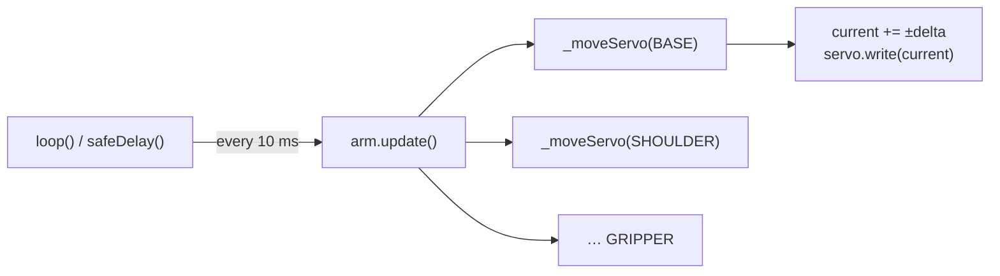

# Lesson 11: Methods, `const` & Overloading

<div class="lesson-meta"><span>⏱ 90 min</span><span>🎯 Intermediate</span><span>🧩 Prerequisite: Lesson 10</span></div>

!!! abstract "What you'll learn"
    - `const` methods: promising not to change the object, and why the compiler enforces it
    - Overloaded methods (like BraccioV2's two `begin()`s)
    - `static` members and methods that belong to the **class**, not to one object
    - Private helper methods and `inline` definitions in headers
    - Operator overloading, briefly
    - Building your own **smooth-motion engine** with ease-out

---

## `const` methods

Some methods only *read* an object (`angle()`, `isMoving()`, `print()`). Mark them `const` by putting the word **after** the
parameter list:

```cpp
int angle() const { return _current; }
```

This is a promise the compiler checks: inside a `const` method, trying to change a member is an error.

```cpp title="const_method.cpp"
#include <iostream>

class Joint {
public:
    explicit Joint(int a) : _angle(a) {}
    int angle() const { return _angle; }        // read-only: OK
    void nudge(int d) { _angle += d; }          // modifies: not const
    // int bad() const { return ++_angle; }     // would NOT compile: modifies a member in a const method
private:
    int _angle;
};

void printJoint(const Joint& j) {               // j is read-only here (the & is Lesson 13)
    std::cout << "angle " << j.angle() << '\n'; // OK: angle() is const
    // j.nudge(5);                              // would NOT compile: nudge() isn't const
}

int main() {
    Joint elbow(90);
    elbow.nudge(10);
    printJoint(elbow);                          // angle 100

    const Joint fixedWrist(45);                 // a const object...
    std::cout << fixedWrist.angle() << '\n';    // ...can only call const methods
    return 0;
}
```

!!! tip "Why bother?"
    1. **Documentation:** readers know `angle()` can't have side effects.
    2. **Usability:** `const` objects, and objects passed as `const&`, which is very common, can *only* call `const`
       methods. If you forget `const` on a getter, other people can't use your class in `const` code.

    **Rule of thumb:** if a method doesn't change the object, mark it `const`. Always.

---

## Overloaded methods

Methods can be overloaded exactly like free functions ([Lesson 04](../Part1_Cpp_Basics/lesson04_functions.md)). BraccioV2 uses this:

```cpp title="BraccioV2.cpp"
void Braccio::begin() {
  _initializeServos(true);          // no argument: stand upright
}
void Braccio::begin(bool defaultPos) {
  _initializeServos(defaultPos);    // let the caller decide
}
```

Both overloads delegate to one **private helper** (`_initializeServos`), so the real logic lives in one place. That's a
good pattern: overloads should be thin wrappers.

---

## `static` members: shared by the whole class

Normal members belong to **each object**: every joint has its own `_angle`. A `static` member belongs to the **class**.
There's exactly one copy, shared by all objects:

```cpp title="static_members.cpp"
#include <iostream>

class Joint {
public:
    Joint() { _count++; }
    static int count() { return _count; }            // static method: no object needed
    static int clamp(int a, int lo, int hi) {        // a utility that uses no member data
        return a < lo ? lo : (a > hi ? hi : a);
    }
private:
    static int _count;                               // declaration
};

int Joint::_count = 0;                               // definition: exactly once, in a .cpp

int main() {
    std::cout << "before: " << Joint::count() << '\n';   // 0: called on the class itself
    Joint a, b, c;
    std::cout << "after:  " << Joint::count() << '\n';   // 3
    std::cout << Joint::clamp(200, 15, 165) << '\n';     // 165
    return 0;
}
```

- A static method has no `this`, so it can't use normal (non-static) members.
- Call it with `ClassName::method()`.
- Good uses: counters, shared configuration, and utility functions that belong conceptually to the class.

---

## Private helpers and inline methods

A method defined **inside** the class body is implicitly `inline`. That's fine for one-liners (getters) and allowed in
headers. Longer methods go in the `.cpp` file.

Private helper methods break big public methods into readable pieces. BraccioV2's private helpers:

| Private helper | Used by |
|---|---|
| `_initializeServos(bool)` | both `begin()` overloads |
| `_setServo(joint, value, updateTarget)` | `setAllNow()`, `_moveServo()` |
| `_moveServo(joint)` | `update()` (called once for each of the 6 joints) |
| `_softStart()`, `_softwarePWM()` | `_initializeServos()` |

The leading underscore is BraccioV2's naming convention for "internal, don't call this". The `private:` keyword is what
actually enforces it.

---

## Operator overloading (a taste)

You can define what operators like `==` or `+` mean for your own types. For example, comparing two poses:

```cpp title="operator_eq.cpp"
#include <iostream>

struct Pose {
    int base, shoulder, elbow, wrist, wristRot, gripper;

    bool operator==(const Pose& o) const {
        return base == o.base && shoulder == o.shoulder && elbow == o.elbow &&
               wrist == o.wrist && wristRot == o.wristRot && gripper == o.gripper;
    }
    bool operator!=(const Pose& o) const { return !(*this == o); }
};

int main() {
    Pose home = {90, 90, 90, 90, 90, 50};
    Pose now  = {90, 90, 91, 90, 90, 50};
    std::cout << (home == now ? "at home" : "not home yet") << '\n';
    return 0;
}
```

Use operator overloading only when the meaning is obvious. `pose1 == pose2` is clear; `arm + 5` is not.

---

## Designing an `update()` method

Robots are usually programmed as a loop of small steps: **read → decide → act**, many times a second. An object that
moves over time therefore needs an `update()` method that advances it by **one small step** and returns quickly.
BraccioV2's `update()` works exactly like that:



BraccioV2 moves at a **constant speed** (`delta` degrees per update). That means the joint starts and stops abruptly. Real
robots use **easing**: fast in the middle, gentle at the end. A simple ease-out: each update, move a fraction of the
**remaining** distance.

```cpp title="ease_out.cpp"
#include <iostream>

int main() {
    int current = 30;
    const int target = 150;
    std::cout << "constant (delta 10): ";
    for (int c = current; c != target; c += 10) std::cout << c << ' ';
    std::cout << target << '\n';

    std::cout << "ease-out (1/6 of remaining): ";
    while (current != target) {
        int remaining = target - current;
        int step = remaining / 6;
        if (step == 0) step = (remaining > 0) ? 1 : -1;
        current += step;
        std::cout << current << ' ';
    }
    std::cout << '\n';
    return 0;
}
```

The ease-out version takes big steps at first (20, 16, 14…) and then tiny ones near the target. The motion looks
smoother and puts less stress on the gears when it stops.

---

## :material-robot-industrial: Arm Lab: your own motion engine

!!! arm "Arm Lab 11"
    Six `SmoothJoint` objects hold their own current/target angles and limits. `updateAll()` steps them all and sends the
    result to the arm with `setAllNow()`. We're now using BraccioV2 only as a "servo driver"; the motion logic is **yours**.
    Compare the motion with Lesson 00: it should feel noticeably smoother when stopping.

```cpp title="L11_smooth_motion.ino"
--8<-- "examples/arm_labs/L11_smooth_motion/L11_smooth_motion.ino"
```

!!! warning "Why `setAllNow` is OK here, and not in general"
    `setAllNow` doesn't clamp (Lesson 10). It's safe here **only** because every value comes from a `SmoothJoint`, whose
    invariant guarantees it's within limits. Encapsulation is what makes the unsafe call safe.

**Try this:**

1. Change `remaining / 6` to `remaining / 3`, and then `/ 12`. How does the motion change?
2. Add a `const` method `int remaining() const` and print the elbow's remaining distance each step.
3. `waitUntilArrived()` blocks. Rewrite `loop()` so it calls `updateAll()` once per pass and starts the next move only
   when `!anyMoving()`. (You'll need a global `int stage` variable.)

---

## Common mistakes

| Mistake | Symptom |
|---|---|
| Getter not marked `const` | `passing 'const Joint' as 'this' argument discards qualifiers` when used on a `const` object |
| Declaring a `static` member but never defining it | Linker error: `undefined reference to 'Joint::_count'` |
| Using a non-static member inside a static method | `invalid use of member '_angle' in static member function` |
| `const` in the wrong place: `const int angle()` | That makes the *return value* const, not the method |

---

## Exercises

**1. Const audit.** Which of these methods should be `const`? `moveTo(int)`, `angle()`, `isMoving()`, `update()`,
`print()`, `distanceTo(int target)`, `reset()`.

**2. Static limit.** Give `SmoothJoint` a `static int globalSpeedDivisor` shared by all joints, and a static method
`setSpeed(int)` that validates it (1–20). Use it instead of the hard-coded `6`.

**3. `Pose` operators.** Add `Pose operator+(const Pose& o) const` that adds two poses joint by joint, and
`Pose operator*(int k) const`. Is `home * 2` a meaningful operation for a robot? Discuss.

??? success "Solution 1"
    `const`: `angle()`, `isMoving()`, `print()`, `distanceTo()`. They only read.
    Not `const`: `moveTo()`, `update()`, `reset()`. They change the object.

??? success "Solution 2"
    ```cpp
    #include <iostream>

    class SmoothJoint {
    public:
        explicit SmoothJoint(int a) : _current(a), _target(a) {}
        static bool setSpeed(int divisor) {
            if (divisor < 1 || divisor > 20) return false;
            _divisor = divisor;
            return true;
        }
        void moveTo(int t) { _target = t; }
        void update() {
            int r = _target - _current;
            int step = r / _divisor;
            if (step == 0 && r != 0) step = r > 0 ? 1 : -1;
            _current += step;
        }
        int angle() const { return _current; }
    private:
        static int _divisor;
        int _current, _target;
    };

    int SmoothJoint::_divisor = 6;

    int main() {
        SmoothJoint::setSpeed(3);           // affects ALL joints
        SmoothJoint base(0);
        base.moveTo(90);
        for (int i = 0; i < 5; i++) { base.update(); std::cout << base.angle() << ' '; }
        std::cout << '\n';                  // 30 50 63 72 78
        return 0;
    }
    ```

??? success "Solution 3 (discussion)"
    `+` can be meaningful for **offsets**: `currentPose + Pose{10, 0, 0, 0, 0, 0}` turns the base by 10°. But `home * 2`
    gives angles like 180 for every joint and 100 for the gripper, which is not a meaningful pose. When an operator's meaning isn't
    obvious, a named method (`scaledOffset(…)`) is clearer.

---

## Recap

- Mark every method that doesn't modify the object as **`const`**. `const` objects and `const&` parameters need it.
- Overloads should be thin wrappers around one private implementation.
- `static` members/methods belong to the class: one shared copy, called as `Class::name`.
- Private helpers keep public methods short. Overload operators only when the meaning is obvious.
- Motion is a series of small `update()` steps. Easing makes it smoother than constant speed.

🎉 **You've finished Part 2!** Try the [Part 2 workbook](../Exercises/exercises_solutions.md#part-2-classes), then
[Project P1 · Arm Simulator](../Projects/project01_robot.md) if you'd like to build something bigger now.

## Further reading

- [LearnCpp: Const class objects and member functions](https://www.learncpp.com/cpp-tutorial/const-class-objects-and-const-member-functions/)
- [LearnCpp: Static member variables](https://www.learncpp.com/cpp-tutorial/static-member-variables/)
- [easings.net: visual guide to easing curves](https://easings.net/)
