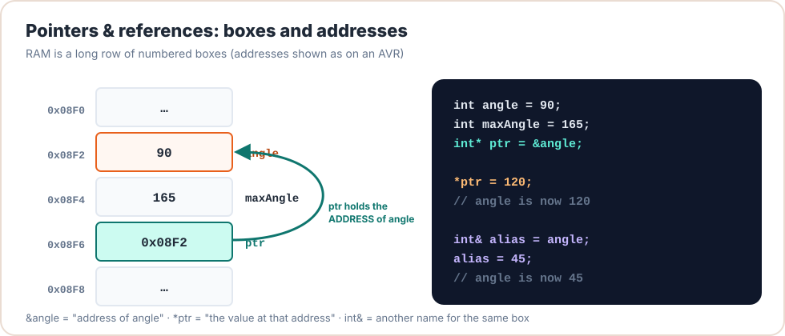

# Lesson 13: References

<div class="lesson-meta"><span>⏱ 75 min</span><span>🎯 Intermediate</span><span>🧩 Prerequisite: Lesson 12</span></div>

!!! abstract "What you'll learn"
    - A **reference** is another name for an existing variable
    - Pass-by-reference (`T&`) to modify arguments; pass-by-const-reference (`const T&`) to avoid copies
    - References vs pointers: when to use which
    - Reference members (like `Braccio& _arm` in Lesson 10's `SafetyGuard`)
    - The danger of returning references to local variables
    - **Synchronised motion**: blending two poses so all joints arrive together

---

## A reference is an alias

```cpp
int shoulderAngle = 90;
int& s = shoulderAngle;   // s IS shoulderAngle, just another name for the same box

s = 120;                  // shoulderAngle is now 120
```

Unlike a pointer, a reference:

- must be **bound when it's created** (`int& s;` alone is an error),
- can **never be re-bound** to another variable,
- is used **without** `*` or `->`: it behaves exactly like the original variable,
- can't be null.

<figure markdown>
{ .diagram width="700" }
<figcaption>A pointer is a separate box holding an address. A reference is just a second label on the same box.</figcaption>
</figure>

---

## Three ways to pass an argument

```cpp title="passing.cpp"
#include <iostream>

struct Pose { int base, shoulder, elbow, wrist, wristRot, gripper; };

void byValue(Pose p)            { p.base = 0; }      // modifies a COPY (6 ints copied)
void byReference(Pose& p)       { p.base = 0; }      // modifies the CALLER's pose
int  byConstRef(const Pose& p)  { return p.base; }   // reads the caller's pose, no copy, can't modify
// void oops(const Pose& p)     { p.base = 0; }      // would NOT compile: p is const

int main() {
    Pose pose = {90, 90, 90, 90, 90, 50};
    byValue(pose);
    std::cout << "after byValue:     " << pose.base << '\n';   // 90
    byReference(pose);
    std::cout << "after byReference: " << pose.base << '\n';   // 0
    std::cout << "byConstRef reads:  " << byConstRef(pose) << '\n';
    return 0;
}
```

| You want to… | Use | Example |
|---|---|---|
| read a small value (`int`, `bool`, `char`, pointers) | **by value** | `void setSpeed(int s)` |
| read a bigger object (struct, class, string) | **`const T&`** | `void print(const Pose& p)` |
| change the caller's variable | **`T&`** | `void clamp(int& angle)` |
| accept "maybe nothing" | **`T*`** (and check for `nullptr`) | `void run(Pose* optionalStart)` |

!!! tip "Why `const&` matters on the Arduino"
    Passing a `Pose` by value copies 12 bytes onto the stack every call. A class with arrays inside could be hundreds of
    bytes. With only 2 KB of RAM, needless copies add up fast, and they cost time too. `const&` passes just an address
    (2 bytes) and still guarantees the function can't change your data.

---

## References vs pointers

| | Reference `T&` | Pointer `T*` |
|---|:-:|:-:|
| Can be null | ❌ | ✅ `nullptr` |
| Can be re-aimed later | ❌ | ✅ |
| Must be initialised | ✅ | ❌ (but should be!) |
| Syntax to use | like a normal variable | `*p`, `p->m` |
| Typical use | function parameters, aliases | optional things, re-selectable things, arrays |

**Guideline:** use a reference when you can, and a pointer when you must (null is meaningful, or you need to re-aim).

---

## Range-based `for` with references

```cpp title="range_for_ref.cpp"
#include <iostream>

int main() {
    int targets[6] = {90, 200, 90, -10, 90, 99};
    const int lo[6] = {0, 15, 0, 0, 0, 10};
    const int hi[6] = {180, 165, 180, 180, 180, 73};

    int i = 0;
    for (int& t : targets) {         // t is a REFERENCE to each element: changes stick
        if (t < lo[i]) t = lo[i];
        if (t > hi[i]) t = hi[i];
        i++;
    }
    for (int t : targets) std::cout << t << ' ';   // by value is fine for reading ints
    std::cout << '\n';                              // 90 165 90 0 90 73
    return 0;
}
```

Without the `&`, the loop would clamp copies and the array would stay unchanged, which is a very common bug.

---

## Reference members

A class can hold a reference to an object that lives elsewhere. Lesson 10's `SafetyGuard` did this:

```cpp
class SafetyGuard {
public:
    explicit SafetyGuard(Braccio& a) : _arm(a) {}   // must be bound in the initializer list
private:
    Braccio& _arm;                                  // refers to the global 'arm' object; not a copy!
};
```

If it stored `Braccio _arm;` (no `&`), the guard would get its **own copy** of the arm object, with separate servo objects
and arrays. Commands would go to the copy, not the real arm. With a reference member, the guard controls the actual arm
**and** can't be accidentally re-pointed at nothing.

!!! warning "Lifetime rule"
    The object a reference member refers to must live **at least as long** as the object holding the reference. With
    global objects on the Arduino, that's automatic.

---

## Returning references

A function can return a reference, which lets the caller use the result directly:

```cpp title="return_ref.cpp"
#include <iostream>

struct Pose { int base, shoulder, elbow, wrist, wristRot, gripper; };

// Returns a reference to one joint inside the pose, selected by index.
int& jointOf(Pose& p, int index) {
    switch (index) {
        case 0: return p.base;
        case 1: return p.shoulder;
        case 2: return p.elbow;
        case 3: return p.wrist;
        case 4: return p.wristRot;
        default: return p.gripper;
    }
}

int main() {
    Pose p = {90, 90, 90, 90, 90, 50};
    jointOf(p, 2) = 45;               // assigns to p.elbow through the returned reference
    jointOf(p, 5) += 10;              // p.gripper = 60
    std::cout << p.elbow << ' ' << p.gripper << '\n';   // 45 60
    return 0;
}
```

!!! danger "Never return a reference to a local"
    ```cpp
    const Pose& makePose() {
        Pose p = {90, 90, 90, 90, 90, 50};
        return p;   // p dies here, so the caller gets a dangling reference
    }
    ```
    Return **by value** instead (`Pose makePose()`). Modern compilers make that cheap.

---

## :material-robot-industrial: Arm Lab: synchronised motion

BraccioV2 moves every joint at the **same speed** (1° per update). So in a move where the base travels 60° and the wrist
10°, the wrist finishes first and waits. The motion looks "robotic", and the gripper follows a strange curved path.

If instead we **blend** from the start pose to the target pose in, say, 50 equal fractions, every joint covers its own
distance in the same time, and all joints **arrive together**:

$$
\text{angle}(t) = \text{start} + (\text{target} - \text{start}) \times \frac{t}{100}, \qquad t = 0 \ldots 100\%
$$

This is called **linear interpolation** (*lerp*) in *joint space*.

!!! arm "Arm Lab 13"
    Look at the parameter types: `blend(const Pose& from, const Pose& to, int percent, Pose& out)` has inputs
    by `const&` and its output by `&`. `glide` updates the caller's `current` pose through a reference, so `loop()` always
    knows where the arm is.

```cpp title="L13_blend_poses.ino"
--8<-- "examples/arm_labs/L13_blend_poses/L13_blend_poses.ino"
```

!!! info "Why `(long)(b - a) * percent`?"
    `(b - a) * percent` can be as large as 180 × 100 = 18 000, which fits in a 16-bit `int`. But if you use
    `percent` in thousandths (for finer steps) it overflows. Casting to `long` first keeps the maths safe. (Remember Lesson 02!)

**Try this:**

1. Change `STEPS` to 10 and then 200. How does it look? What's the trade-off?
2. Remove the `&` from `Pose& current` in `glide`. What goes wrong on the *second* glide?
3. Write `void glideEased(...)` that uses an ease-in-out curve instead of a straight line:
   `eased = percent * percent * (300 - 2 * percent) / 10000`.

??? success "Answer to 2"
    `glide` then modifies a **copy** of `where`. The global `where` stays at `HOME` forever, so every glide starts its
    blend from HOME even though the arm is somewhere else. At the start of each move the arm swings back toward HOME
    instead of continuing from where it is. That's a physical, visible bug caused by one missing `&`.

---

## Exercises

**1. Clamp in place.** Write `void clampPose(Pose& p)` that clamps all six joints to their limits. Use it on a pose read
from somewhere untrusted.

**2. Choose the signature.** Pick the best parameter type for each: (a) `printPose(? p)`, (b) `mirrorBase(? p)` that sets
`p.base = 180 - p.base`, (c) `setSpeed(? delta)`, (d) `totalTravel(? a, ? b)`.

**3. Trace it.**
```cpp
int a = 5, b = 10;
int& r = a;
r = b;
r = 20;
std::cout << a << ' ' << b << '\n';
```

??? success "Solution 2"
    (a) `const Pose&` (b) `Pose&` (c) `int` (d) `const Pose&, const Pose&`

??? success "Solution 3"
    `20 10`. `r = b` doesn't re-bind `r`: references can't be re-aimed. It **copies** b's value (10) into `a`. Then
    `r = 20` sets `a` to 20. `b` is never touched.

---

## Recap

- A reference is an alias: must be initialised, can't be null, can't be re-bound.
- Use `const T&` for reading objects, `T&` for modifying them, and by-value for small types.
- `for (T& x : array)` modifies elements; without `&` you get copies.
- Reference members link objects without copying. Mind the lifetimes, and never return references to locals.
- Blending poses gives **synchronised** motion where all joints arrive together.

## Further reading

- [LearnCpp: Lvalue references](https://www.learncpp.com/cpp-tutorial/lvalue-references/)
- [LearnCpp: Pass by const lvalue reference](https://www.learncpp.com/cpp-tutorial/pass-by-const-lvalue-reference/)
- [C++ Core Guidelines: F.16 "in" parameters](https://isocpp.github.io/CppCoreGuidelines/CppCoreGuidelines#Rf-in)
