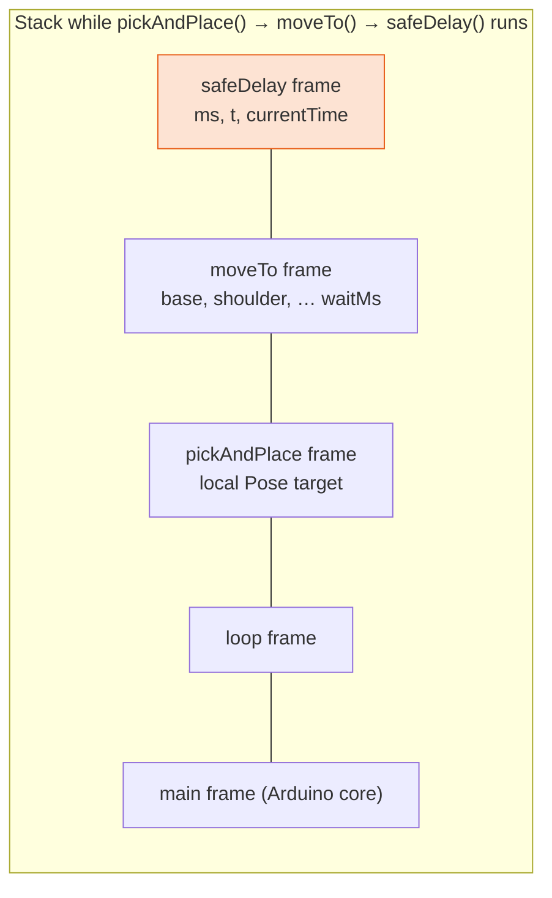

# Lesson 14: Stack, Heap & 2 KB of RAM

<div class="lesson-meta"><span>⏱ 75 min</span><span>🎯 Intermediate</span><span>🧩 Prerequisite: Lesson 13</span></div>

!!! abstract "What you'll learn"
    - The three memories in an Arduino: **flash**, **SRAM** and **EEPROM**
    - How the **stack** works (function calls, local variables) and how it overflows
    - The **heap**: `new` / `delete`, memory leaks, and fragmentation
    - Why embedded code avoids dynamic allocation, and what to do instead
    - The `F()` macro, `PROGMEM`, and measuring free RAM on a real board
    - RAII and smart pointers on the PC (and why they're missing on AVR)

---

## Three kinds of memory

<figure markdown>
{ .diagram }
<figcaption>The UNO has 32 KB of flash for code, only 2 KB of SRAM for variables, and 1 KB of EEPROM for settings that survive power-off.</figcaption>
</figure>

| Memory | Size (UNO) | Holds | Survives power-off? | Speed |
|---|---|---|:-:|---|
| **Flash** | 32 KB | your compiled program, constant tables (`PROGMEM`), `F("text")` | ✅ | read fast, write only when uploading |
| **SRAM** | **2 KB** | all variables: globals, stack, heap | ❌ | fast |
| **EEPROM** | 1 KB | calibration, saved poses | ✅ | slow writes, ~100 000 write cycles |

When you verify a sketch, the IDE reports *"Global variables use N bytes of dynamic memory"*. That's the fixed part of
SRAM. The **stack** and **heap** share whatever is left, and the IDE can't predict how much they'll need.

---

## The stack

Every time a function is called, a **stack frame** is pushed onto the stack. It holds the function's parameters, local
variables and the return address. When the function returns, its frame is popped and the memory is instantly reusable.



The stack is **fast** (no searching for space) and **automatic** (no clean-up needed), but it's **small**, and big local
variables or deep call chains can exhaust it:

```cpp title="stack_depth.cpp"
#include <iostream>

int depth = 0;

void recurse(int n) {
    int local[32];               // 128 bytes per call on a PC (64 on the UNO)
    local[0] = n;
    depth = n;
    if (n < 1000) recurse(n + 1);
    local[1] = local[0];         // use the array so it's kept
}

int main() {
    recurse(1);
    std::cout << "reached depth " << depth << " (fine on a PC with ~1 MB of stack)\n";
    std::cout << "on a UNO, 1000 frames x ~70 bytes = 70 KB: the stack would overflow 35 times over\n";
    return 0;
}
```

!!! danger "Stack overflow on a microcontroller"
    There's no operating system to stop the program with an error. The stack simply grows down into the heap and the
    global variables, **silently overwriting them**. Symptoms: variables changing "by themselves", random resets, a
    servo suddenly moving to a strange angle. Avoid recursion and large local arrays in embedded code.

---

## The heap: `new` and `delete`

The **heap** is memory you request manually at run time:

```cpp title="heap_basics.cpp"
#include <iostream>

struct Pose { int base, shoulder, elbow, wrist, wristRot, gripper; };

int main() {
    int n = 5;                                  // imagine this comes from the user at run time
    Pose* sequence = new Pose[n];               // ask the heap for 5 Poses
    for (int i = 0; i < n; i++) {
        sequence[i] = {90 + i * 10, 90, 90, 90, 90, 50};
    }
    std::cout << "last base: " << sequence[n - 1].base << '\n';
    delete[] sequence;                          // give it back (delete[] for arrays)
    sequence = nullptr;                         // don't leave a dangling pointer

    Pose* single = new Pose{90, 45, 180, 180, 90, 10};
    std::cout << "park elbow: " << single->elbow << '\n';
    delete single;                              // plain delete for a single object
    return 0;
}
```

Every `new` needs **exactly one** matching `delete`:

| Mistake | Name | Effect |
|---|---|---|
| never calling `delete` | **memory leak** | free memory shrinks every time the code runs, until it runs out |
| using the pointer after `delete` | **use-after-free** | reads/writes memory now used by something else |
| calling `delete` twice | **double free** | heap corruption |
| `delete` for an array allocated with `new[]` | mismatched delete | undefined behaviour |

### Why embedded code avoids the heap

On a PC with gigabytes of RAM, the heap is everyday tools. On a 2 KB microcontroller that runs **for weeks**, it's risky:

1. **Fragmentation.** Allocate and free blocks of different sizes and the free space turns into small holes. Eventually
   a request for 100 bytes fails even though 300 bytes are free in total.
2. **No safety net.** On AVR, a failed `new` returns `nullptr` (there are no exceptions), and most code never checks.
3. **Collisions.** The heap grows up toward the stack. Nothing warns you when they meet.
4. **Unpredictable timing.** Allocation takes a variable amount of time, which is bad for smooth motion control.

!!! bug "The Arduino `String` class uses the heap"
    ```cpp
    String cmd = "";
    cmd += c;            // may reallocate on every character!
    ```
    Every time a `String` grows, it may allocate a new, bigger block and free the old one, which is a fast path to
    fragmentation. In long-running sketches, prefer a fixed `char buffer[32]` (you'll do this in
    [Project P3](../Projects/project03_serial_control.md)).

### What to do instead: static allocation

| Instead of… | Do this |
|---|---|
| `new Pose[n]` with `n` from the user | a global `Pose poses[MAX_POSES]` plus a counter `int poseCount` |
| `String` concatenation | `char buf[32]` with a length index |
| creating objects in `loop()` with `new` | create them once, globally or as members |

The memory is reserved at compile time, so it shows up in the IDE's *"Global variables use…"* report. You know **before
uploading** whether it fits. BraccioV2 follows this rule: all its arrays are fixed-size members, and it never calls `new`.

---

## Saving RAM with `F()` and `PROGMEM`

On AVR, string literals are **copied from flash into SRAM** at start-up, so every `Serial.println("long message")` costs
RAM for the entire run. The `F()` macro keeps the text in flash:

```cpp
Serial.println("Initialising the Braccio arm, please wait...");      // ~45 bytes of RAM, forever
Serial.println(F("Initialising the Braccio arm, please wait..."));   // 0 bytes of RAM
```

For constant tables, such as a long list of poses for a dance, `PROGMEM` does the same:

```cpp
const int DANCE[][6] PROGMEM = {
  {90, 90, 90, 90, 90, 50},
  {45, 70, 110, 60, 90, 10},
  // ...hundreds more rows, stored in flash
};
int angle = pgm_read_word(&DANCE[1][0]);   // read with the special pgm_read_* functions
```

---

## RAII and smart pointers (on the PC)

In desktop C++, you rarely write `delete` yourself. Objects that clean up in their **destructor** do it for you. This
idea is called **RAII** (*Resource Acquisition Is Initialisation*):

```cpp title="raii.cpp"
#include <iostream>
#include <memory>
#include <vector>

struct Pose { int base, shoulder, elbow, wrist, wristRot, gripper; };

int main() {
    // unique_ptr: owns one heap object, deletes it automatically
    std::unique_ptr<Pose> p = std::make_unique<Pose>(Pose{90, 90, 90, 90, 90, 50});
    std::cout << "gripper " << p->gripper << '\n';

    // vector: a growable array on the heap, cleaned up automatically
    std::vector<Pose> recording;
    recording.push_back({90, 90, 90, 90, 90, 50});
    recording.push_back({60, 80, 100, 90, 90, 73});
    std::cout << recording.size() << " poses recorded\n";
    return 0;
}   // both freed here, with no delete anywhere
```

The standard AVR toolchain doesn't ship the C++ standard library (`<memory>`, `<vector>`), so on the UNO we use fixed
arrays. On bigger boards (ESP32, Arduino Due, Raspberry Pi Pico) these tools are available.

---

## :material-robot-industrial: Arm Lab: watch the RAM

!!! arm "Arm Lab 14"
    This sketch measures free SRAM at different moments: at start-up, after `arm.begin()`, **inside** a function with a
    400-byte local array (the stack grows), and after it returns (the stack shrinks back). Every message uses `F()`.

```cpp title="L14_free_ram.ino"
--8<-- "examples/arm_labs/L14_free_ram/L14_free_ram.ino"
```

!!! note "How `freeMemory()` works"
    `__heap_start` and `__brkval` are symbols provided by the AVR C library that mark the start and current end of the
    heap. The address of a fresh local variable is the current top of the stack. The difference is the free gap between
    them. It's AVR-specific, hence the `#ifdef __AVR__`.

**Try this:**

1. Remove the `F()` from the long message in `loop()` and verify. How much did *"Global variables use…"* grow?
2. Change `int samples[200]` to `int samples[800]`. Upload and watch what happens. (Don't worry, nothing is damaged. The
   board may reset or print garbage.)
3. Add `String s; for (int i = 0; i < 50; i++) s += "abc";` to `loop()` and watch free RAM over time.

??? success "What you should see"
    1. It grows by about the length of the message plus 1 (the terminating `'\0'`).
    2. 1 600 bytes of stack is more than the free space. The stack crashes into the globals, and you'll likely see a
       reset loop or corrupted output: a *stack overflow* in action.
    3. Free RAM drops while the `String` exists, and may not fully recover between loops because of fragmentation.

---

## Exercises

**1. Where does it live?** For each, say flash, stack, heap, or global/static SRAM: (a) `Braccio arm;` declared globally,
(b) `int i` in a `for` loop, (c) the code of `setup()`, (d) `new int[10]`, (e) `static int count` inside a function,
(f) `F("hello")`, (g) the parameters of a function while it runs.

**2. Budget.** You want to record poses of 6 `int`s each. The globals already use 900 bytes and you want to keep 400 bytes
free for the stack. What's the maximum number of poses you can store in RAM? Could you store more in EEPROM?

**3. Fix the leak.**
```cpp
void logMove(int angle) {
    char* msg = new char[20];
    sprintf(msg, "move %d", angle);
    Serial.println(msg);
}
```

??? success "Solution 1"
    (a) global SRAM (b) stack (c) flash (d) heap (e) global/static SRAM (f) flash (g) stack

??? success "Solution 2"
    2048 − 900 − 400 = 748 bytes. One pose = 6 × 2 = 12 bytes → **62 poses**. EEPROM has 1024 bytes → 85 poses (minus a
    few bytes for a header/count), and they survive power-off. That's exactly what Project P4 does.

??? success "Solution 3"
    It never frees `msg`, so it leaks 20 bytes on **every call**. After about 60 moves, the UNO is out of RAM. Better: no heap at all.
    ```cpp
    void logMove(int angle) {
        char msg[20];                     // stack: freed automatically on return
        snprintf(msg, sizeof msg, "move %d", angle);
        Serial.println(msg);
    }
    ```

---

## Recap

- Flash holds code, SRAM (2 KB!) holds variables, EEPROM holds settings that survive power-off.
- The **stack** is automatic and fast but small. Avoid recursion and big local arrays.
- The **heap** (`new`/`delete`) risks leaks and fragmentation. Embedded code prefers fixed, global allocation.
- `F()` and `PROGMEM` keep constant data in flash.
- On the PC, RAII, `unique_ptr` and `vector` manage memory for you.

## Further reading

- [Arduino: Memory guide](https://docs.arduino.cc/learn/programming/memory-guide/)
- [Adafruit: Memories of an Arduino](https://learn.adafruit.com/memories-of-an-arduino)
- [LearnCpp: Dynamic memory allocation with new and delete](https://www.learncpp.com/cpp-tutorial/dynamic-memory-allocation-with-new-and-delete/)
- [Arduino: PROGMEM](https://docs.arduino.cc/language-reference/en/variables/utilities/PROGMEM/)
