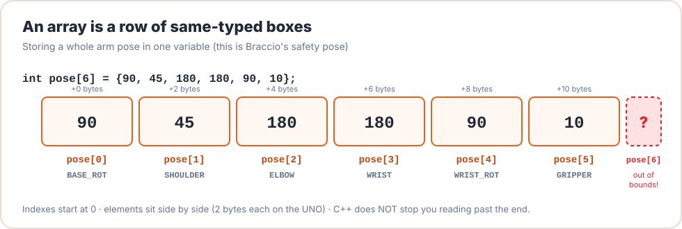

# Lesson 15: Arrays & Joint State

<div class="lesson-meta"><span>⏱ 90 min</span><span>🎯 Intermediate</span><span>🧩 Prerequisite: Lesson 14</span></div>

!!! abstract "What you'll learn"
    - C-style arrays: declaring, initialising, indexing, looping
    - Why indexes start at 0, and what happens when you go **out of bounds**
    - How arrays relate to pointers, and why functions need the length passed separately
    - `sizeof(array) / sizeof(array[0])` to count elements
    - 2-D arrays for **pose sequences**, and arrays of structs/objects
    - C strings (`char` arrays), and `std::array` on the PC
    - Why BraccioV2 uses **arrays indexed by joint number** everywhere

---

## One variable, many values

Six joints means six angles. Instead of six variables, use one **array**:

```cpp
int pose[6] = {90, 45, 180, 180, 90, 10};
```

<figure markdown>
{ .diagram }
<figcaption>An array is a row of same-typed boxes side by side in memory. <code>pose[0]</code> is the first; <code>pose[5]</code> is the last.</figcaption>
</figure>

| Syntax | Meaning |
|---|---|
| `int a[6];` | 6 ints, **uninitialised** if local (garbage!), zero if global |
| `int a[6] = {};` | 6 ints, all zero |
| `int a[6] = {90, 45};` | first two set, the rest zero |
| `int a[] = {1, 2, 3};` | size deduced from the list (3) |
| `a[i]` | element number `i`, from `0` to `size - 1` |

This is exactly how BraccioV2 stores its state. The joint names are just array indexes:

```cpp title="BraccioV2.h (excerpt)"
#define BASE_ROT 0
#define SHOULDER 1
// ...
int _jointMax[7] = {180, 165, 180, 180, 180, 73};
int _currentJointPositions[7];
int _targetJointPositions[7];
```

So `_jointMax[SHOULDER]` becomes `_jointMax[1]`, which is `165`. The same index finds the shoulder's data in every array. This pattern
is called **parallel arrays**.

---

## Looping over arrays

```cpp title="array_loops.cpp"
#include <iostream>

int main() {
    const int NUM_JOINTS = 6;
    const char* names[NUM_JOINTS] = {"base", "shoulder", "elbow", "wrist", "wristRot", "gripper"};
    int minA[NUM_JOINTS] = {0, 15, 0, 0, 0, 10};
    int maxA[NUM_JOINTS] = {180, 165, 180, 180, 180, 73};
    int target[NUM_JOINTS] = {90, 200, 90, -30, 90, 99};

    for (int j = 0; j < NUM_JOINTS; j++) {         // j from 0 to 5: note the < not <=
        int safe = target[j];
        if (safe < minA[j]) safe = minA[j];
        if (safe > maxA[j]) safe = maxA[j];
        std::cout << names[j] << ": " << target[j] << " -> " << safe << '\n';
        target[j] = safe;
    }

    int count = sizeof(target) / sizeof(target[0]);   // bytes of array / bytes of one element
    std::cout << "the array has " << count << " elements\n";
    return 0;
}
```

---

## Out of bounds: C++ won't stop you

```cpp
int pose[6];
pose[6] = 120;   // there is no pose[6]!
```

C++ does **no bounds checking**. `pose[6]` computes the address "6 boxes after the start" and writes there, into whatever
variable happens to live next. On the Arduino that might be another joint's target, a `Servo` object, or the stack's
return address. This is undefined behaviour and one of the most common sources of mysterious bugs.

!!! question "Why are BraccioV2's arrays size **7** for **6** joints?"
    Nothing uses index 6. It's probably a leftover or a defensive "spare" slot. But it doesn't make the library safe:
    `setOneAbsolute(9, 90)` still writes out of bounds, because the joint index is never checked. The right fix is
    validation (`if (joint < 0 || joint >= 6) return false;`), which `MyBraccio` does in Lesson 19.

---

## Arrays and pointers

When you pass an array to a function, C++ passes a **pointer to its first element**. The size is lost ("array decay"):

```cpp title="array_decay.cpp"
#include <iostream>

// These three declarations mean exactly the same thing:
//   void printPose(int pose[6]);   void printPose(int pose[]);   void printPose(int* pose);
void printPose(const int pose[], int count) {
    std::cout << "inside the function, sizeof(pose) = " << sizeof(pose) << " (just a pointer!)\n";
    for (int i = 0; i < count; i++) std::cout << pose[i] << ' ';
    std::cout << '\n';
}

int main() {
    int park[6] = {90, 45, 180, 180, 90, 10};
    std::cout << "in main, sizeof(park) = " << sizeof(park) << " bytes\n";
    printPose(park, 6);                 // pass the length separately

    int* p = park;                      // the array name converts to &park[0]
    std::cout << "*(p + 2) = " << *(p + 2) << ", park[2] = " << park[2] << '\n';   // pointer arithmetic
    return 0;
}
```

- `park[i]` is literally `*(park + i)`: start address plus `i` elements.
- Because arrays decay, **always pass the length** (or use a constant everyone agrees on, like `NUM_JOINTS`).
  With `-Wall` the compiler even warns you: *sizeof on array function parameter will return size of 'const int \*'*.
- Mark read-only array parameters `const int pose[]`.
- Arrays can't be assigned (`a = b;` is an error) or returned from functions. Copy element by element, or wrap them in a `struct`.

---

## 2-D arrays: sequences of poses

A 2-D array is an array of arrays, which is perfect for a **routine**: each row is a pose.

```cpp title="routine.cpp"
#include <iostream>

const int NUM_JOINTS = 6;

int main() {
    const int routine[][NUM_JOINTS] = {       // number of rows deduced; columns must be given
        {90, 90, 90, 90, 90, 50},
        {60, 70, 110, 60, 90, 10},
        {60, 70, 110, 60, 90, 73},
        {120, 95, 80, 100, 30, 73},
    };
    const int rows = sizeof(routine) / sizeof(routine[0]);

    for (int r = 0; r < rows; r++) {
        std::cout << "step " << r << ": ";
        for (int j = 0; j < NUM_JOINTS; j++) {
            std::cout << routine[r][j] << (j < NUM_JOINTS - 1 ? ", " : "\n");
        }
    }
    std::cout << rows << " steps, " << sizeof(routine) << " bytes\n";
    return 0;
}
```

---

## Arrays of structs and objects

Often clearer than parallel arrays: one array of structs, each holding everything about one joint:

```cpp title="array_of_structs.cpp"
#include <iostream>

struct JointInfo {
    const char* name;
    int pin;
    int minAngle;
    int maxAngle;
};

const JointInfo JOINTS[] = {
    {"base",      11,  0, 180},
    {"shoulder",  10, 15, 165},
    {"elbow",      9,  0, 180},
    {"wrist",      6,  0, 180},
    {"wrist rot",  5,  0, 180},
    {"gripper",    3, 10,  73},
};

int main() {
    for (const JointInfo& j : JOINTS) {       // range-for with const& (Lesson 13)
        std::cout << j.name << " on pin " << j.pin << ": " << j.minAngle << "-" << j.maxAngle << '\n';
    }
    return 0;
}
```

Arrays of **class objects** need a default constructor, or an initialiser for every element. BraccioV2 could have used
`Servo _servos[6];` instead of six separate members (`_base`, `_shoulder`…). Then its 50-line `switch` in `_setServo`
would shrink to `_servos[joint].write(value);`. You'll make exactly that improvement in Lesson 19.

---

## C strings: arrays of `char`

A text string in C/C++ is an array of `char` ending with a special `'\0'` (null) character:

```cpp
char cmd[8] = "HOME";   // H O M E \0 + 3 spare = 8 bytes
```

| Function (from `<string.h>`) | Does |
|---|---|
| `strlen(s)` | length, not counting `'\0'` |
| `strcmp(a, b)` | 0 if equal (careful: **0 means equal**) |
| `strncpy(dst, src, n)` | copy at most `n` chars |
| `atoi(s)` | text → int, e.g. `"120"` → `120` |

Always leave room for the `'\0'`, and never write past the end. That's how buffer-overflow bugs start. Project P3
uses a `char` buffer to read serial commands without the heap.

---

## `std::array` (on the PC)

Modern C++ offers `std::array<int, 6>`, which knows its own size, can be copied and returned, and has a bounds-checked
`.at(i)`:

```cpp title="std_array.cpp"
#include <array>
#include <iostream>

std::array<int, 6> mirrored(std::array<int, 6> pose) {   // can pass and return by value
    pose[0] = 180 - pose[0];
    return pose;
}

int main() {
    std::array<int, 6> home = {90, 90, 90, 90, 90, 50};
    std::array<int, 6> left = {30, 90, 90, 90, 90, 50};
    std::array<int, 6> right = mirrored(left);
    std::cout << "right base = " << right[0] << ", size = " << right.size() << '\n';   // 150, 6
    try {
        home.at(6) = 1;                                    // bounds-checked
    } catch (const std::out_of_range&) {
        std::cout << "caught out-of-range access!\n";
    }
    return 0;
}
```

The standard AVR toolchain doesn't include `<array>`, so on the UNO we use C arrays with care.

---

## :material-robot-industrial: Arm Lab: a choreographed routine

!!! arm "Arm Lab 15"
    The whole routine is **data** in a 2-D array: each row has six angles and a hold time. `playRoutine()` checks each row
    against the limit arrays before sending it. To change the dance you only edit numbers, not code.

```cpp title="L15_sequence.ino"
--8<-- "examples/arm_labs/L15_sequence/L15_sequence.ino"
```

**Try this:**

1. Add a row with a shoulder angle of 170 and watch it get skipped.
2. Add a column for the **speed** (`setDelta`) of each step.
3. Write `void playReversed()` that plays the rows from last to first.
4. Move `ROUTINE` into flash with `PROGMEM` (Lesson 14) and read it with `pgm_read_word`. How much RAM do you save?

??? success "Answer to 4"
    The routine is 7 rows × 7 ints × 2 bytes = **98 bytes** of RAM saved. With `PROGMEM`, each value must be read like
    this: `int v = pgm_read_word(&ROUTINE[step][j]);`

---

## Common mistakes

| Mistake | Result |
|---|---|
| `for (int i = 0; i <= 6; i++)` over `int a[6]` | Reads/writes `a[6]`, out of bounds |
| Using a local array without initialising it | Garbage values sent to the servos |
| `sizeof(arr)` inside a function that received `arr` | Gives the pointer size (2 on UNO), not the array size |
| `if (strcmp(cmd, "HOME"))` to test equality | True when they're **different** (strcmp returns 0 when equal) |
| Forgetting space for `'\0'`: `char s[4] = "HOME";` | Compile error (in C++), or a missing terminator in manual code |

---

## Exercises

**1. Average angle.** Write `double averageAngle(const int angles[], int count)` and test it with a pose.

**2. Largest move.** Given two poses as arrays, write a function that returns the **index** of the joint that has to move
the farthest. (Useful for choosing the move duration.)

**3. Joint histogram.** A recorded routine is a 2-D array `int rec[10][6]`. Write code that prints each joint's minimum
and maximum over all 10 rows.

**4. Refactor BraccioV2 (on paper).** Rewrite BraccioV2's `_setServo` using an array `Servo _servos[6]` instead of six
named members and a `switch`. How many lines does it take?

??? success "Solution 1 & 2"
    ```cpp
    #include <iostream>

    double averageAngle(const int angles[], int count) {
        if (count <= 0) return 0.0;
        long sum = 0;
        for (int i = 0; i < count; i++) sum += angles[i];
        return static_cast<double>(sum) / count;
    }

    int farthestJoint(const int from[], const int to[], int count) {
        int best = 0, bestDist = -1;
        for (int j = 0; j < count; j++) {
            int d = to[j] - from[j];
            if (d < 0) d = -d;
            if (d > bestDist) { bestDist = d; best = j; }
        }
        return best;
    }

    int main() {
        int home[6] = {90, 90, 90, 90, 90, 50};
        int park[6] = {90, 45, 180, 180, 90, 10};
        std::cout << averageAngle(park, 6) << '\n';          // 99.1667
        std::cout << farthestJoint(home, park, 6) << '\n';   // 2 (elbow: 90 degrees; the first of the ties)
        return 0;
    }
    ```

??? success "Solution 4"
    ```cpp
    void Braccio::_setServo(int joint, int value, bool updateTarget) {
      if (joint < 0 || joint >= 6) return;          // bonus: bounds check!
      _servos[joint].write(value);
      _currentJointPositions[joint] = value;
      if (updateTarget) _targetJointPositions[joint] = value;
    }
    ```
    About 6 lines instead of 50, and adding a seventh joint needs no new `case`.

---

## Recap

- Arrays store many same-typed values side by side. Indexes run `0 … size-1`.
- C++ doesn't check bounds. **You** must, especially with indexes from outside (like joint numbers).
- Arrays decay to pointers when passed. Pass the length and use `const` for read-only.
- 2-D arrays are great for routines. Arrays of structs keep related data together.
- BraccioV2 is built on parallel arrays indexed by joint number.

🎉 **You've finished Part 3!** Try the [Part 3 workbook](../Exercises/exercises_solutions.md#part-3-memory) and
[Project P1 · Arm Simulator](../Projects/project01_robot.md).

## Further reading

- [LearnCpp: Introduction to C-style arrays](https://www.learncpp.com/cpp-tutorial/introduction-to-c-style-arrays/)
- [LearnCpp: std::array](https://www.learncpp.com/cpp-tutorial/introduction-to-stdarray/)
- [Arduino: Arrays](https://docs.arduino.cc/language-reference/en/variables/data-types/array/)
