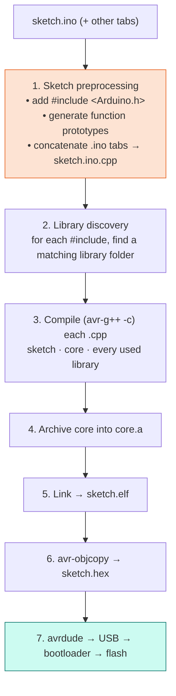

# Lesson 16: The Arduino Build System

<div class="lesson-meta"><span>⏱ 60 min</span><span>🎯 Intermediate</span><span>🧩 Prerequisite: Parts 1–3</span></div>

!!! abstract "What you'll learn"
    - What happens to your `.ino` before `avr-g++` sees it
    - The Arduino **core**, **board packages** and **libraries**, and how `#include` finds them
    - The real compiler flags, the linker, `avrdude` and the bootloader
    - Hidden hardware conflicts: why `Servo` disables `analogWrite` on pins 9 and 10
    - Building and uploading from the command line with `arduino-cli`
    - Profiling your code with `micros()`

---

## The whole pipeline

You met the four stages in [Lesson 01](../Part1_Cpp_Basics/lesson01_compiler.md). Here's what the Arduino IDE adds
around them when you click **Upload**:



### Step 1: sketch preprocessing

Your `.ino` isn't quite valid C++. The IDE fixes that by generating a real `.cpp`:

=== "What you wrote (sketch.ino)"

    ```cpp
    #include <BraccioV2.h>
    Braccio arm;

    void setup() {
      arm.begin();
      wave();
    }

    void loop() {}

    void wave() {   // used before it's defined!
      arm.setOneAbsolute(WRIST, 60);
    }
    ```

=== "What gets compiled (sketch.ino.cpp)"

    ```cpp
    #include <Arduino.h>          // added automatically
    #line 1 "sketch.ino"
    #include <BraccioV2.h>
    Braccio arm;

    void setup();                 // prototypes generated automatically
    void loop();
    void wave();

    void setup() {
      arm.begin();
      wave();
    }
    void loop() {}
    void wave() {
      arm.setOneAbsolute(WRIST, 60);
    }
    ```

That's why sketches "just work" in any order, but library `.cpp` files, which get no such help, don't. The prototype
generator can also get confused by unusual code (default arguments, templates, custom types in signatures). If you see
strange errors pointing at the first line of a function, declare the prototype yourself or define the function earlier.

### Step 2: library discovery

For every `#include <X.h>`, the builder searches, in order:

1. the **sketch folder**,
2. libraries inside the **board package** (e.g. `EEPROM`, `SPI`, `Wire` for AVR),
3. your **sketchbook `libraries/`** folder (where the Library Manager installs `BraccioV2`),
4. the IDE's **built-in** libraries (e.g. `Servo`).

The first folder containing `X.h` wins. If two libraries provide the same header, the IDE prints
*"Multiple libraries were found for X.h"* and tells you which one it used.

### Step 3: the real compiler command

Turn on **File → Preferences → Show verbose output during compile** and you'll see lines like this (shortened):

```text
avr-g++ -c -g -Os -w -std=gnu++11 -fpermissive -fno-exceptions -ffunction-sections
        -fdata-sections -fno-threadsafe-statics -mmcu=atmega328p -DF_CPU=16000000L
        -DARDUINO=10819 -DARDUINO_AVR_UNO -DARDUINO_ARCH_AVR
        -I.../cores/arduino -I.../variants/standard -I.../libraries/BraccioV2/src
        sketch.ino.cpp -o sketch.ino.cpp.o
```

| Flag | Meaning |
|---|---|
| `-Os` | optimise for **size** (flash is precious) |
| `-w` | **hide all warnings** (!). Turn them back on in Preferences → *Compiler warnings: All* |
| `-std=gnu++11` | C++11 with GNU extensions (newer cores use `gnu++17`) |
| `-fno-exceptions` | no `try`/`catch` on AVR |
| `-mmcu=atmega328p` | generate code for the UNO's chip |
| `-DF_CPU=16000000L` | defines the macro `F_CPU` (16 MHz), used by `delay()` |
| `-DARDUINO_AVR_UNO` | board macro you can test with `#ifdef` (Lesson 07) |
| `-I…` | where to look for headers: the core, the board variant, each library |
| `-ffunction-sections` + linker `--gc-sections` | unused functions are **removed** from the final program |

!!! tip "Turn on compiler warnings now"
    **File → Preferences → Compiler warnings → All.** The IDE hides warnings by default, which hides real bugs,
    like the signed/unsigned comparison in BraccioV2's `safeDelay` (Lesson 18).

### Steps 5–7: link, convert, upload

- The **linker** joins everything into `sketch.elf` and throws away unused functions.
- `avr-objcopy` extracts the raw bytes into `sketch.hex`.
- `avrdude` sends them over USB. The UNO's **bootloader** (a tiny program in the top 0.5 KB of flash) receives them and
  writes them into flash, then jumps to your code. Opening the serial port **resets** the board, which is why your arm
  restarts every time you open the Serial Monitor.

---

## The core: Arduino's hardware abstraction

`Arduino.h` and the **core** (`cores/arduino/`) give you `pinMode`, `digitalWrite`, `millis`, `Serial` and the hidden
`main()`. Underneath, they talk to the chip's **registers**, special memory addresses that control the hardware:

```cpp
digitalWrite(12, HIGH);   // Arduino way: portable, easy, ~4 µs
PORTB |= (1 << 4);        // register way: pin 12 is bit 4 of port B on the UNO, ~0.1 µs, UNO-only
```

The core trades a little speed for portability: the same sketch compiles for an UNO, a Mega or an Arduino Zero.

### Hidden conflicts: timers

The ATmega328P has three hardware **timers**, and several features share them:

| Timer | Used by | Consequence |
|---|---|---|
| Timer0 | `millis()`, `delay()`, `micros()`, PWM on pins 5 & 6 | don't reconfigure it |
| **Timer1** | **`Servo` library**, PWM on pins 9 & 10 | with `Servo`, `analogWrite(9/10, …)` stops working |
| Timer2 | `tone()`, PWM on pins 3 & 11 | `tone()` disturbs PWM on 3 and 11 |

The `Servo` library generates all its pulses in **software** from Timer1 interrupts, so any pin can drive a servo (the
Braccio uses 3, 5, 6, 9, 10, 11). But if you add an LED on pin 9 and call `analogWrite(9, 128)`, it won't dim. Knowing the
hardware underneath the library saves hours of debugging.

---

## `arduino-cli`: the build system from the terminal

Everything the IDE does is available as a command-line tool, which is useful for scripting, CI and seeing exactly what happens:

```bash
# one-time setup
arduino-cli core install arduino:avr
arduino-cli lib install BraccioV2

# compile and upload
arduino-cli compile --fqbn arduino:avr:uno --warnings all examples/arm_labs/L16_profiling
arduino-cli board list                                   # find the port
arduino-cli upload  --fqbn arduino:avr:uno -p COM4 examples/arm_labs/L16_profiling
arduino-cli monitor -p COM4 -c baudrate=115200
```

Install it from [arduino.github.io/arduino-cli](https://arduino.github.io/arduino-cli/latest/installation/).
`--fqbn` is the *fully qualified board name*: package:architecture:board.

---

## Measuring speed with `micros()`

`micros()` returns microseconds since start-up (with 4 µs resolution on a 16 MHz UNO). To measure a piece of code:

```cpp
unsigned long start = micros();
// ...code to measure...
unsigned long elapsed = micros() - start;   // correct even across rollover (Lesson 02)
```

Measure **many** repetitions and divide, because a single call may be shorter than the timer's resolution.

---

## :material-robot-industrial: Arm Lab: profile `update()`

!!! arm "Arm Lab 16"
    This sketch prints the board macros the build system defined, then times 100 calls to `arm.update()`. Set the Serial
    Monitor to **115200 baud**.

```cpp title="L16_profiling.ino"
--8<-- "examples/arm_labs/L16_profiling/L16_profiling.ino"
```

**Think about it:**

1. `update()` probably takes a few tens of microseconds. `safeDelay` calls it every 10 000 µs. What fraction of the CPU
   is spent moving the arm? What could the CPU do with the rest?
2. What happens to the timing if you add `Serial.println` inside the timed loop? (Printing 20 characters at 9600 baud
   takes about 20 ms!)
3. Compile with *Compiler warnings: All*. How many warnings come from `BraccioV2.cpp`?

??? success "Answer to 1"
    If `update()` takes ~50 µs every 10 000 µs, that's **0.5 %** of the CPU. The other 99.5 % is spent inside
    `delay()` doing nothing. A non-blocking design (update when due, otherwise do other work) can use that time to read
    sensors or serial commands. Projects P3 and P4 do exactly that.

---

## Exercises

**1. Where did it come from?** For each, name the component that provides it (sketch, core, board package library,
installed library, built-in library): `Serial`, `Servo`, `EEPROM`, `Braccio`, `millis()`, `main()`, `setup()`.

**2. Read verbose output.** Compile Lesson 00's sketch with verbose output. Find: (a) the path of `BraccioV2.cpp`,
(b) the command that creates `sketch.hex`, (c) the final flash and RAM usage.

**3. Pin audit.** You want to add a status LED that fades with `analogWrite` to the Braccio setup. Pins 3, 5, 6, 9, 10, 11 and 12
are taken. Which free PWM pin could you use, and would it work while `Servo` is active?

??? success "Solution 1"
    `Serial` → core · `Servo` → built-in library · `EEPROM` → board package library · `Braccio` → installed library
    (BraccioV2) · `millis()` → core · `main()` → core · `setup()` → your sketch.

??? success "Solution 3"
    None! On the UNO the PWM pins are 3, 5, 6, 9, 10 and 11, and all are used by the arm. You could use a plain digital
    pin (on/off, e.g. 13), or software PWM. This is why a real project picks pins early, with the hardware in mind.

---

## Recap

- The IDE turns `.ino` files into `.cpp` (adding `#include <Arduino.h>` and prototypes), finds libraries, compiles, links,
  and uploads through the bootloader.
- Look at verbose output, and **turn compiler warnings on**.
- The core abstracts registers. Timers are shared: `Servo` takes Timer1 and disables PWM on pins 9 and 10.
- `arduino-cli` does everything from the terminal. `micros()` measures speed.

## Further reading

- [Arduino CLI: Sketch build process](https://arduino.github.io/arduino-cli/latest/sketch-build-process/)
- [Arduino CLI: Getting started](https://arduino.github.io/arduino-cli/latest/getting-started/)
- [Arduino: Servo library reference](https://docs.arduino.cc/libraries/servo/)
- [Nick Gammon: Timers and counters](https://www.gammon.com.au/timers)
