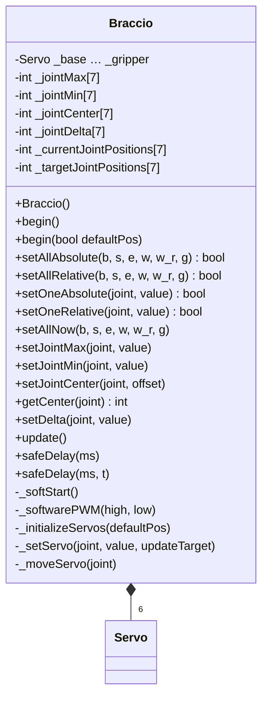
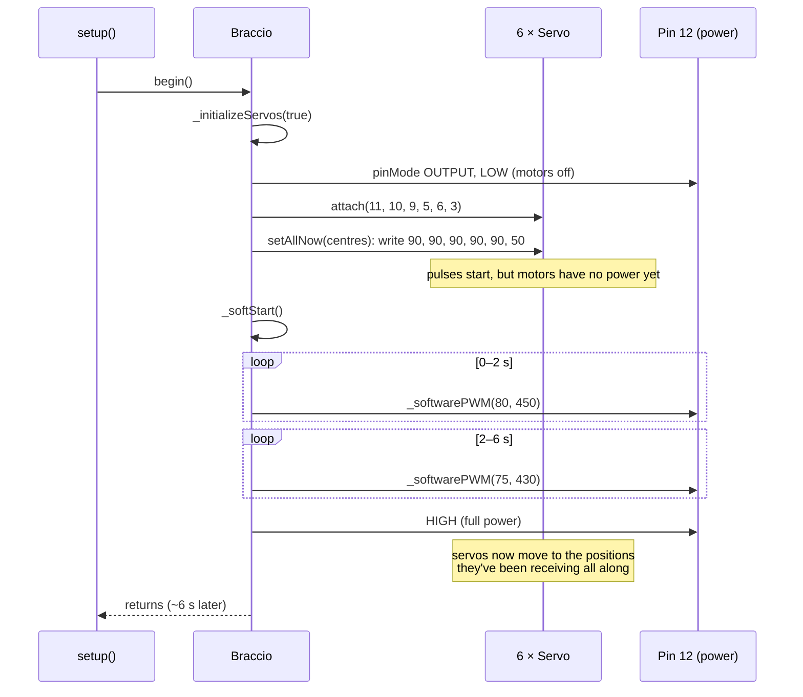
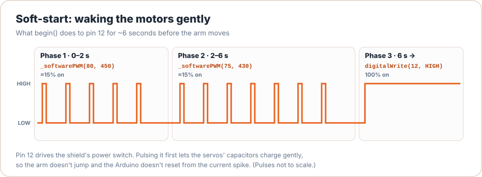
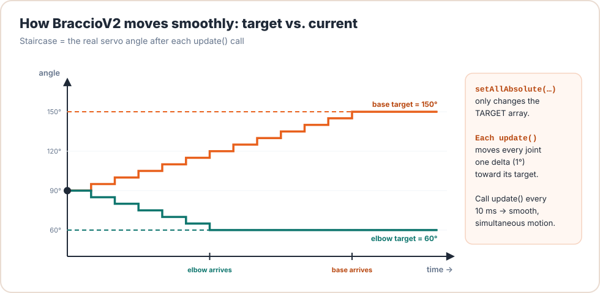

# Lesson 18: Inside BraccioV2

<div class="lesson-meta"><span>⏱ 2 h</span><span>🎯 Intermediate → Advanced</span><span>🧩 Prerequisite: Lessons 01–17</span></div>

!!! abstract "What you'll learn"
    - How to **read** a real library: from the public API down to the private details
    - Start-up: `begin()`, attaching servos, and the pin-12 **soft-start**
    - The motion engine: **target vs. current** positions, `update()`, `_moveServo()` and `safeDelay()`
    - Calibration: limits and centre offsets
    - A code review: **six real bugs**, with reproductions and fixes
    - Everything you learned in Parts 1–3, found in one real codebase

Open [`BraccioV2.h`](https://github.com/TheAfricanJiant/Practical-C-/blob/main/BraccioV2.h) and
[`BraccioV2.cpp`](https://github.com/TheAfricanJiant/Practical-C-/blob/main/BraccioV2.cpp) side by side as you read.

---

## How to read someone else's code

1. **Start with the header.** It's the table of contents: what can users do?
2. **Follow one real use-case** through the code. Here: `begin()`, then `setAllAbsolute()`, then `safeDelay()`.
3. **Draw the data.** Which member variables exist, and who changes them?
4. **Question everything.** What if the input is negative? Too big? Called in the wrong order?

---

## 1. The header: the whole library at a glance



What you can recognise already:

| In the header | Lesson |
|---|---|
| `#ifndef BRACCIOV2_H_` … `#endif` | 06 · include guard |
| `#include <Arduino.h>`, `#include <Servo.h>` | 05, 16 · headers and libraries |
| `#define BASE_ROT 0` … `#define _GRIPPER_PIN 3` | 07 · object-like macros (and their scope problem) |
| `class Braccio { public: … private: … };` | 08, 10 · class and encapsulation |
| `Braccio();` / `void begin();` | 09 · constructor + `begin()` pattern |
| `begin()` / `begin(bool)`, `safeDelay(int)` / `safeDelay(int, int)` | 04, 11 · overloading |
| `Servo _base; …` | 08 · composition |
| `int _jointMax[7] = {180, 165, …};` | 09, 15 · default member initialisers, arrays |

---

## 2. Start-up: `begin()` and the soft-start



```cpp title="BraccioV2.cpp"
void Braccio::_initializeServos(bool defaultPos) {
  pinMode(SOFT_START_PIN, OUTPUT);
  digitalWrite(SOFT_START_PIN, LOW);     // motors OFF while we prepare
  _base.attach(_BASE_ROT_PIN);           // start generating pulses on each pin
  _shoulder.attach(_SHOULDER_PIN);
  // ... elbow, wrist_rot, wrist, gripper
  if (defaultPos) {
    setAllNow(_jointCenter[BASE_ROT], _jointCenter[SHOULDER], _jointCenter[ELBOW],
              _jointCenter[WRIST], _jointCenter[WRIST_ROT], _jointCenter[GRIPPER]);
  }
  _softStart();
}
```

The order is clever: the servos are told **where to be** *before* they get power. When power arrives, each servo moves
directly to its commanded angle instead of an unknown one.

<figure markdown>
{ .diagram }
<figcaption>Pin 12 switches the servos' power. Short pulses first let the capacitors charge gently, then it stays fully on.</figcaption>
</figure>

```cpp title="BraccioV2.cpp"
void Braccio::_softwarePWM(int high_time, int low_time) {
  digitalWrite(SOFT_START_PIN, HIGH);
  delayMicroseconds(high_time);
  digitalWrite(SOFT_START_PIN, LOW);
  delayMicroseconds(low_time);
}

void Braccio::_softStart() {
  long int tmp = millis();
  while (millis() - tmp < 2000)
    _softwarePWM(80, 450);   // the sum should be 530usec
  while (millis() - tmp < 6000)
    _softwarePWM(75, 430);   // the sum should be 505usec
  digitalWrite(SOFT_START_PIN, HIGH);
}
```

- **Duty cycle** in phase 1: \( \frac{80}{80 + 450} \approx 15.1\% \); in phase 2: \( \frac{75}{505} \approx 14.9\% \).
- It's **software PWM**: the CPU toggles the pin itself and does nothing else for 6 seconds. That's a *blocking* loop, but
  acceptable at start-up.
- `millis() - tmp < 2000` is the rollover-safe pattern from Lesson 02 ✅ (even though `tmp` should be `unsigned long`).

---

## 3. Setting targets (nothing moves yet!)

```cpp title="BraccioV2.cpp"
bool Braccio::setOneAbsolute(int joint, int value) {
  int out = constrain(value, _jointMin[joint], _jointMax[joint]);
  _targetJointPositions[joint] = out;
  return joint == out;                   // 🐛 see Bug 1
}

bool Braccio::setOneRelative(int joint, int value) {
  int currentPos = _targetJointPositions[joint];   // relative to the TARGET, not the current position
  int rawPos = currentPos + value;
  int actualPos = constrain(rawPos, _jointMin[joint], _jointMax[joint]);
  _targetJointPositions[joint] = actualPos;
  return rawPos == actualPos;            // ✅ correct here
}

bool Braccio::setAllAbsolute(int b, int s, int e, int w, int w_r, int g) {
  boolean out = true;
  out = out & setOneAbsolute(BASE_ROT, b);   // & (not &&) so EVERY joint is set,
  out = out & setOneAbsolute(SHOULDER, s);   // even after one returns false
  // ...
  return out;
}
```

- Setting a target only writes to the `_targetJointPositions` array. **The servos don't move** until something calls `update()`.
- `setAllAbsolute` uses **bitwise `&`** on purpose. `out && setOne…()` would **short-circuit**: once `out` became false, the
  remaining joints would never get their new targets. Subtle and correct.
- `setOneRelative` adds to the **target**. Two quick `setOneRelative(BASE_ROT, 10)` calls give +20 even if the joint hasn't moved yet.

---

## 4. The motion engine

<figure markdown>
{ .diagram }
<figcaption>Each call to <code>update()</code> moves every joint's current position one <code>delta</code> toward its target.</figcaption>
</figure>

```cpp title="BraccioV2.cpp"
void Braccio::update() {
  _moveServo(BASE_ROT);
  _moveServo(SHOULDER);
  _moveServo(ELBOW);
  _moveServo(WRIST);
  _moveServo(WRIST_ROT);
  _moveServo(GRIPPER);
}

void Braccio::_moveServo(int joint) {
  int currentPos = _currentJointPositions[joint];
  int targetPos = _targetJointPositions[joint];
  if (currentPos != targetPos) {
    int dir = (currentPos <= targetPos) ? 1 : -1;   // the ?: operator from Lesson 03
    int delta = _jointDelta[joint];
    int dirDelta = dir * delta;
    int newPos = currentPos + dirDelta;             // 🐛 see Bug 2
    _setServo(joint, newPos, false);                // write, but DON'T touch the target
  }
}
```

`_setServo` is a 50-line `switch` that picks the right `Servo` object, writes the angle, and records it:

```cpp title="BraccioV2.cpp (one case of six)"
case SHOULDER:
  _shoulder.write(value);
  _currentJointPositions[SHOULDER] = value;
  if (updateTarget) {
    _targetJointPositions[SHOULDER] = value;
  }
  break;
```

(An array `Servo _servos[6]` would replace the whole switch with three lines, as you worked out in Lesson 15.)

### `safeDelay()`: waiting while moving

```cpp title="BraccioV2.cpp"
void Braccio::safeDelay(int ms, int t) {
  long currentTime = millis();
  while (millis() < currentTime + ms) {   // 🐛 see Bug 3
    update();
    delay(t);
  }
}

void Braccio::safeDelay(int ms) {
  safeDelay(ms, 10);                      // overload with a default update period
}
```

**Speed** follows from the numbers: `delta` degrees every `t` ms. With the defaults (1° every 10 ms), a joint moves at
**100 °/s**, so a 90° move takes about 0.9 s. `setDelta(joint, 3)` makes that joint 3× faster.

Because every joint moves at the same speed, joints with **shorter** moves finish **first** (compare Lesson 13's blended,
synchronised motion).

---

## 5. Calibration

```cpp title="BraccioV2.cpp"
void Braccio::setJointMax(int joint, int value)     { _jointMax[joint]    = constrain(value, GLOBAL_MIN, GLOBAL_MAX); }
void Braccio::setJointMin(int joint, int value)     { _jointMin[joint]    = constrain(value, GLOBAL_MIN, GLOBAL_MAX); }
void Braccio::setJointCenter(int joint, int offset) { _jointCenter[joint] = constrain(offset, GLOBAL_MIN, GLOBAL_MAX); }
int  Braccio::getCenter(int joint)                  { return _jointCenter[joint]; }
```

The centres are used **only** by `begin()` to choose the start pose. After that, all angles are absolute. So "90" is still
90 even if your calibrated centre is 93. To work *relative to calibration*, use `arm.getCenter(SHOULDER) + 20` (as Lesson 09's
Arm Lab did).

---

## 6. Bug hunt { #bug-hunt }

A **code review** reads code looking for problems. Here's what careful reading (and the compiler warnings from Lesson 16)
turns up in BraccioV2. Every bug below has been reproduced by compiling the real `BraccioV2.cpp`.

### Bug 1: `setOneAbsolute` returns the wrong thing

```cpp
return joint == out;   // compares the JOINT NUMBER with the ANGLE
```

It should be `return value == out;` (was the value used unchanged?). As written, the result is essentially random:

| Call | Clamped? | Should return | Actually returns |
|---|:-:|:-:|:-:|
| `setOneAbsolute(ELBOW, 90)` | no | `true` | `false` (2 ≠ 90) |
| `setOneAbsolute(BASE_ROT, -40)` | yes, to 0 | `false` | `true` (0 == 0) |
| `setOneAbsolute(ELBOW, 200)` | yes, to 180 | `false` | `false` (right by accident) |

Consequence: `setAllAbsolute` (built on it) almost always returns `false`, so **you can't trust either return value**.

### Bug 2: `delta > 1` overshoots and oscillates

`_moveServo` always adds a full `delta`, even when the target is closer than that:

```cpp title="overshoot.cpp"
#include <iostream>

int main() {
    int current = 90, target = 100, delta = 7;
    std::cout << "BraccioV2 logic: ";
    for (int i = 0; i < 8; i++) {                      // _moveServo, 8 updates
        if (current != target) {
            int dir = (current <= target) ? 1 : -1;
            current = current + dir * delta;
        }
        std::cout << current << ' ';
    }
    std::cout << " <- never arrives\n";

    current = 90;
    std::cout << "fixed logic:     ";
    for (int i = 0; i < 8; i++) {
        int remaining = target - current;
        if (remaining > delta)  remaining = delta;     // limit the step...
        if (remaining < -delta) remaining = -delta;    // ...but never step past the target
        current += remaining;
        std::cout << current << ' ';
    }
    std::cout << '\n';
    return 0;
}
```

```text
BraccioV2 logic: 97 104 97 104 97 104 97 104  <- never arrives
fixed logic:     97 100 100 100 100 100 100 100
```

Worse: overshooting can **exceed the joint's limit**. From 90 toward 180 with `delta = 4`, the joint reaches 178 and then
steps to **182**, which `_setServo` writes without clamping. The upstream example sets `setDelta(BASE_ROT, 3)`; it only
works because its moves happen to be multiples of 3.

### Bug 3: `safeDelay`'s timing arithmetic

```cpp
long currentTime = millis();                // unsigned long squeezed into a signed long
while (millis() < currentTime + ms) { ... } // "end time" comparison, not a duration
```

- `-Wall` reports *comparison of integers of different signs*.
- After ~24.8 days, `millis()` no longer fits in a `long` and `currentTime` becomes negative. After ~49.7 days `millis()` wraps
  to 0. Around those moments, the comparison is wrong and `safeDelay` returns immediately or waits far too long.
- `int ms` limits one delay to 32 767 ms on the UNO.

**Fix:** `unsigned long start = millis(); while (millis() - start < (unsigned long)ms) { ... }`

### Bug 4: no joint-index validation

Every method uses `joint` directly as an array index. `arm.setOneAbsolute(6, 90)` touches the spare 7th element;
`arm.setOneAbsolute(7, 90)` or `(-1, 90)` writes **outside** the arrays and corrupts neighbouring members (Lesson 15).
**Fix:** `if (joint < 0 || joint >= 6) return false;` at the top of every public method.

### Bug 5: `begin(false)` starts from 0°

With `begin(false)`, `setAllNow` is skipped, so `_currentJointPositions` keeps its initial value of **0** for every joint
(global objects are zero-initialised). The first target you set makes `update()` write 1°, 2°, 3°… so the arm swings
toward 0° first, which is **below the shoulder's 15° and gripper's 10° limits**. The library's example comment says
*"setAllNow MUST be run immediately after the begin method"*. A rule that must be remembered, instead of enforced, is a
design smell. **Fix:** have `begin(false)` initialise the current positions from the centres (or refuse to move until
`setAllNow` has run).

### Bug 6: unvalidated setters

- `setAllNow` writes values **without clamping** (its own comment says so).
- `setDelta(joint, 0)` freezes a joint; a negative delta drives it *away* from its target, forever and past its limits.
- `setJointMin` can be set above `setJointMax`.

(Plus a code smell: arrays of size **7** for **6** joints.)

!!! success "This isn't a criticism of the author"
    BraccioV2 is a useful, freely shared library that thousands of people have used, and it made the Braccio much nicer
    to program. **All** real code has bugs. Finding them is a skill, and you just practised it. The polite way to act
    on a review is to [open an issue or pull request](https://github.com/kk6axq/BraccioV2/issues) upstream.

---

## :material-robot-industrial: Arm Lab: see the bugs happen

!!! arm "Arm Lab 18"
    This sketch prints the return values of `setOneAbsolute` next to what they *should* be, then makes the base
    jitter with an overshooting delta for 4 seconds (a small, safe movement around 100°).

```cpp title="L18_bug_hunt.ino"
--8<-- "examples/arm_labs/L18_bug_hunt/L18_bug_hunt.ino"
```

Expected Serial Monitor output (confirmed by compiling the real library):

```text
--- Bug 1: setOneAbsolute's return value ---
setOneAbsolute(ELBOW, 90)   returned false  (should be true)  <-- BUG
setOneAbsolute(BASE_ROT,-40) returned true   (should be false)  <-- BUG
setOneAbsolute(ELBOW, 200)  returned false  (should be false)  OK
--- Bug 2: delta overshoot ---
...
```

---

## Exercises

**1. Trace `update()`.** Current positions `{90, 90, 90, 90, 90, 50}`, targets `{95, 88, 90, 90, 90, 53}`, all deltas 1.
Write the current positions after 1, 3 and 5 calls to `update()`.

**2. Timing.** With default settings, how long does `setAllAbsolute(0, 15, 0, 0, 0, 10)` take to complete from the upright
start pose? Which joint finishes last?

**3. Patch it.** Write corrected versions of `setOneAbsolute` and `_moveServo`. (You'll use them in Lesson 19.)

**4. Review a new feature.** A teammate adds `void Braccio::setAllDelta(int d) { for (int j = 0; j <= 6; j++) _jointDelta[j] = d; }`.
Review it: find at least two problems.

??? success "Solution 1"
    After 1: `{91, 89, 90, 90, 90, 51}` · after 3: `{93, 88, 90, 90, 90, 53}` · after 5: `{95, 88, 90, 90, 90, 53}`

??? success "Solution 2"
    Distances from upright (90, 90, 90, 90, 90, 50): 90, 75, 90, 90, 90, 40. At 1° per 10 ms the largest (90°) takes
    **~0.9 s** (90 updates). Base, elbow, wrist and wrist rotation all finish last together. The shoulder is done after 0.75 s
    and the gripper after 0.4 s.

??? success "Solution 3"
    ```cpp
    bool Braccio::setOneAbsolute(int joint, int value) {
      if (joint < 0 || joint > GRIPPER) return false;
      int out = constrain(value, _jointMin[joint], _jointMax[joint]);
      _targetJointPositions[joint] = out;
      return value == out;
    }

    void Braccio::_moveServo(int joint) {
      int remaining = _targetJointPositions[joint] - _currentJointPositions[joint];
      if (remaining == 0) return;
      int delta = _jointDelta[joint] > 0 ? _jointDelta[joint] : 1;
      int step = remaining > delta ? delta : (remaining < -delta ? -delta : remaining);
      _setServo(joint, _currentJointPositions[joint] + step, false);
    }
    ```

??? success "Solution 4"
    - `j <= 6` writes 7 elements. It happens to fit the size-7 array, but it's clearly meant to cover 6 joints (`j < 6`).
    - No validation: `d <= 0` freezes or reverses every joint (Bug 6), and a huge `d` makes joints jump.
    - Suggest: `bool setAllDelta(int d) { if (d < 1 || d > 10) return false; for (int j = 0; j < 6; j++) _jointDelta[j] = d; return true; }`

---

## Recap

- Read a library header-first, then follow one use-case through the code.
- `begin()` attaches servos, commands a pose, then soft-starts power on pin 12.
- Setting targets doesn't move anything. `update()` steps each joint by `delta`, and `safeDelay` calls it in a loop.
- Calibration centres only affect the start pose.
- Six bugs: wrong return value, delta overshoot, timing arithmetic, no index checks, `begin(false)` from 0°, unvalidated setters.

Next, you'll fix every one of them in your own library: [Lesson 19 · Writing MyBraccio](lesson19_coding_mybraccio.md).

## Further reading

- [BraccioV2 on GitHub](https://github.com/kk6axq/BraccioV2) · [original Arduino Braccio library](https://github.com/arduino-libraries/Braccio)
- [Google: How to do a code review](https://google.github.io/eng-practices/review/reviewer/)
- [Arduino Servo library source](https://github.com/arduino-libraries/Servo)
