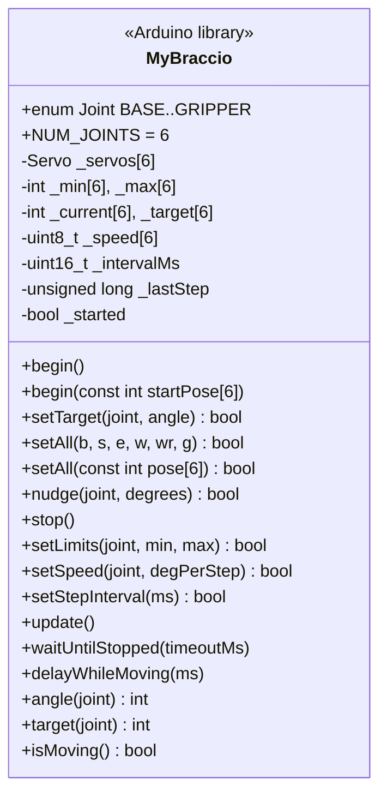
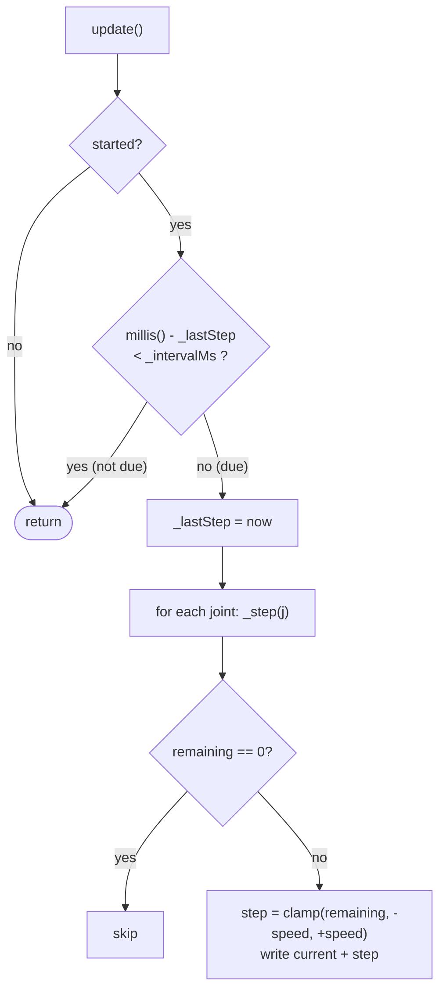

# Lesson 19: Writing MyBraccio

<div class="lesson-meta"><span>⏱ 2–3 h</span><span>🎯 Advanced</span><span>🧩 Prerequisite: Lesson 18</span></div>

!!! abstract "What you'll build"
    Your own Braccio driver library, **MyBraccio**, designed from what you learned in every lesson so far, and fixing
    all six bugs found in Lesson 18:

    | BraccioV2 problem | MyBraccio solution | Lesson |
    |---|---|---|
    | `#define` joint names clash with user code | `enum Joint` **inside the class**: `MyBraccio::ELBOW` | 07, 11 |
    | 6 named `Servo`s + a 50-line `switch` | `Servo _servos[6]`, indexed by joint | 15 |
    | wrong return value (bug 1) | `return safe == angle;` | 18 |
    | overshoot with speed > 1 (bug 2) | step = min(speed, remaining) | 10, 18 |
    | rollover-unsafe timing (bug 3) | `millis() - start < interval` everywhere | 02 |
    | no joint-index checks (bug 4) | `_valid(joint)` guard on every public method | 10, 15 |
    | `begin(false)` starts from 0° (bug 5) | constructor initialises to home; `begin(pose)` | 09 |
    | unvalidated setters (bug 6) | `setSpeed` 1–10, `setLimits` rejects min > max | 10 |
    | caller must call `update()` at exactly the right rate | **self-timed** `update()`: call as often as you like | 03, 16 |

    The finished library is in the repository at
    [`examples/libraries/MyBraccio`](https://github.com/TheAfricanJiant/Practical-C-/tree/main/examples/libraries/MyBraccio).
    Try to write each step yourself before looking at it.

---

## Step 0: design before code

Before writing a line, decide **what users should be able to do**, and write the header (the contract) first.



Design rules we'll follow:

1. **Invariant:** for every joint, `min ≤ target ≤ max` and `min ≤ current ≤ max`, always.
2. **Every public method validates** its joint index.
3. **Nothing blocks** unless its name says so (`waitUntilStopped`, `delayWhileMoving`).
4. **Constructor = configuration, `begin()` = hardware** (Lesson 09).
5. **No macros** in the public header.

---

## Step 1: create the library folder

In your sketchbook's `libraries/` folder (Lesson 17):

```text
MyBraccio/
├── library.properties
├── keywords.txt
├── src/
│   ├── MyBraccio.h
│   └── MyBraccio.cpp
└── examples/
    ├── Basic/Basic.ino
    └── NonBlocking/NonBlocking.ino
```

```ini title="library.properties"
--8<-- "examples/libraries/MyBraccio/library.properties"
```

---

## Step 2: the header

```cpp title="src/MyBraccio.h" linenums="1"
--8<-- "examples/libraries/MyBraccio/src/MyBraccio.h"
```

Walk through the decisions:

- **Line 13: `enum Joint : uint8_t { BASE = 0, … };` inside the class.** Users write `MyBraccio::ELBOW`. The names are scoped to
  the class, so a user's `int ELBOW = 9;` can't collide (Lesson 07). `: uint8_t` makes each value a single byte.
- **Line 14: `static const uint8_t NUM_JOINTS = 6;`** A typed, class-scoped constant, usable as an array size.
- **Two `begin()` overloads.** `begin(startPose)` replaces BraccioV2's risky `begin(false)` + `setAllNow` combination.
- **Every method returns `bool` when it can refuse or clamp.** Callers can react.
- **Queries are `const`** (Lesson 11), so they work on `const MyBraccio&` too.
- **`_valid` is `static`**: it needs no object data.

---

## Step 3: file-private constants and the constructor

```cpp title="src/MyBraccio.cpp (part 1)"
namespace {
// File-private constants (an unnamed namespace = visible only in this .cpp file).
const uint8_t PINS[MyBraccio::NUM_JOINTS]        = {11, 10, 9, 6, 5, 3};
const int     DEFAULT_MIN[MyBraccio::NUM_JOINTS] = {0, 15, 0, 0, 0, 10};
const int     DEFAULT_MAX[MyBraccio::NUM_JOINTS] = {180, 165, 180, 180, 180, 73};
const int     HOME_POSE[MyBraccio::NUM_JOINTS]   = {90, 90, 90, 90, 90, 50};
const uint8_t SOFT_START_PIN = 12;
}  // namespace

MyBraccio::MyBraccio() : _intervalMs(10), _lastStep(0), _started(false) {
  for (uint8_t j = 0; j < NUM_JOINTS; j++) {
    _min[j] = DEFAULT_MIN[j];
    _max[j] = DEFAULT_MAX[j];
    _current[j] = HOME_POSE[j];     // never 0: fixes BraccioV2 bug 5
    _target[j] = HOME_POSE[j];
    _speed[j] = 1;
  }
}
```

- An **unnamed namespace** makes names visible only inside this `.cpp`, so users never see `PINS`. (The old-C way is
  `static const`.)
- The pin table is **the only place** the wiring appears. Supporting a different shield means changing one line.
- The constructor touches **no hardware**. It's safe for a global object.

---

## Step 4: start-up

```cpp title="src/MyBraccio.cpp (part 2)"
void MyBraccio::begin() {
  begin(HOME_POSE);               // one overload delegates to the other (Lesson 11)
}

void MyBraccio::begin(const int startPose[NUM_JOINTS]) {
  pinMode(SOFT_START_PIN, OUTPUT);
  digitalWrite(SOFT_START_PIN, LOW);            // motors off while we prepare
  for (uint8_t j = 0; j < NUM_JOINTS; j++) {
    int a = _clamp(j, startPose[j]);
    _current[j] = a;
    _target[j] = a;
    _servos[j].attach(PINS[j]);
    _servos[j].write(a);                        // command the pose BEFORE power arrives
  }
  _softStart();
  _lastStep = millis();
  _started = true;
}
```

The array of servos turns BraccioV2's six `attach` lines and its `switch` into one loop. The soft-start copies the proven
timing from the original libraries (with `unsigned long` timing):

```cpp title="src/MyBraccio.cpp (part 3)"
void MyBraccio::_softStart() {
  unsigned long start = millis();
  while (millis() - start < 2000UL) {
    digitalWrite(SOFT_START_PIN, HIGH); delayMicroseconds(80);
    digitalWrite(SOFT_START_PIN, LOW);  delayMicroseconds(450);
  }
  while (millis() - start < 6000UL) {
    digitalWrite(SOFT_START_PIN, HIGH); delayMicroseconds(75);
    digitalWrite(SOFT_START_PIN, LOW);  delayMicroseconds(430);
  }
  digitalWrite(SOFT_START_PIN, HIGH);
}
```

---

## Step 5: commands that keep the invariant

```cpp title="src/MyBraccio.cpp (part 4)"
int MyBraccio::_clamp(uint8_t joint, int angle) const {
  if (angle < _min[joint]) return _min[joint];
  if (angle > _max[joint]) return _max[joint];
  return angle;
}

bool MyBraccio::setTarget(uint8_t joint, int angle) {
  if (!_valid(joint)) return false;             // fixes bug 4
  int safe = _clamp(joint, angle);
  _target[joint] = safe;
  return safe == angle;                         // fixes bug 1
}

bool MyBraccio::setAll(const int pose[NUM_JOINTS]) {
  bool allExact = true;
  for (uint8_t j = 0; j < NUM_JOINTS; j++) {
    allExact = setTarget(j, pose[j]) && allExact;   // setTarget runs for EVERY joint
  }
  return allExact;
}
```

!!! question "Why `setTarget(j, pose[j]) && allExact` and not `allExact && setTarget(j, pose[j])`?"
    `&&` stops evaluating as soon as the answer is known. With `allExact` first, once one joint was clamped, `allExact` is
    `false` and **`setTarget` would never be called for the remaining joints**. Putting the call first guarantees it
    always runs. (BraccioV2 solved the same problem with the bitwise `&`.)

`setLimits` re-clamps the target so the invariant survives a limit change (Lesson 10), and `setSpeed` rejects 0 and
silly values (fixing bug 6):

```cpp title="src/MyBraccio.cpp (part 5)"
bool MyBraccio::setLimits(uint8_t joint, int minAngle, int maxAngle) {
  if (!_valid(joint)) return false;
  if (minAngle < 0 || maxAngle > 180 || minAngle > maxAngle) return false;   // reject
  _min[joint] = minAngle;
  _max[joint] = maxAngle;
  _target[joint] = _clamp(joint, _target[joint]);   // keep min <= target <= max
  return true;
}

bool MyBraccio::setSpeed(uint8_t joint, uint8_t degreesPerStep) {
  if (!_valid(joint) || degreesPerStep < 1 || degreesPerStep > 10) return false;
  _speed[joint] = degreesPerStep;
  return true;
}
```

---

## Step 6: the non-blocking motion engine

This is the heart of the library. BraccioV2's `update()` moves one step **every time it's called**, so the speed depends on
how often the caller calls it. MyBraccio's `update()` checks the clock itself:



```cpp title="src/MyBraccio.cpp (part 6)"
void MyBraccio::_step(uint8_t joint) {
  int remaining = _target[joint] - _current[joint];
  if (remaining == 0) return;
  int s = _speed[joint];
  int step = remaining > s ? s : (remaining < -s ? -s : remaining);   // never overshoot: fixes bug 2
  _write(joint, _current[joint] + step);
}

void MyBraccio::update() {
  if (!_started) return;                        // servos not attached yet
  unsigned long now = millis();
  if (now - _lastStep < _intervalMs) return;    // not due yet: return immediately
  _lastStep = now;                              // durations, not end times: fixes bug 3
  for (uint8_t j = 0; j < NUM_JOINTS; j++) _step(j);
}
```

Because `update()` returns immediately when no step is due, `loop()` can call it thousands of times per second **and do
other work in between**: read serial commands, blink an LED, check a sensor. The speed stays exactly
`speed` degrees per `_intervalMs`.

The blocking helpers are built on top, and their names say that they block:

```cpp title="src/MyBraccio.cpp (part 7)"
void MyBraccio::waitUntilStopped(unsigned long timeoutMs) {
  unsigned long start = millis();
  while (isMoving() && millis() - start < timeoutMs) {   // a timeout: never wait forever
    update();
  }
}
```

---

## The complete source

??? example "src/MyBraccio.cpp (full file)"
    ```cpp linenums="1"
    --8<-- "examples/libraries/MyBraccio/src/MyBraccio.cpp"
    ```

---

## Step 7: examples

=== "Basic.ino"

    ```cpp
    --8<-- "examples/libraries/MyBraccio/examples/Basic/Basic.ino"
    ```

=== "NonBlocking.ino"

    ```cpp
    --8<-- "examples/libraries/MyBraccio/examples/NonBlocking/NonBlocking.ino"
    ```

---

## :material-robot-industrial: Arm Lab: install and run your library

!!! arm "Arm Lab 19"
    1. Copy `examples/libraries/MyBraccio` into `Documents/Arduino/libraries/` (or build it yourself from the steps above).
    2. Restart the IDE and open **File → Examples → MyBraccio → NonBlocking**.
    3. Upload. The arm cycles through four poses while the **L** LED blinks steadily. Type `s` in the Serial Monitor
       to stop the arm instantly.
    4. Compare with BraccioV2: could you blink an LED at a steady rate during `arm.safeDelay(2000)`?

!!! warning "Don't include both libraries in one sketch"
    `MyBraccio` and `BraccioV2` both attach servos to pins 3–11 and drive pin 12. Use one or the other.

**Extend it** (each is a good exercise):

1. Add `bool setAllSynchronised(const int pose[6], unsigned long durationMs)` that picks a speed per joint so all joints arrive
   together (Lesson 13's idea, now non-blocking).
2. Add `void setHome(const int pose[6])` and `void goHome()`.
3. Add an `onArrive` callback: `void setArriveCallback(void (*fn)())`, called once when motion stops. *(A pointer to a function!)*

---

## Recap

- Design the **header first**: the public contract, invariants and names.
- Arrays + loops replace repetitive code. Class-scoped enums replace macros.
- Every public method validates, clamps or rejects, and reports with `bool`.
- A **self-timed `update()`** makes the whole library non-blocking.
- You've fixed every bug from the code review. Now prove it with tests: [Lesson 20](lesson20_deployment.md).

## Further reading

- [Arduino library style guide](https://docs.arduino.cc/learn/contributions/arduino-library-style-guide/)
- [LearnCpp: Unnamed namespaces](https://www.learncpp.com/cpp-tutorial/unnamed-and-inline-namespaces/)
- [LearnCpp: Function pointers](https://www.learncpp.com/cpp-tutorial/function-pointers/) (for the callback extension)
