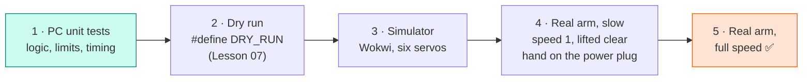
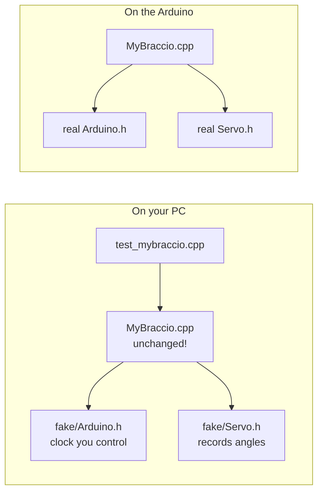
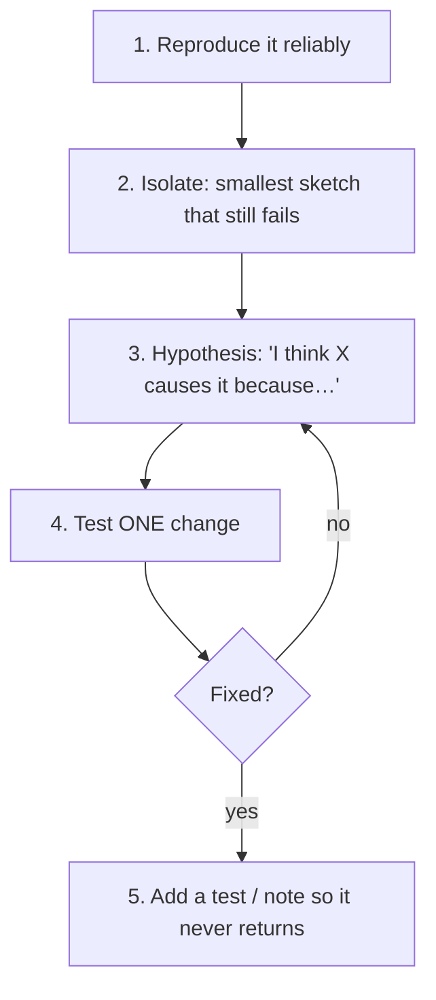

# Lesson 20: Deploy, Test & Debug

<div class="lesson-meta"><span>⏱ 90 min</span><span>🎯 Advanced</span><span>🧩 Prerequisite: Lesson 19</span></div>

!!! abstract "What you'll learn"
    - A safe **deployment ladder**: PC tests → dry run → simulator → slow on the arm → full speed
    - **Unit-testing** library code on your PC with fake `Arduino.h` and `Servo.h`
    - Debugging with the **Serial Monitor** and **Serial Plotter**
    - A systematic debugging method for hardware + software problems
    - Version control with git, and automatic testing with GitHub Actions

---

## The deployment ladder

Uploading untested code to a robot arm is how gears get stripped. Climb one rung at a time:



| Rung | Catches | Costs |
|---|---|---|
| PC unit tests | wrong maths, missing clamps, off-by-one, timing bugs | seconds, zero risk |
| Dry run | wrong sequence order, bad parsing | no motion risk |
| Simulator | wrong pins, wrong joint order, stuck loops | no hardware needed |
| Real arm, slow | wrong directions, collisions, calibration | small risk, easy to stop |

### Pre-flight checklist

- [ ] Library installed in `Documents/Arduino/libraries/` and the IDE restarted
- [ ] *Tools → Board* = Arduino UNO, correct *Port*
- [ ] *Compiler warnings: All*, and **zero warnings** in your own code
- [ ] Limits and calibration values set for **this** arm
- [ ] Base clamped, area clear, 5 V adapter **unplugged** during upload
- [ ] Serial Monitor open at the right baud rate *before* powering up

---

## Unit testing on your PC

Your library's **logic** (clamping, stepping, timing, validation) doesn't need a real servo to be tested. The trick:
compile the library on your PC with **fake** versions of `Arduino.h` and `Servo.h` that just *record* what would happen.



The library code is **exactly the same** file in both builds. Only the headers it includes are different: `-I fake` makes the
compiler find the fake ones first (Lesson 16's library search order, used on purpose).

=== "fake/Arduino.h"

    ```cpp
    --8<-- "examples/pc_tests/fake/Arduino.h"
    ```

=== "fake/Servo.h"

    ```cpp
    --8<-- "examples/pc_tests/fake/Servo.h"
    ```

The test file checks one behaviour per test, and there's a test for **every bug** from Lesson 18:

??? example "test_mybraccio.cpp (full file)"
    ```cpp linenums="1"
    --8<-- "examples/pc_tests/test_mybraccio.cpp"
    ```

Build and run it from `examples/pc_tests`:

```bash
g++ -std=c++17 -Wall -Wextra -I fake -I ../libraries/MyBraccio/src \
    test_mybraccio.cpp ../libraries/MyBraccio/src/MyBraccio.cpp -o test_mybraccio
./test_mybraccio
```

```text
begin() holds the home pose and switches power on
setTarget clamps to the limits and reports correctly (BraccioV2 bug 1)
invalid joint indexes are rejected (bug 4)
speed > 1 arrives exactly, without overshoot (bug 2)
bad speed and limits are rejected (bug 6)
update() only steps every 10 ms, however often it is called
timing survives millis() rolling over (bug 3)
begin(pose) starts where told, never at 0 (bug 5)

32 checks, 0 failed
```

!!! tip "The rollover test is the magic one"
    Testing `millis()` rollover on real hardware means waiting **49.7 days**. With a fake clock it takes a millisecond:
    `fake::nowMs = 4294967295UL - 50;`. Fakes let you test situations that are rare, slow or dangerous in real life.

**Try this:** break the library on purpose. Change `return safe == angle;` back to BraccioV2's `return joint == safe;` and
rerun. Which checks fail? That's the point of tests: they catch the bug **before** it reaches the arm, and they keep catching it
if someone reintroduces it later.

---

## Debugging on the hardware

### Serial Monitor: print the state, not just "here"

```cpp
void printState(const MyBraccio& arm) {          // const& (Lesson 13): read-only, no copy
  Serial.print(millis());
  Serial.print(F(" ms | "));
  for (uint8_t j = 0; j < MyBraccio::NUM_JOINTS; j++) {
    Serial.print(arm.angle(j));
    Serial.print('/');
    Serial.print(arm.target(j));
    Serial.print(' ');
  }
  Serial.println(arm.isMoving() ? F("moving") : F("stopped"));
}
```

Print **current/target pairs with timestamps**. Most motion bugs become obvious in a table like this:

```text
6021 ms | 91/150 90/90 89/60 90/90 90/90 50/50 moving
6031 ms | 92/150 90/90 88/60 90/90 90/90 50/50 moving
```

### Serial Plotter: see motion as a graph

Arduino IDE 2's **Tools → Serial Plotter** draws a line for every `label:value` pair on each printed line. It's perfect
for seeing speed, overshoot and jitter:

!!! arm "Arm Lab 20"
    Upload this with the MyBraccio library installed, then open **Tools → Serial Plotter** at 115200 baud. You'll see six
    lines ramping between poses, like the target-vs-current diagram from Lesson 18, but live.

```cpp title="L20_plotter.ino"
--8<-- "examples/arm_labs/L20_plotter/L20_plotter.ino"
```

**Try this:** set the base speed to 7 and plot BraccioV2's `update()` next to MyBraccio's. Can you *see* bug 2 (a
zig-zag that never settles)?

### A debugging method



Hardware adds suspects that pure software doesn't have. Check the cheap ones first:

| Symptom | Check first |
|---|---|
| Arm doesn't move at all | 5 V adapter plugged in? Shield V4+? `begin()` called? Using `update()`/`safeDelay`? |
| Arduino resets when the arm moves | Power supply too weak / USB-only power; soft-start skipped |
| One joint twitches or buzzes | Loose cable; angle at a mechanical limit; gripper > 73 |
| Joint moves the wrong way | Direction differs on your arm (Lesson 00): fix in calibration, not by guessing |
| Works for 30 s, then breaks | `int` used for `millis()` (Lesson 02) |
| Random behaviour after adding features | RAM exhausted (Lesson 14), out-of-bounds array write (Lesson 15) |

The full list is in [Troubleshooting](../Appendix/troubleshooting.md).

---

## Version control with git

Treat your library like real software: track every change.

```bash
cd Documents/Arduino/libraries/MyBraccio
git init
git add .
git commit -m "MyBraccio 1.0.0: safe, non-blocking Braccio driver"
git tag 1.0.0                      # matches version= in library.properties
```

If a change breaks the arm, `git diff` shows exactly what changed, and `git checkout 1.0.0` gets you back to a working
version in seconds. [Pro Git](https://git-scm.com/book/en/v2) is free and excellent.

## Automatic testing with GitHub Actions

This course's repository runs the PC tests **and** compiles every sketch for the Arduino UNO automatically on every push.
Here's the workflow file:

```yaml title=".github/workflows/test-code.yml"
--8<-- ".github/workflows/test-code.yml"
```

- The **`pc-unit-tests`** job builds and runs `test_mybraccio` with `g++` and `-Werror` (warnings count as failures).
- The **`compile-sketches`** job uses Arduino's official [compile-sketches](https://github.com/arduino/compile-sketches)
  action to install the AVR core and libraries and compile every example.

A green ✅ on GitHub means every sketch still compiles and every test passes.

---

## Exercises

**1. Write a test.** Add `test_stop_freezes_all_joints()`: start a move, run 50 ms, call `stop()`, run 500 ms more, and check
that no joint changed after `stop()`.

**2. Write a fake.** Extend `fake/Arduino.h` with `analogRead` returning values from an array the test controls, and test a
function that maps a potentiometer (0–1023) to a joint angle.

**3. Bug report.** Write a GitHub issue for BraccioV2 bug 2, with a title, steps to reproduce, expected vs actual behaviour,
and a suggested fix. (Good bug reports are a professional skill.)

??? success "Solution 1"
    ```cpp
    static void test_stop_freezes_all_joints() {
      std::printf("stop() freezes every joint where it is\n");
      resetFakes();
      MyBraccio arm;
      arm.begin();
      arm.setAll(0, 15, 0, 0, 0, 10);
      runFor(arm, 50);
      arm.stop();
      int frozen[6];
      for (uint8_t j = 0; j < 6; j++) frozen[j] = arm.angle(j);
      runFor(arm, 500);
      for (uint8_t j = 0; j < 6; j++) CHECK_EQ(arm.angle(j), frozen[j]);
      CHECK(!arm.isMoving());
    }
    ```

??? success "Solution 3 (example)"
    **Title:** `_moveServo` overshoots and oscillates when `setDelta(joint, d)` with `d > 1`

    **Steps:** `arm.begin(); arm.setDelta(BASE_ROT, 7); arm.setOneAbsolute(BASE_ROT, 100); arm.safeDelay(2000);`

    **Expected:** base moves 90 → 97 → 100 and stops. **Actual:** base alternates 97 ↔ 104 forever. With larger
    targets it can exceed the joint's max limit, because `_setServo` doesn't clamp.

    **Suggested fix:** limit the step to the remaining distance:
    `int step = constrain(target - current, -delta, delta);`

---

## Recap

- Deploy in rungs: PC tests → dry run → simulator → slow on the arm → full speed.
- Fake headers let you unit-test library logic on a PC, including rare cases like `millis()` rollover.
- Print current/target with timestamps, and **graph** motion with the Serial Plotter.
- Debug methodically: reproduce, isolate, hypothesise, change one thing, then lock the fix in with a test.
- Use git tags that match your library version, and let CI check every change.

🎉 **You've finished Part 4, and the core course!** You can read, write, test and ship C++ for a real robot.
Now put it all together in the [Projects](../Projects/project01_robot.md).

## Further reading

- [Arduino: Using the Serial Plotter](https://docs.arduino.cc/software/ide-v2/tutorials/ide-v2-serial-plotter/)
- [GoogleTest primer](https://google.github.io/googletest/primer.html): a full C++ testing framework for PC code
- [arduino/compile-sketches action](https://github.com/arduino/compile-sketches)
- [Pro Git book](https://git-scm.com/book/en/v2)
