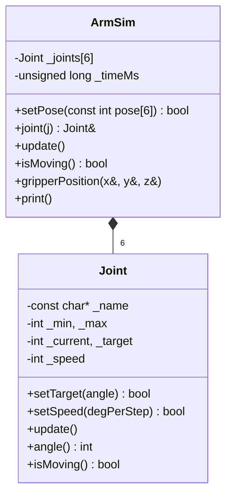
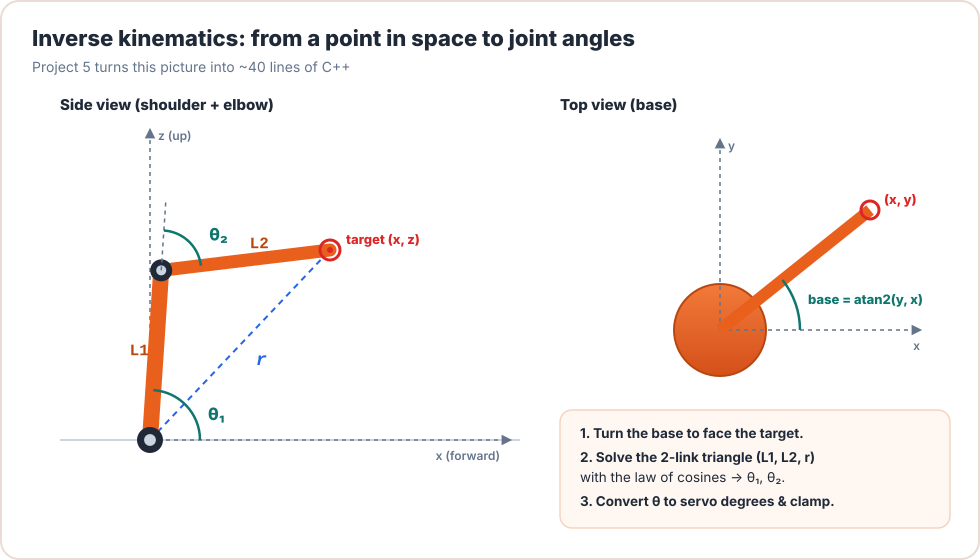

# Project P1: Arm Simulator (PC)

<div class="lesson-meta"><span>⏱ 2–3 h</span><span>🎯 Intermediate</span><span>🧩 Uses: Parts 1–3</span><span>💻 No hardware needed</span></div>

!!! abstract "What you'll build"
    A console program that simulates the Braccio: six `Joint` objects with limits and speeds, an `ArmSim` class that
    plays a routine step by step, ASCII gauges for every joint, and **forward kinematics** that computes where the
    gripper tip is in space.

    **Skills used:** classes & constructors (L08–09), encapsulation (L10), `const` methods (L11), references (L13),
    arrays of objects (L15), `<cmath>`.

---

## Why simulate?

Simulators let you test motion logic **without risking the hardware**, and without needing an arm at all. Industrial
robot programmers spend most of their time in simulation (ROS, RoboDK, Gazebo) before touching a real robot.



---

## Step 1: the `Joint` class

Each joint owns its limits, current angle, target and speed, and keeps the invariant `min ≤ target ≤ max`:

```cpp
class Joint {
public:
  Joint() : Joint("joint", 0, 180, 90) {}                 // needed for arrays of Joint
  Joint(const char* name, int minAngle, int maxAngle, int home)
      : _name(name), _min(minAngle), _max(maxAngle), _current(home), _target(home) {}

  bool setTarget(int angle) {
    _target = angle < _min ? _min : (angle > _max ? _max : angle);
    return _target == angle;
  }

  void update() {                                         // one step, never overshoots
    int remaining = _target - _current;
    if (remaining > _speed) remaining = _speed;
    if (remaining < -_speed) remaining = -_speed;
    _current += remaining;
  }
  // ... getters, setSpeed ...
};
```

## Step 2: the `ArmSim` class

`ArmSim` **contains** six joints (composition), initialised in its constructor's initializer list:

```cpp
ArmSim()
    : _joints{Joint("base", 0, 180, 90),    Joint("shoulder", 15, 165, 90),
              Joint("elbow", 0, 180, 90),   Joint("wrist", 0, 180, 90),
              Joint("wristRot", 0, 180, 90), Joint("gripper", 10, 73, 50)} {}
```

`update()` steps every joint and advances a simulated clock by 10 ms, just like BraccioV2's `safeDelay`.

## Step 3: ASCII gauges

Each joint prints a 20-character bar showing where it sits between its limits:

```text
  shoulder  [######..............]  60
  gripper   [###.................]  20  moving
```

---

## Step 4: forward kinematics, "where is the gripper?"

**Forward kinematics (FK)** answers: *given the joint angles, where is the gripper tip?* Model the side view of the arm
as three links, each at an angle to the horizontal:

<figure markdown>
{ .diagram }
<figcaption>Side view: each link adds its own vector. The base turns that whole side view around the vertical axis.</figcaption>
</figure>

With servo 90° = "straight up" and elbow/wrist measured **relative** to the previous link:

\[
\begin{aligned}
a_1 &= \text{shoulder} \\
a_2 &= a_1 + (\text{elbow} - 90^\circ) \\
a_3 &= a_2 + (\text{wrist} - 90^\circ) \\[4pt]
\text{reach} &= L_1\cos a_1 + L_2\cos a_2 + L_3\cos a_3 \\
z &= H + L_1\sin a_1 + L_2\sin a_2 + L_3\sin a_3 \\
x &= \text{reach}\cdot\cos(\text{base}), \qquad y = \text{reach}\cdot\sin(\text{base})
\end{aligned}
\]

Approximate Braccio dimensions: \(H\) = 71.5 mm (table to shoulder axis), \(L_1\) = \(L_2\) = 125 mm, \(L_3\) ≈ 195 mm (wrist to
gripper tip). With every joint at 90°, the tip is at \(z = 71.5 + 125 + 125 + 195 = 516.5\) mm, which matches the Braccio's
published **52 cm** maximum height. ✅

!!! warning "Your arm may be mirrored"
    This model assumes "shoulder below 90° leans forward". If your arm leans backward (Lesson 00's direction table),
    use `180 - shoulder` in the model. The same goes for elbow and wrist. Always measure a few real poses with a ruler.

---

## The complete program

```cpp title="arm_simulator.cpp" linenums="1"
--8<-- "examples/pc_simulator/arm_simulator.cpp"
```

Build and run:

```bash
g++ -std=c++17 -Wall -Wextra arm_simulator.cpp -o arm_simulator
./arm_simulator
```

```text
=== Braccio simulator ===
t =     0 ms
  base      [##########..........]  90
  shoulder  [##########..........]  90
  elbow     [##########..........]  90
  wrist     [##########..........]  90
  wristRot  [##########..........]  90
  gripper   [############........]  50
  gripper tip at x=   0.0  y=   0.0  z= 516.5 mm

--- step 1: new pose ---
t =   300 ms
  base      [#####...............]  45
  shoulder  [######..............]  60
  elbow     [#############.......] 120
  wrist     [######..............]  60
  wristRot  [##########..........]  90
  gripper   [###.................]  20  moving
  gripper tip at x= 113.1  y= 113.1  z= 473.6 mm
...
```

---

## Extensions

1. **Collision check.** Make `ArmSim::update()` refuse to continue if the gripper tip's `z` drops below 0 (the table),
   printing `COLLISION at t = …`.
2. **Timing report.** After each routine step, print how long it took. Which joint was the slowest?
3. **CSV export.** Print `t,base,shoulder,elbow,wrist,wristRot,gripper,x,y,z` lines and open them in a spreadsheet to graph the motion.
4. **Share code with the Arduino.** Move `Joint` into `joint.h` so the *same file* compiles in the simulator and in a sketch.
   (Tip: avoid `printf` inside `Joint`.)
5. **Synchronised mode.** Give each joint a speed so they all arrive together (Lesson 13).

??? success "Hint for extension 1"
    ```cpp
    bool ArmSim::update() {
      for (Joint& j : _joints) j.update();
      _timeMs += 10;
      double x, y, z;
      gripperPosition(x, y, z);
      if (z < 0) {
        std::printf("COLLISION at t = %lu ms (z = %.1f)\n", _timeMs, z);
        return false;   // caller stops the routine
      }
      return true;
    }
    ```

---

## Checklist

- [ ] My simulator compiles with **no warnings** using `-Wall -Wextra`
- [ ] Out-of-range poses are clamped and reported
- [ ] The upright pose reports z ≈ 516 mm
- [ ] I completed at least two extensions

Next: [Project P2 · Pick & Place](project02_pick_and_place.md)
