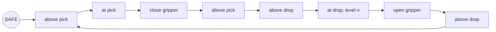
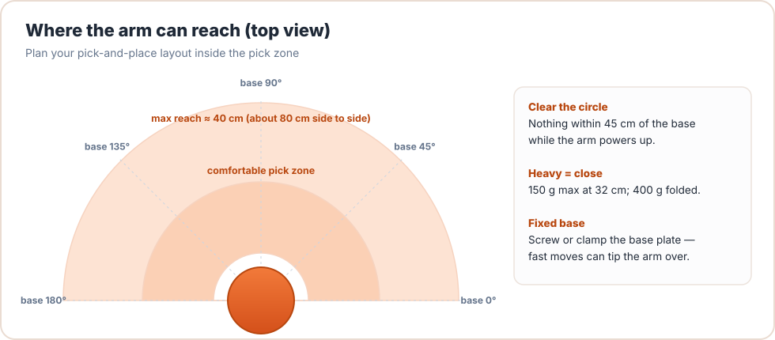
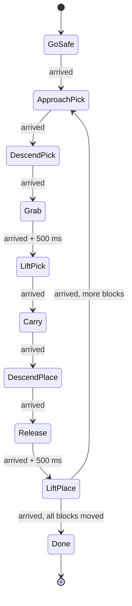

# Project P2: Pick & Place

<div class="lesson-meta"><span>⏱ 2–3 h</span><span>🎯 Advanced</span><span>🧩 Uses: MyBraccio (L19), enums, structs, arrays</span><span>🦾 Arm or Wokwi</span></div>

!!! abstract "What you'll build"
    The classic industrial-robot task: pick up three blocks, one by one, from a pick-up spot and **stack** them at a
    drop-off spot. The program is a **finite-state machine**, the standard way to write robot behaviour that never blocks.

    **You'll need:** 3 light blocks (foam cubes, wooden blocks or bottle caps about 3 cm across) and the MyBraccio library.

---

## Step 1: plan the motion

Never move straight down onto an object, or straight from one spot to another at table height. Always go
**above → down → act → up**:



<figure markdown>
{ .diagram }
<figcaption>Place the pick-up and drop-off spots inside the comfortable zone, for example at base 45° and base 135°, about 20 cm from the base.</figcaption>
</figure>

## Step 2: teach the poses

Use the jog controller from [Lesson 12](../Part3_Memory/lesson12_pointers.md) to find, for **your** table:

| Pose | Description |
|---|---|
| `SAFE` | high above everything; gripper open |
| `ABOVE_PICK` | ~5 cm above the block |
| `AT_PICK` | gripper around the block, not touching the table |
| `ABOVE_PLACE` | ~5 cm above the drop-off spot |
| `AT_PLACE[0..2]` | release height for the 1st, 2nd and 3rd block of the stack |

Write them into the sketch as `Pose` structs.

---

## Step 3: why a state machine?

The obvious approach is a long list of moves with waits in between:

```cpp
moveTo(ABOVE_PICK); arm.waitUntilStopped();
moveTo(AT_PICK);    arm.waitUntilStopped();
// ...
```

It works, but while the arm is waiting, **nothing else can happen**: no emergency-stop button, no serial commands, no
sensor checks. A **finite-state machine (FSM)** turns the task into named *states*. Every pass of `loop()` asks one quick
question ("is the current step done?") and moves to the next state when it is.



Each state has:

- an **entry action** (in `enter()`): what to do once when we arrive in it, usually "set a new target pose",
- a **transition condition** (in `loop()`): when to leave it, usually "the arm has stopped and settled".

### `enum class`: naming the states

```cpp
enum class State : uint8_t { GoSafe, ApproachPick, DescendPick, Grab, /* ... */ Done };
State state = State::GoSafe;
```

`enum class` (Lesson 07) gives type-safe, scoped names: `State::Grab` can't be confused with an `int` or with another
enum's `Grab`.

---

## The complete sketch

```cpp title="P2_pick_and_place.ino" linenums="1"
--8<-- "examples/projects/P2_pick_and_place/P2_pick_and_place.ino"
```

Serial Monitor output:

```text
block 0 -> GoSafe
block 0 -> ApproachPick
block 0 -> DescendPick
block 0 -> Grab
block 0 -> LiftPick
block 0 -> Carry
block 0 -> DescendPlace
block 0 -> Release
block 0 -> LiftPlace
block 1 -> ApproachPick
...
block 3 -> Done
```

---

## Testing safely

1. **Dry run in the air:** set every pose's shoulder 20° higher, so the arm goes through the whole routine without
   touching anything.
2. **Speed 1:** `arm.setSpeedAll(1)` for the first real run, with your hand on the 5 V plug.
3. **One block first:** set `NUM_BLOCKS` to 1 by keeping only `AT_PLACE[0]`.
4. **Then stack.** Adjust `AT_PLACE[1]` and `[2]` until each block lands gently on the previous one.

!!! tip "Grip force"
    `GRIP_CLOSED = 60`, not 73: the servo stops when the fingers touch the block. Closing further only makes the
    servo push and heat up. Find the smallest value that holds your block securely.

---

## Extensions

1. **Emergency stop.** Add a push button on pin 2 (the other leg to GND, `pinMode(2, INPUT_PULLUP)`). When pressed,
   call `arm.stop()` and enter a new `State::Paused`. Resume when it's pressed again. *(This is only possible because the FSM
   never blocks!)*
2. **Unstack.** When `Done`, reverse the process and move the blocks back.
3. **Retry.** Add an analog sensor (e.g. a light sensor under the pick spot) and only enter `Grab` if a block is present.
4. **Serial start.** Stay in `Idle` until the user types `go`.
5. **Tower of Hanoi.** Three spots, three blocks of different sizes, and a recursive solver that generates the move list.
   (A classic that combines recursion with the FSM.)

??? success "Hint for extension 1"
    ```cpp
    const int BUTTON_PIN = 2;
    State resumeState;                       // where to go back to

    // in setup(): pinMode(BUTTON_PIN, INPUT_PULLUP);

    // at the top of loop(), after arm.update():
    static bool wasPressed = false;
    bool pressed = digitalRead(BUTTON_PIN) == LOW;
    if (pressed && !wasPressed) {            // react to the moment it's pressed
      if (state != State::Paused) {
        resumeState = state;
        arm.stop();
        state = State::Paused;
      } else {
        enter(resumeState);                  // re-issue that state's target
      }
    }
    wasPressed = pressed;
    ```
    A real design would also debounce the button (ignore changes for ~30 ms).

---

## Checklist

- [ ] All poses taught and written down
- [ ] Dry run completed in the air
- [ ] One block moved successfully
- [ ] Three blocks stacked
- [ ] At least one extension

Next: [Project P3 · Serial Command Console](project03_serial_control.md)

## Further reading

- [Wikipedia: Finite-state machine](https://en.wikipedia.org/wiki/Finite-state_machine)
- [Adafruit: Multi-tasking the Arduino, part 1](https://learn.adafruit.com/multi-tasking-the-arduino-part-1): state machines and `millis()`
