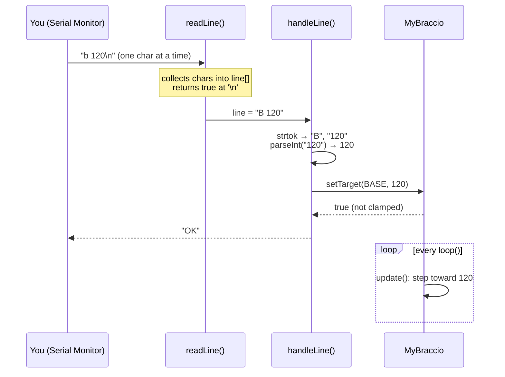

# Project P3: Serial Command Console

<div class="lesson-meta"><span>⏱ 2–3 h</span><span>🎯 Advanced</span><span>🧩 Uses: C strings, pointers, references, MyBraccio</span><span>🦾 Arm or Wokwi</span></div>

!!! abstract "What you'll build"
    A text **command language** for the arm. Type `B 120` to turn the base, `G CLOSE` to grab, `MOVE 90 60 120 60 90 10`
    for a full pose, `SPEED 3`, `STOP`, `POSE`… The sketch parses every line safely, without `String` and without the
    heap, and the arm keeps moving smoothly while you type.

    This is how real robots, CNC machines and 3-D printers (G-code!) are controlled.

---

## The protocol

A **protocol** is the agreement between sender and receiver. Ours:

- One command per line, ending with a newline (`\n`).
- Words separated by spaces. Upper or lower case.
- The arm always answers with a line starting with `OK` or `ERR`, so a *program* on your PC can also drive it and check
  the result.

| Command | Example | Effect |
|---|---|---|
| `B`/`S`/`E`/`W`/`R`/`G` *angle* | `E 45` | move one joint (base, shoulder, elbow, wrist, wrist rotation, gripper) |
| `G OPEN` / `G CLOSE` | `G CLOSE` | gripper to its min / max limit |
| `MOVE` *b s e w r g* | `MOVE 90 60 120 60 90 10` | set all six joints |
| `HOME` / `PARK` | `PARK` | named poses |
| `STOP` | `STOP` | freeze every joint where it is |
| `SPEED` *1–10* | `SPEED 3` | degrees per step for all joints |
| `POSE` | `POSE` | print current (and target) angles |
| `HELP` | `HELP` | list the commands |



---

## Step 1: read a line without blocking

`Serial.readStringUntil('\n')` is easy but **blocks** (up to 1 s by default) and uses the heap-hungry `String` class. Instead, we
collect characters into a fixed buffer, **one call at a time**:

```cpp
const uint8_t MAX_LINE = 48;
char line[MAX_LINE];
uint8_t lineLength = 0;

bool readLine() {
  while (Serial.available() > 0) {
    char c = Serial.read();
    if (c == '\r') continue;
    if (c == '\n') {
      line[lineLength] = '\0';        // terminate the C string (Lesson 15)
      // ... reset and return true
    }
    if (lineLength < MAX_LINE - 1) {  // leave room for '\0': never overflow!
      line[lineLength++] = (char)toupper(c);
    } else {
      lineTooLong = true;
    }
  }
  return false;                       // no complete line yet: come back later
}
```

The `MAX_LINE - 1` check is what separates a robust program from a **buffer overflow**: a user pasting 200 characters
must never be able to write past the end of `line`.

## Step 2: split the line into words with `strtok`

```cpp
char* cmd = strtok(line, " \t");     // first word; strtok writes '\0' after it inside line[]
char* arg = strtok(nullptr, " \t");  // nullptr = "continue in the same string"
```

`strtok` returns **pointers into your buffer** (Lesson 12), so no copying and no heap. When there are no more words, it returns `nullptr`.
Always check for that before using the pointer.

## Step 3: parse numbers strictly

`atoi("12abc")` happily returns 12, and `atoi("abc")` returns 0, which would send a joint to 0°! `strtol` tells us where
it stopped reading, so we can reject anything that isn't a clean number:

```cpp
bool parseInt(const char* token, int& out) {   // result via reference (Lesson 13)
  if (token == nullptr || *token == '\0') return false;
  char* end;
  long v = strtol(token, &end, 10);
  if (*end != '\0' || v < -1000 || v > 1000) return false;
  out = (int)v;
  return true;
}
```

!!! danger "Never trust input"
    Anything typed, received over a network, or read from a sensor can be wrong. Validate **everything** before it
    reaches a motor: parse strictly, then let MyBraccio clamp to the joint limits. That gives two layers of defence.

## Step 4: find the joint with pointer arithmetic

```cpp
const char JOINT_LETTERS[] = "BSEWRG";              // index = MyBraccio joint number
const char* found = strchr(JOINT_LETTERS, cmd[0]);   // pointer to the matching letter, or nullptr
uint8_t joint = found - JOINT_LETTERS;               // distance from the start = the index
```

---

## The complete sketch

```cpp title="P3_serial_console.ino" linenums="1"
--8<-- "examples/projects/P3_serial_console/P3_serial_console.ino"
```

A session (Serial Monitor, line ending *Newline*):

```text
Starting arm...
Ready. Type HELP.
> POSE
base=90 shoulder=90 elbow=90 wrist=90 wristRot=90 gripper=50
> B 120
OK
> S 200
OK (clamped to limits)
> G CLOSE
OK
> FOO
ERR unknown command: FOO
```

---

## Drive the arm from a Python script

Because every reply starts with `OK` or `ERR`, a program can use the protocol too. With
[pySerial](https://pyserial.readthedocs.io/) (`pip install pyserial`):

```python title="wave.py"
import time
import serial

arm = serial.Serial("COM4", 9600, timeout=2)   # "/dev/ttyACM0" on Linux, "/dev/cu.usbmodem…" on macOS
time.sleep(9)                                  # opening the port resets the UNO; wait for the soft-start
arm.reset_input_buffer()

def send(cmd):
    arm.write((cmd + "\n").encode())
    arm.readline()                             # the "> CMD" echo
    reply = arm.readline().decode().strip()
    print(cmd, "->", reply)
    return reply.startswith("OK")

for _ in range(3):
    send("W 60");  time.sleep(0.8)
    send("W 120"); time.sleep(0.8)
send("HOME")
```

That's the start of connecting the arm to anything: a GUI, a game controller, a web page, a computer-vision system.

---

## Extensions

1. **Relative moves.** `B +10` / `B -10` using `arm.nudge()`. (Hint: check whether the token starts with `+` or `-`.)
2. **Wait command.** `WAIT` replies `OK` only when the arm has stopped. Useful for scripts. *(Don't block: remember that a
   wait is pending and reply from `loop()` when `!arm.isMoving()`.)*
3. **Named poses.** `SAVE name` / `GO name` for up to 8 poses stored in an array of structs with a `char name[9]`.
4. **Checksum.** Append `*XX` (hex XOR of all characters) to each command, and reject corrupted lines, like NMEA/GPS sentences.
5. **G-code style.** Accept `G1 B120 S60 F3` (move base and shoulder at speed 3), like a 3-D printer.

??? success "Hint for extension 1"
    ```cpp
    if (arg != nullptr && (arg[0] == '+' || arg[0] == '-')) {
      int delta;
      if (!parseInt(arg, delta)) { Serial.println(F("ERR bad number")); return; }
      reportClamp(arm.nudge(joint, delta));   // strtol understands the sign itself
      return;
    }
    ```

---

## Checklist

- [ ] All commands work, in upper and lower case
- [ ] Garbage input (`B abc`, `MOVE 1 2`, 100 random characters) gives `ERR` and never moves the arm
- [ ] The arm keeps moving smoothly while I type
- [ ] I drove the arm from a Python script (optional)

Next: [Project P4 · Record & Replay](project04_record_replay.md)

## Further reading

- [cplusplus.com: strtok](https://cplusplus.com/reference/cstring/strtok/) · [strtol](https://cplusplus.com/reference/cstdlib/strtol/)
- [Nick Gammon: Processing incoming serial data](https://www.gammon.com.au/serial)
- [pySerial documentation](https://pyserial.readthedocs.io/)
