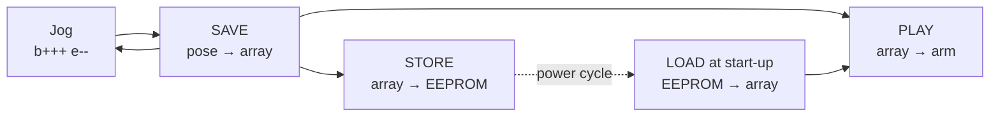

# Project P4: Record & Replay

<div class="lesson-meta"><span>⏱ 3 h</span><span>🎯 Advanced</span><span>🧩 Uses: structs, arrays, EEPROM, pointers, non-blocking design</span><span>🦾 Arm (or Wokwi)</span></div>

!!! abstract "What you'll build"
    A **teach pendant**, the way factory robots are programmed: jog the arm into a pose with the keyboard, `SAVE` it, repeat,
    then `PLAY` the whole sequence back. `STORE` writes the recording to **EEPROM**, so it's still there after you
    unplug the arm, and it loads automatically at start-up.

---

## How industrial robots are taught

Most factory robots aren't programmed by typing angles. An operator moves the robot with a hand-held *teach pendant*, presses
"record" at each important point, and the controller replays the points. You're building the same thing:



---

## Step 1: data design

One recorded pose is six angles. `int16_t` makes the size explicit (Lesson 02):

```cpp
struct Pose {
  int16_t angle[MyBraccio::NUM_JOINTS];   // 12 bytes
};

const uint8_t MAX_POSES = 30;
Pose poses[MAX_POSES];                     // 360 bytes, reserved at compile time (Lesson 14)
uint8_t poseCount = 0;
```

!!! question "Why 30?"
    30 × 12 = 360 bytes of RAM. MyBraccio, Serial's buffers and the other globals add a few hundred more. Check the IDE's
    *"Global variables use…"* line and keep at least ~500 bytes free for the stack. In EEPROM the recording needs
    4 + 30 × 12 = 364 of 1 024 bytes. Always do this budget before choosing a size.

## Step 2: jogging with a string of keys

Each input line is either an UPPERCASE command (`SAVE`, `PLAY`…) or a string of **jog keys**, handled by walking through
the C string with a pointer:

```cpp
void handleJogKeys(const char* keys) {
  for (const char* k = keys; *k != '\0'; k++) {   // stop at the terminating '\0'
    const char* found = strchr(JOINT_KEYS, *k);
    if (found != nullptr) {
      selected = KEY_TO_JOINT[found - JOINT_KEYS];   // select a joint
    } else if (*k == '+') {
      arm.nudge(selected, JOG_STEP);
    } else if (*k == '-') {
      arm.nudge(selected, -JOG_STEP);
    }
  }
}
```

`b+++e--` means: select base, +15°, select elbow, −10°. MyBraccio clamps every nudge to the limits.

## Step 3: EEPROM, memory that survives power-off

The UNO's 1 KB EEPROM keeps its contents with no power. The `EEPROM` library's `put()` and `get()` copy **any** type,
struct or array, to and from an address:

```cpp
EEPROM.put(address, value);   // writes sizeof(value) bytes (only the bytes that changed)
EEPROM.get(address, value);   // reads them back into value (passed by reference)
```

Our layout:

| Address | Contents | Size |
|---|---|---|
| 0 | `Header { magic, version, count }` | 4 bytes |
| 4 | pose 0 | 12 bytes |
| 16 | pose 1 | 12 bytes |
| 4 + 12·i | pose i | 12 bytes |

!!! tip "Why a magic number?"
    A new UNO's EEPROM contains `0xFF` bytes, or leftovers from someone else's sketch. Without a check, `LOAD` could
    read "255 poses" of garbage angles and send them to the arm. The **magic number** `0xB2AC` and the **version** prove
    that the data was written by *this* program in *this* format. Anything else is rejected.

!!! warning "EEPROM wears out"
    Each EEPROM byte survives about 100 000 writes. Writing only on `STORE` (never inside `loop()`) makes that last forever.
    `EEPROM.put()` already skips bytes that haven't changed.

## Step 4: non-blocking playback

Playback is a tiny state machine (like P2) driven from `loop()`: when the arm has arrived **and** held the pose for
`HOLD_MS`, send the next pose. That means `STOP` works *during* playback.

```cpp
void updatePlayback() {
  if (!playing || arm.isMoving()) return;
  if (arrivedAt == 0) { arrivedAt = millis(); return; }   // just arrived
  if (millis() - arrivedAt < HOLD_MS) return;             // still holding
  arrivedAt = 0;
  if (++playIndex >= poseCount) { playing = false; return; }
  goToPose(poses[playIndex]);
}
```

---

## The complete sketch

```cpp title="P4_record_replay.ino" linenums="1"
--8<-- "examples/projects/P4_record_replay/P4_record_replay.ino"
```

A teaching session:

```text
> b+++++s---
target: 115 75 90 90 90 50
> SAVE
Saved pose 0: 115 75 90 90 90 50
> e++++++
target: 115 75 120 90 90 50
> SAVE
Saved pose 1: 115 75 120 90 90 50
> PLAY
Playing...
Playback finished
> STORE
Stored 2 poses in EEPROM
```

Unplug everything, plug it back in, and the Serial Monitor greets you with `Loaded 2 poses from EEPROM`. Type `PLAY`.

---

## Extensions

1. **Hold times.** Add `uint16_t holdMs` to `Pose` and a command `HOLD 1500` that sets it for the last saved pose.
   *(Bump `VERSION` to 2: the EEPROM format changed!)*
2. **Loop mode.** `LOOP` replays the recording forever until `STOP`.
3. **Potentiometer teaching.** Connect potentiometers to A0–A5 and use them as a mini "master arm": `map()` each reading to its
   joint's range, and press a button to `SAVE`.
4. **Smooth playback.** Use Lesson 13's blending so all joints arrive together in each step.
5. **Several programs.** Store up to 3 named recordings in EEPROM (`STORE 2`, `LOAD 2`).

??? success "Hint for extension 3"
    ```cpp
    const uint8_t POT_PINS[6] = {A0, A1, A2, A3, A4, A5};

    void followPots() {
      for (uint8_t j = 0; j < MyBraccio::NUM_JOINTS; j++) {
        int raw = analogRead(POT_PINS[j]);                        // 0..1023
        int angle = map(raw, 0, 1023, arm.minAngle(j), arm.maxAngle(j));
        arm.setTarget(j, angle);
      }
    }
    ```
    Readings are noisy: ignore changes smaller than ~3 degrees, or average a few readings, so the arm doesn't jitter.

---

## Checklist

- [ ] I can jog every joint and see the target angles
- [ ] SAVE / LIST / UNDO / CLEAR work
- [ ] PLAY replays the recording and STOP interrupts it
- [ ] A recording survives unplugging the arm (STORE, then power-cycle)
- [ ] Corrupt or empty EEPROM is rejected safely

Next: [Project P5 · Reach a Point (Kinematics)](project05_kinematics.md)

## Further reading

- [Arduino: EEPROM library](https://docs.arduino.cc/learn/built-in-libraries/eeprom/)
- [Arduino: EEPROM.put()](https://docs.arduino.cc/learn/built-in-libraries/eeprom/#eeprom-put)
- [Wikipedia: Teach pendant](https://en.wikipedia.org/wiki/Teach_pendant)
