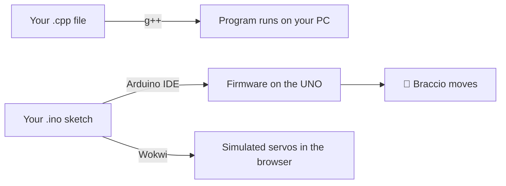

# Setting Up Your Tools

<div class="lesson-meta"><span>⏱ 30–45 min</span><span>🛠 One-time setup</span></div>

You need two kinds of tools:

1. A **desktop C++ compiler** to try small programs on your PC (Parts 1–3 use this a lot).
2. The **Arduino IDE** plus the **BraccioV2** library to program the arm, or the **Wokwi** simulator if you don't have one.



---

## Step 1: A C++ compiler for your PC

=== "Windows"

    The easiest option is **MSYS2**, which gives you `g++`:

    1. Download and run the installer from [msys2.org](https://www.msys2.org/).
    2. Open **MSYS2 UCRT64** from the Start menu and run:
       ```bash
       pacman -S --needed mingw-w64-ucrt-x86_64-gcc
       ```
    3. Add `C:\msys64\ucrt64\bin` to your Windows **PATH**
       ([how-to guide](https://code.visualstudio.com/docs/cpp/config-mingw#_prerequisites)).
    4. Open a new PowerShell and check: `g++ --version`

=== "macOS"

    Open Terminal and run:
    ```bash
    xcode-select --install
    ```
    Then check with `g++ --version` (it's really Apple's `clang`, which works the same for this course).

=== "Linux"

    ```bash
    sudo apt update && sudo apt install build-essential   # Debian / Ubuntu
    g++ --version
    ```

=== "No install (browser)"

    Use an online compiler. Paste your code and press **Run**:

    - [OnlineGDB C++](https://www.onlinegdb.com/online_c++_compiler): simple, has a debugger
    - [Compiler Explorer (godbolt.org)](https://godbolt.org): shows the machine code your C++ becomes, great for Lesson 01
    - [cpp.sh](https://cpp.sh): minimal and fast

### Test it

Create a file called `hello.cpp`:

```cpp title="hello.cpp"
#include <iostream>

int main() {
    std::cout << "Hello, Braccio!" << std::endl;
    return 0;
}
```

Compile and run it:

```bash
g++ -std=c++17 -Wall -Wextra hello.cpp -o hello
./hello          # on Windows PowerShell: .\hello.exe
```

You should see `Hello, Braccio!`. If you do, your desktop compiler works. :tada:

!!! tip "Always use `-Wall -Wextra`"
    These flags turn on **warnings**. The compiler will point out many bugs (like using a variable before giving it a
    value) before they ever reach the robot.

!!! info "Optional: a code editor"
    Any text editor works, but [Visual Studio Code](https://code.visualstudio.com/) with the
    [C/C++ extension](https://marketplace.visualstudio.com/items?itemName=ms-vscode.cpptools) gives you colours,
    auto-complete and error squiggles.

---

## Step 2: The Arduino IDE

1. Download **Arduino IDE 2** from [arduino.cc/en/software](https://www.arduino.cc/en/software) and install it.
2. Plug your **Arduino UNO** into the computer with the USB cable.
3. In the IDE choose **Tools → Board → Arduino AVR Boards → Arduino Uno**.
4. Choose **Tools → Port** and pick the port that appeared when you plugged in the board
   (`COM3`, `COM4`… on Windows, `/dev/cu.usbmodem…` on macOS, `/dev/ttyACM0` on Linux).
5. Test it: **File → Examples → 01.Basics → Blink**, then click **Upload** (→). The small LED marked **L** on the
   board should blink once per second.

!!! question "No port shows up?"
    Try another USB cable (some cables only carry power), another USB port, or install the
    [CH340 driver](https://learn.sparkfun.com/tutorials/how-to-install-ch340-drivers/all) if your board is a clone.
    See [Troubleshooting](Appendix/troubleshooting.md) for more.

---

## Step 3: Install the Braccio libraries

We use two libraries:

| Library | Author | Used for |
|---|---|---|
| **Servo** | Arduino | Built in. Generates the signal each motor needs. |
| **BraccioV2** | Lukas Severinghaus | Individual joints, smooth non-blocking motion, calibration |

Install **BraccioV2** from the Library Manager:

1. **Sketch → Include Library → Manage Libraries…** (or click the 📚 icon on the left).
2. Search for **`BraccioV2`**.
3. Click **Install**. If it asks to install dependencies (Servo), click **Install all**.

??? note "Manual install (if the Library Manager can't find it)"
    1. Download the ZIP from [github.com/kk6axq/BraccioV2](https://github.com/kk6axq/BraccioV2) (green **Code → Download ZIP** button).
    2. In the IDE: **Sketch → Include Library → Add .ZIP Library…** and pick the file.

    This repository also contains a copy of the library source (`BraccioV2.h` / `BraccioV2.cpp`) that we study in
    [Lesson 18](Part4_Arduino_Libraries/lesson18_bracciov2_deep_dive.md).

!!! warning "BraccioV2 needs the Braccio Shield **V4** (or newer)"
    The library switches the motors on through **pin 12**, and only shield V4+ has that circuit. Check the version printed
    on your shield. On older shields, use the official [Arduino Braccio library](https://github.com/arduino-libraries/Braccio)
    instead. Everything you learn about C++ still applies.

---

## Step 4 (optional): The Wokwi simulator

[Wokwi](https://wokwi.com) simulates an Arduino UNO and servo motors in your browser, which is perfect if you don't have an arm,
or if you want to test code **before** risking the real one.

1. Go to [wokwi.com/projects/new/arduino-uno](https://wokwi.com/projects/new/arduino-uno).
2. Click the **diagram.json** tab and replace its contents with our ready-made
   [six-servo Braccio circuit](https://github.com/TheAfricanJiant/Practical-C-/blob/main/examples/wokwi/diagram.json).
   You'll see six servos wired to pins 11, 10, 9, 6, 5 and 3, exactly like the real shield.
3. Click the **Library Manager** tab → **+** and add **BraccioV2**.
4. Paste any Arm Lab sketch into `sketch.ino` and press ▶.

!!! note "Simulator limits"
    Wokwi shows the servo angles but not the arm's shape, weight or collisions. A pose that looks fine in the
    simulator might still hit the table. Always move the real arm slowly the first time.

---

## Step 5: Get the course code

All example sketches and the finished `MyBraccio` library live in this repository:

```bash
git clone https://github.com/TheAfricanJiant/Practical-C-.git
```

Or click **Code → Download ZIP** on [the GitHub page](https://github.com/TheAfricanJiant/Practical-C-).

```text
Practical-C-/
├── docs/                 ← this website (Markdown)
├── examples/
│   ├── arm_labs/         ← one Arduino sketch per lesson
│   ├── projects/         ← the project sketches (P2–P5)
│   ├── libraries/        ← ArmPoses (Lesson 17) and MyBraccio (Lesson 19)
│   ├── pc_tests/         ← unit tests that run on your PC (Lesson 20)
│   ├── pc_simulator/     ← desktop programs for P1 and P5
│   └── wokwi/            ← simulator circuit
├── BraccioV2.h / .cpp    ← the library we study in Lesson 18
└── mkdocs.yml            ← website configuration
```

??? info "Preview this website locally (for contributors)"
    ```bash
    pip install -r requirements.txt
    mkdocs serve
    ```
    Then open <http://127.0.0.1:8000>. Every push to `main` rebuilds the site on GitHub Pages automatically.

---

## Checklist

- [ ] `g++ --version` works (or I have an online compiler bookmarked)
- [ ] The **Blink** example uploads to my UNO
- [ ] **BraccioV2** appears under *Sketch → Include Library*
- [ ] (Optional) My Wokwi project has six servos

Next: [Meet the Braccio Arm](hardware/meet_the_braccio.md) :material-arrow-right:
