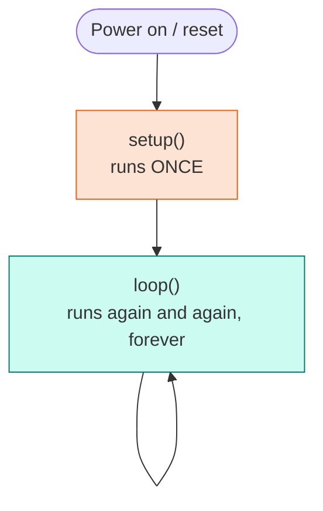

# Lesson 00: Make the Arm Move

<div class="lesson-meta"><span>⏱ 15–30 min</span><span>🎯 Beginner</span><span>🦾 Needs: arm or Wokwi</span></div>

!!! abstract "What you'll do"
    - Upload your first sketch and watch the Braccio turn left and right
    - Learn the **shape** of every Arduino program: `setup()` and `loop()`
    - Discover which way each joint turns on **your** arm
    - Change numbers and see what happens (that's already programming!)

You don't need to understand every line yet. Think of this lesson as a test drive: you drive first and
learn how the engine works in the lessons that follow.

---

## Step 1: Prepare the arm

- [ ] The arm is **clamped** to the table and the area around it is clear (see [safety rules](meet_the_braccio.md#safety-rules)).
- [ ] The shield is on the UNO and all six servo cables are plugged into M1–M6.
- [ ] The **5 V adapter is unplugged** for now.
- [ ] The UNO is connected by USB and the Arduino IDE shows the right board and port.

## Step 2: The code

Create a new sketch (**File → New Sketch**) and type this in:

```cpp title="L00_first_move.ino" linenums="1"
--8<-- "examples/arm_labs/L00_first_move/L00_first_move.ino"
```

[:material-download: Download this sketch](https://github.com/TheAfricanJiant/Practical-C-/tree/main/examples/arm_labs/L00_first_move){ .md-button }

## Step 3: Upload, then power up

1. Click **Upload** (→). Wait for *"Done uploading"*.
2. Open **Tools → Serial Monitor** and set the speed to **9600 baud**.
3. **Plug in the 5 V adapter.**
4. After about 8 seconds the arm stands up straight, then starts turning its base from side to side. :tada:

!!! success "You just programmed a robot"
    Unplug the 5 V adapter whenever you want the arm to stop.

---

## What just happened?

Every Arduino program (called a **sketch**) has the same shape:



Line by line:

| Line | Code | Meaning |
|---|---|---|
| 3 | `#include <BraccioV2.h>` | "Paste in the BraccioV2 library so I can use it." ([Lesson 05](../Part1_Cpp_Basics/lesson05_headers.md)) |
| 5 | `Braccio arm;` | Create an **object** called `arm` that represents the robot. ([Lesson 08](../Part2_OOP/lesson08_classes.md)) |
| 7 | `void setup() { ... }` | A **function** that runs once at start-up. ([Lesson 04](../Part1_Cpp_Basics/lesson04_functions.md)) |
| 8 | `Serial.begin(9600);` | Open a text channel to your computer at 9600 bits per second. |
| 10 | `arm.begin();` | Switch the motors on gently and stand the arm upright. |
| 14 | `void loop() { ... }` | A function that repeats forever. |
| 16 | `arm.setAllAbsolute(45, 90, 90, 90, 90, 50);` | Set a **target** angle for all six joints (base, shoulder, elbow, wrist, wrist rotation, gripper). |
| 17 | `arm.safeDelay(2000);` | Wait 2000 ms while **moving** the joints step by step toward their targets. |

!!! info "Why `safeDelay` and not `delay`?"
    `setAllAbsolute` does not move anything on its own. It only records where the joints *should* go.
    `safeDelay` keeps nudging every joint one degree at a time until it gets there. You'll see exactly how in
    [Lesson 18](../Part4_Arduino_Libraries/lesson18_bracciov2_deep_dive.md). If you used plain `delay(2000)`, the arm would not move at all.

---

## Step 4: Play with the numbers

Change one thing at a time, upload, and watch:

1. Change `45` and `135` to `60` and `120`. The swing gets smaller.
2. Change `2000` to `1000`. What happens when there isn't enough time to finish the move?
3. Add a third pose that also closes the gripper (`73`):
   ```cpp
   arm.setAllAbsolute(90, 90, 90, 90, 90, 73);   // centre, gripper closed
   arm.safeDelay(2000);
   ```
4. Try a gripper value of `120`. Look at what the arm actually does. Is it `120`? (Hint: [joint limits](meet_the_braccio.md#safe-angles-and-famous-poses).)

??? success "What you should observe"
    1. The base swings through a smaller angle.
    2. The base only gets part of the way before the next command arrives. At 1° every 10 ms, a 90° swing needs about 900 ms, so 1000 ms is *just* enough, but 500 ms would not be.
    3. The gripper closes while the base returns to the centre. Both move **at the same time**.
    4. The gripper stops at **73°**. BraccioV2 *clamped* your value to the joint's maximum. Software limits protect the hardware.

---

## Step 5: Find the directions on your arm

Because of how each arm was assembled, a positive change can turn a joint one way on your arm and the
other way on your friend's. Upload this sketch and watch each joint move **+20°**:

```cpp title="L00_find_directions.ino"
--8<-- "examples/arm_labs/L00_find_directions/L00_find_directions.ino"
```

Copy this table into your lab notebook and fill it in:

| Joint | +20° moves it… | Is 90° straight? (if not, what value is?) |
|---|---|---|
| Base | left / right | |
| Shoulder | forward / back | |
| Elbow | forward / back | |
| Wrist | up / down | |
| Wrist rotation | clockwise / anticlockwise | |
| Gripper | opens / closes | — |

!!! tip "Repetition is a hint"
    Notice how `Find directions` repeats the same four lines six times? Programmers hate repeating themselves.
    In [Lesson 03](../Part1_Cpp_Basics/lesson03_control_flow.md) you'll shrink it to five lines with a **loop**.

---

## No arm? Use the simulator

Open [Wokwi](https://wokwi.com/projects/new/arduino-uno), paste our
[six-servo `diagram.json`](https://github.com/TheAfricanJiant/Practical-C-/blob/main/examples/wokwi/diagram.json),
add the **BraccioV2** library, paste the sketch and press ▶. The servo horns turn exactly as the real joints would.

---

## Exercises

1. **Nod.** Make the arm "nod" by moving only the wrist between 60° and 120°.
2. **Grab.** Open the gripper (10°), wait, close it (73°), wait, forever.
3. **Your own dance.** Create a loop with at least four different poses.

??? success "Solution 1: Nod"
    ```cpp
    void loop() {
      arm.setAllAbsolute(90, 90, 90, 60, 90, 50);
      arm.safeDelay(1000);
      arm.setAllAbsolute(90, 90, 90, 120, 90, 50);
      arm.safeDelay(1000);
    }
    ```
    You can also move just one joint: `arm.setOneAbsolute(WRIST, 60);`

??? success "Solution 2: Grab"
    ```cpp
    void loop() {
      arm.setOneAbsolute(GRIPPER, 10);   // open
      arm.safeDelay(1500);
      arm.setOneAbsolute(GRIPPER, 73);   // closed
      arm.safeDelay(1500);
    }
    ```

---

## Recap

- A sketch has `setup()` (runs once) and `loop()` (runs forever).
- `arm.begin()` powers the arm up; `setAllAbsolute(...)` sets six target angles; `safeDelay(ms)` moves toward them.
- The library **clamps** angles to safe limits.
- Every arm is a little different, so record your arm's directions and centre values.

Now let's learn how that text became motion: [Lesson 01 · How C++ Becomes Motion](../Part1_Cpp_Basics/lesson01_compiler.md) :material-arrow-right:
