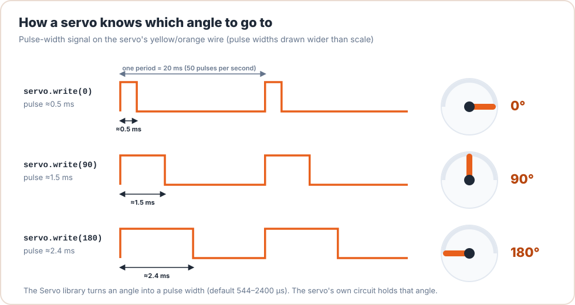
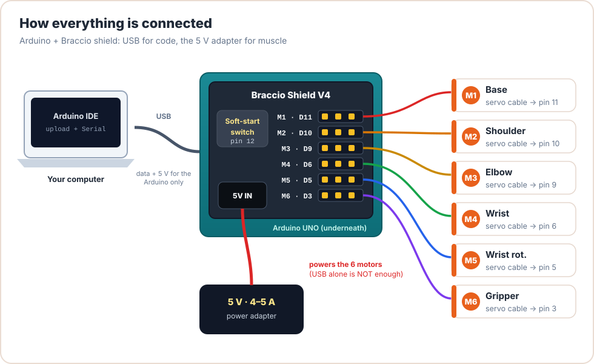
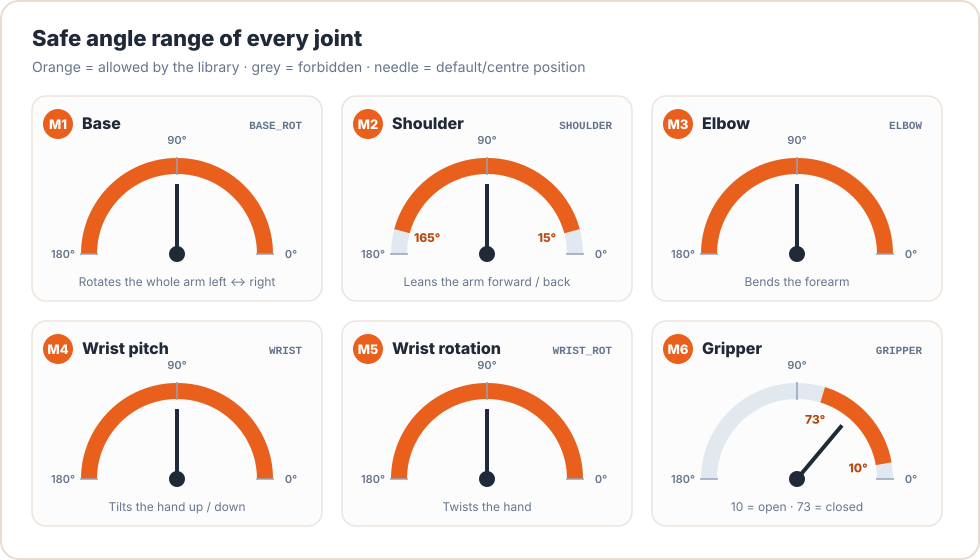

# Meet the Braccio Arm

<div class="lesson-meta"><span>⏱ 25 min</span><span>🦾 Hardware tour</span><span>⚠️ Read before powering up</span></div>

!!! abstract "In this page"
    - The six joints, what each one does, and which Arduino pin controls it
    - How a servo motor turns a number into an angle
    - How the Arduino, shield and power supply connect
    - The safe angle limits and working area
    - **Safety rules** for working with a robot arm

---

## The arm at a glance

<figure markdown>
{ .diagram }
<figcaption>The six motors are named M1 to M6, counting from the base up to the gripper. Every one of them is a servo motor.</figcaption>
</figure>

| Motor | Joint | Arduino pin | Range | What it does | BraccioV2 name |
|:-:|---|:-:|:-:|---|---|
| **M1** | Base | 11 | 0°–180° | Turns the whole arm left and right | `BASE_ROT` |
| **M2** | Shoulder | 10 | 15°–165° | Leans the arm forward and back | `SHOULDER` |
| **M3** | Elbow | 9 | 0°–180° | Bends the forearm | `ELBOW` |
| **M4** | Wrist (pitch) | 6 | 0°–180° | Tilts the hand up and down | `WRIST` |
| **M5** | Wrist rotation | 5 | 0°–180° | Twists the hand | `WRIST_ROT` |
| **M6** | Gripper | 3 | 10°–73° | Opens (10°) and closes (73°) the fingers | `GRIPPER` |

!!! tip "Memorise the pin order"
    **11 – 10 – 9 – 6 – 5 – 3.** These are six of the UNO's PWM-capable pins (marked with a `~` on the board).
    You'll see these numbers again in `BraccioV2.h` in [Lesson 18](../Part4_Arduino_Libraries/lesson18_bracciov2_deep_dive.md).

### Technical specifications

| Property | Value |
|---|---|
| Weight (assembled) | 792 g |
| Maximum operating distance | 80 cm (about 40 cm from the base axis in each direction) |
| Maximum height | 52 cm |
| Base width | 14 cm |
| Gripper opening | 90 mm |
| Payload | 150 g at 32 cm reach · 400 g in the most compact pose |
| Motors | 4 × SpringRC **SR431** (M1–M4, ~12 kg·cm) + 2 × **SR311** (M5–M6, ~3 kg·cm) |
| Power | Regulated **5 V DC, 4–5 A** external adapter |

*Source: [Arduino store page](https://store.arduino.cc/products/tinkerkit-braccio-robot) and the
[official getting-started guide](https://docs.arduino.cc/retired/getting-started-guides/Braccio/).*

---

## How a servo motor works

A **servo** is a small motor with a gearbox, a position sensor (a potentiometer) and a control circuit, all packed
in one box. You don't tell it *how fast to spin*. You tell it **which angle to hold**, and its circuit
does the rest.

The Arduino sends the angle as a **pulse** on the signal wire, 50 times per second. The *width* of each pulse
encodes the angle:

<figure markdown>
{ .diagram }
<figcaption>A longer pulse means a bigger angle. The Arduino <code>Servo</code> library generates these pulses for you: <code>myServo.write(90)</code> is all you type.</figcaption>
</figure>

Every servo has three wires:

| Wire colour (typical) | Name | Purpose |
|---|---|---|
| Brown / black | GND | Ground (0 V) |
| Red | V+ | Power (5 V from the shield) |
| Orange / yellow | Signal | The pulse from the Arduino pin |

!!! note "Why the gripper is only 10°–73°"
    The gripper's fingers touch each other at about 73°. If you command a larger angle, the servo keeps pushing
    against a wall that won't move. It heats up, draws a lot of current, and can strip its plastic gears. This is why
    **software limits** matter, and why a big part of this course is about enforcing them in C++.

---

## How everything connects

<figure markdown>
{ .diagram }
<figcaption>The Braccio shield plugs on top of the UNO. The USB cable carries your code; the 5 V adapter carries the power for the motors.</figcaption>
</figure>

1. The **Braccio shield** plugs on top of the **Arduino UNO**. Line up the pins carefully and press down evenly.
2. Each servo cable plugs into its header **M1 … M6**. Check the colour order: the signal wire goes toward the
   pin label and ground goes toward the board edge, as printed on the shield.
3. The **5 V adapter** plugs into the shield's power jack. It powers the **motors**.
4. The **USB cable** connects the UNO to your computer. It uploads code and powers the Arduino chip.

!!! danger "USB power is not enough"
    Six servos can draw several amps. USB gives about 0.5 A. Always use the 5 V adapter for the motors. And
    **never** plug a 9 V or 12 V adapter into the shield: the servos are rated for 4.8–6 V and will be destroyed.

### The soft-start switch (pin 12)

Shield V4 and newer have a transistor "switch" on **pin 12** that controls power to the servos. The BraccioV2 library
turns it on *gradually* over about 6 seconds, so the arm doesn't jump or reset the board. That is why your sketch
seems to "wait" at start-up. You'll study this code in [Lesson 18](../Part4_Arduino_Libraries/lesson18_bracciov2_deep_dive.md).

---

## Safe angles and famous poses

<figure markdown>
{ .diagram }
<figcaption>Each joint has a physical range. BraccioV2 stores these limits in arrays and clamps every command to them.</figcaption>
</figure>

Two poses you'll use all the time:

| Pose | Base | Shoulder | Elbow | Wrist | Wrist rot. | Gripper | Use |
|---|:-:|:-:|:-:|:-:|:-:|:-:|---|
| **Upright / home** | 90 | 90 | 90 | 90 | 90 | 50 | BraccioV2's default start. The arm points straight up. |
| **Safety / parked** | 90 | 45 | 180 | 180 | 90 | 10 | The official library's start pose. Folded and stable. |

!!! info "Angle directions differ from arm to arm"
    Depending on how the arm was assembled, "shoulder 45°" might lean **forward** on one arm and **backward**
    on another. In [Lesson 00](first_move.md) you will check your own arm and write down its directions in your
    lab notebook.

### Where can it reach?

<figure markdown>
{ .diagram }
<figcaption>Top view of the reachable area. Keep objects you want to pick in the inner "comfortable" ring.</figcaption>
</figure>

---

## Calibration: why 90° might not be straight

When the arm was assembled, each servo horn was pressed onto a spline with teeth about 15° apart, so "90°" is rarely
*exactly* vertical. BraccioV2 fixes this with a **per-joint centre offset**:

```cpp
arm.setJointCenter(SHOULDER, 93);   // on this arm, 93 is truly vertical
```

You find the numbers once (using the `Braccio_Calibration` example in the BraccioV2 library, or by trial in
[Lesson 00](first_move.md)) and paste them at the top of every sketch. Write them in your lab notebook.

---

## Safety rules

!!! danger "Read these before every session"
    1. **Clamp the base.** Screw or clamp the wooden base plate to the table. Fast moves can tip the arm over.
    2. **Clear the circle.** Keep hands, faces, hair, cables and drinks out of the ~45 cm reach zone whenever the
       5 V supply is plugged in.
    3. **Power last, unplug first.** Upload your code *first*, then plug in the 5 V supply. To stop the arm in an
       emergency, **pull the 5 V plug**. USB alone won't move the motors.
    4. **Move slowly the first time.** Test a new pose with small steps and a slow speed.
    5. **Listen.** A servo that buzzes or hums without moving is pushing against something. Cut the power and check
       your limits.
    6. **Never exceed the gripper range.** 73° is fully closed. Beyond that the gears get damaged.
    7. **Don't force joints by hand while powered.** Moving a powered servo by hand strips its gears.

---

## Recap

- The Braccio has **six servos** (M1–M6) on pins **11, 10, 9, 6, 5, 3**.
- A servo holds an **angle**, which the Arduino encodes as a **pulse width**.
- The **USB** cable carries code; the **5 V adapter** powers the motors.
- Every joint has **limits**. Respecting them in code protects the hardware.
- Calibrate once, write the offsets down, and always follow the safety rules.

Next: [Lesson 00 · Make the Arm Move](first_move.md) :material-arrow-right:
