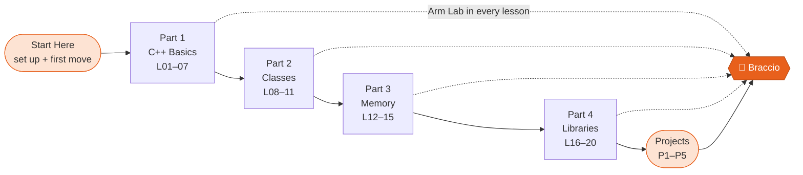

---
hide:
  - navigation
  - toc
---

# Learn **C++** by programming a real robot arm

A free, hands-on course that takes you from “I have never written code” to writing your own
Arduino library that drives the 6-joint <b>Tinkerkit Braccio</b> robotic arm. You write every line, and the arm runs it.

[Start the course :material-arrow-right:](introduction.md){ .md-button .md-button--primary }
[Make the arm move in 15 min](hardware/first_move.md){ .md-button }

<b>20</b>step-by-step lessons

<b>5</b>robot projects

<b>15</b>illustrated diagrams

<b>100+</b>exercises with solutions

---

## What you will be able to do

-   :material-language-cpp:{ .lg .middle } **Write real C++**

    ---

    Variables, loops, functions, classes, pointers, references and arrays. You learn the language the way
    embedded engineers use it, on a chip with only **2 KB of RAM**.

-   :material-robot-industrial:{ .lg .middle } **Control the Braccio**

    ---

    Move six joints smoothly and at the same time, respect safe angle limits, calibrate the arm, and
    pick up objects with the gripper.

-   :material-package-variant-closed:{ .lg .middle } **Build a library**

    ---

    Take the real **BraccioV2** library apart line by line (and find its bugs), then write
    your own `MyBraccio` library from scratch.

-   :material-console:{ .lg .middle } **Ship robot projects**

    ---

    Pick & place, a serial command console, teach-and-replay, and inverse kinematics that moves the
    gripper to an (x, y, z) point.

---

## Meet the hardware

{ .diagram }

The Braccio has **six servo motors**. Each one is plugged into a numbered pin on the Braccio shield, which sits on
top of an Arduino UNO. Your C++ program tells each motor which angle to hold, and that is all a robot arm needs.
Take the full tour in [Meet the Braccio Arm](hardware/meet_the_braccio.md).

---

## The learning path

Every lesson has three parts:

1. **Concept.** A short explanation with a diagram.
2. **Try it on your PC.** Small programs you can compile anywhere, even in a browser.
3. **:material-robot-industrial: Arm Lab.** The same idea running on the real Braccio. No arm? Every lab also works
   in the free [Wokwi simulator](https://wokwi.com/projects/new/arduino-uno) with six servos.

-   :material-flag-checkered: **Brand new to programming?**

    Start with the [Introduction](introduction.md), then [set up your tools](getting_started.md).

-   :material-lightning-bolt: **Have an arm on your desk right now?**

    Jump to [Lesson 00: Make the Arm Move](hardware/first_move.md) and come back for the theory.

-   :material-school: **Teaching a class or workshop?**

    See the [Course Roadmap](roadmap.md) for timings, milestones and a suggested 6-week schedule.

-   :material-bookshelf: **Looking for references?**

    See the [BraccioV2 API](Appendix/api_reference.md), the [cheatsheet](Appendix/cheatsheet.md) and the
    [curated resources](Appendix/resources.md).

---

!!! quote "Community Edition"
    This course is written and maintained by the
    **[Hardware Innovation Valley Community (HWIVC)](https://hwivc.org/)** in Buea, Cameroon, as part of a
    community effort to make practical robotics and embedded-systems education accessible to everyone.

    It builds on the open-source **[BraccioV2](https://github.com/kk6axq/BraccioV2)** library by **Lukas Severinghaus**,
    which is itself based on the original **[Arduino Braccio](https://github.com/arduino-libraries/Braccio)** library by
    Andrea Martino and Angelo Ferrante.
