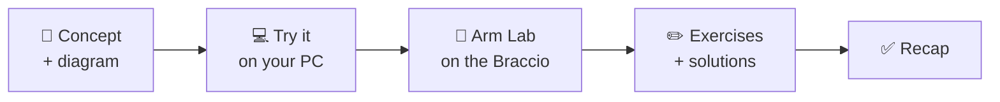

# Introduction

⏱ 10 min read🎯 No experience needed

## Why learn C++ with a robot arm?

Most people learn programming by printing text to a screen. That works, but it is abstract, and it's easy to lose
motivation when the only result of your hard work is `Hello, World!`.

In this course, the result of your code is **physical motion**. When you get a loop right, the arm sweeps smoothly.
When you forget a safety check, the gripper squeezes too hard and you hear the servo strain. You learn quickly
when the feedback is that direct.

!!! tip "The promise of this course"
    By the end you will **understand C++** well enough to read and write real embedded code, and you will be able to
    **make the Braccio do what you want**: move to poses, pick things up, take commands from your laptop, and
    reach for points in space.

## Why C++ and not Python?

Python is excellent, but it cannot run on a small microcontroller like the Arduino UNO. The UNO has:

| Resource | Arduino UNO | A typical laptop |
|---|---|---|
| CPU speed | 16 MHz | ~3 000 MHz |
| RAM | **2 KB** (2 048 bytes) | 8 000 000 KB |
| Program storage | 32 KB | 500 000 000 KB |
| Operating system | none | Windows / macOS / Linux |

C++ compiles directly to the chip's own machine instructions, with **no interpreter and no operating system** in
between. That is why C++ (and C) is used in almost every robot, drone, car ECU, 3-D printer and industrial arm in the
world. You will see in [Lesson 01](Part1_Cpp_Basics/lesson01_compiler.md) exactly how your text becomes those
instructions.

## What is the Braccio?

The **Tinkerkit Braccio** (Italian for "arm") is a desktop robotic arm made by Arduino. It has six servo motors,
a special *shield* (an add-on board) that plugs on top of an Arduino UNO, and a 5 V power supply. It is big enough
to pick up a small ball or a plastic cup, and cheap enough for schools and makerspaces.

<figure markdown>
{ width="420" }
<figcaption>The Tinkerkit Braccio: orange plastic body, six servo motors, and a two-finger gripper.</figcaption>
</figure>

We control it using the open-source **BraccioV2** C++ library. We don't just *use* this library: in Part 4 we open it,
read every line, find its bugs, and then write our own improved version.

## How the course is organised

| Section | You learn | You build |
|---|---|---|
| **Start Here** | Tools, the hardware, safety | Your first moving sketch |
| **Part 1 · C++ Basics** | Compiling, types, `if`/loops, functions, headers, preprocessor | A "wave hello" routine, joint limit checker |
| **Part 2 · Classes** | Classes, constructors, encapsulation, `const` | A `Joint` class that can never exceed its limits |
| **Part 3 · Memory** | Pointers, references, stack vs heap, arrays | Poses stored in arrays, a memory-safe sequence player |
| **Part 4 · Libraries** | Arduino build system, library layout, reading real code | Your own **MyBraccio** library |
| **Projects** | Putting it all together | Simulator, pick & place, serial console, teach & replay, kinematics |

Every lesson follows the same rhythm:

## What you need

=== "Minimum (free)"

    - Any computer (Windows, macOS or Linux), or even just a web browser
    - A free [Wokwi](https://wokwi.com) account to simulate an Arduino and servos online
    - An online C++ compiler like [OnlineGDB](https://www.onlinegdb.com/online_c++_compiler) or
      [Compiler Explorer](https://godbolt.org)

    You can complete **every lesson** this way. The arm labs run in the simulator.

=== "Full hardware kit"

    - Tinkerkit **Braccio** robot (includes the Braccio Shield V4 and 5 V power supply)
    - **Arduino UNO** (or compatible board)
    - USB cable (type A–B for the UNO)
    - A table where you can **clamp or screw down** the arm's base
    - Optional: a few light objects to pick up (sponge cubes, ping-pong balls, bottle caps)

## How to study

1. **Type the code, don't paste it.** Typing builds muscle memory, and your typos teach you to read compiler errors.
2. **Break things on purpose.** Remove a semicolon and read the error. Change a limit and watch what happens.
3. **Do the exercises before opening the solutions.** Struggling is how the idea sticks.
4. **Keep a lab notebook.** Write down your arm's calibration values, the angles that worked, and bugs you fixed.

!!! warning "Robot safety"
    A robot arm is a machine with motors. Before powering it, read the safety section of
    [Meet the Braccio Arm](hardware/meet_the_braccio.md#safety-rules). Keep fingers, hair and cables out of the
    arm's reach while it is powered, and be ready to unplug the 5 V supply.

---

Ready? Continue to the [Course Roadmap](roadmap.md), or go straight to [Setting Up Your Tools](getting_started.md).
