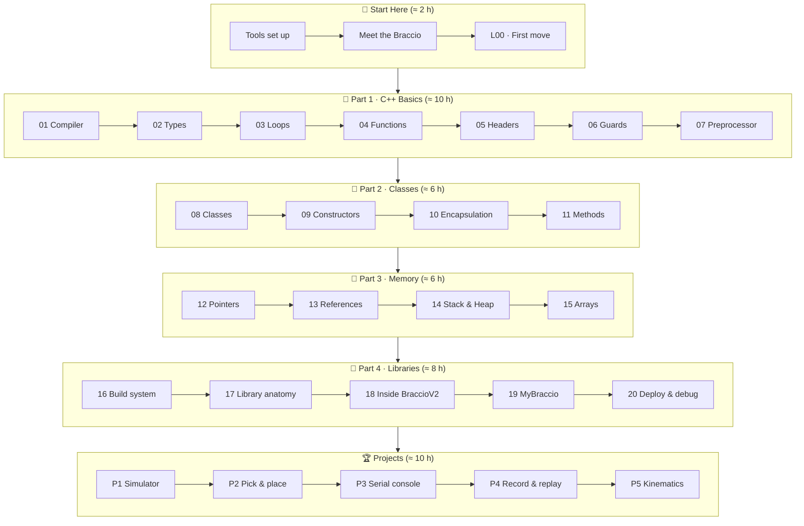

# Course Roadmap

⏱ 5 min read🗺 Plan your journey

This page shows the whole course at a glance: what each part teaches, how long it takes, and the
**milestones** that prove you have mastered it.

## The big picture

## Milestones

Use these checklists to track your progress. When you can tick every box, move on.

### After *Start Here*
- [ ] I can upload a sketch to the Arduino UNO from the Arduino IDE.
- [ ] I can name the six joints (M1–M6) and the pin each one uses.
- [ ] My arm moved to a pose I chose, and I know how to cut power safely.

### After *Part 1 · C++ Basics*
- [ ] I can explain what the preprocessor, compiler and linker each do.
- [ ] I choose sensible types (`int`, `uint8_t`, `unsigned long`, `bool`, `float`) and use `const`.
- [ ] I can write `if`, `switch`, `for` and `while` and make the arm sweep or wave with a loop.
- [ ] I can split a program into a `.h` and a `.cpp` file protected by include guards.

### After *Part 2 · Classes*
- [ ] I can write a class with private data, public methods and a constructor with an initializer list.
- [ ] My `Joint` class refuses (clamps) any angle outside its limits.
- [ ] I know when to mark a method `const` and why overloading `begin()` is useful.

### After *Part 3 · Memory*
- [ ] I can draw a pointer diagram and explain `&` and `*`.
- [ ] I pass large objects by `const&` and modify arguments through `&`.
- [ ] I know why `new` is avoided on a 2 KB microcontroller.
- [ ] I store and replay a sequence of poses from a 2-D array.

### After *Part 4 · Libraries*
- [ ] I can explain every function in `BraccioV2.cpp`, including its bugs.
- [ ] I wrote, installed and used my own `MyBraccio` library.
- [ ] I can debug a misbehaving arm with the Serial Monitor.

### After *Projects*
- [ ] My arm can pick up an object and place it somewhere else.
- [ ] I can drive the arm by typing commands on my laptop.
- [ ] I can teach the arm poses by hand and replay them, even after a power cycle.
- [ ] I can move the gripper to an (x, y, z) point using inverse kinematics.

## Suggested schedules

=== "Self-study (8–10 weeks)"

    | Week | Work |
    |---|---|
    | 1 | Start Here, Lessons 01–02 |
    | 2 | Lessons 03–04 |
    | 3 | Lessons 05–07 + Part 1 workbook |
    | 4 | Lessons 08–11 |
    | 5 | Lessons 12–15 + Project P1 |
    | 6 | Lessons 16–18 |
    | 7 | Lessons 19–20 + Project P2 |
    | 8–10 | Projects P3, P4, P5 |

=== "Workshop / bootcamp (6 weeks, 2 × 3 h per week)"

    | Week | Session A | Session B |
    |---|---|---|
    | 1 | Start Here + L00 (everyone moves the arm) | L01–L03 |
    | 2 | L04–L05 | L06–L07 + workbook |
    | 3 | L08–L09 | L10–L11 |
    | 4 | L12–L13 | L14–L15 + P1 |
    | 5 | L16–L18 | L19–L20 |
    | 6 | P2 pick & place challenge | P3 / P4 showcase |

    **Tip for instructors:** one arm per 3–4 learners works well. Learners without the arm can use
    Wokwi while waiting. Rotate the "arm operator" role every lab.

## How long is each lesson?

Each lesson is designed for **60–90 minutes**: about 20 minutes of reading, 30 minutes of coding, and
the rest on exercises. Projects take 2–3 hours each.

---

Next: [Setting Up Your Tools](getting_started.md)
